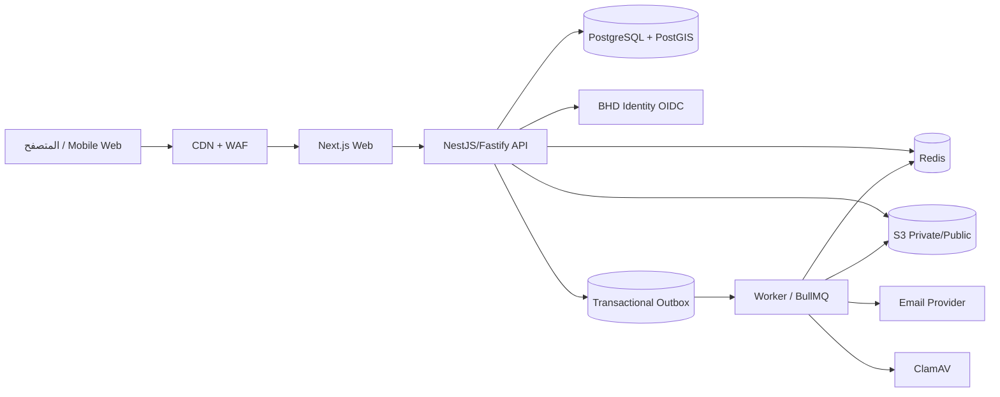
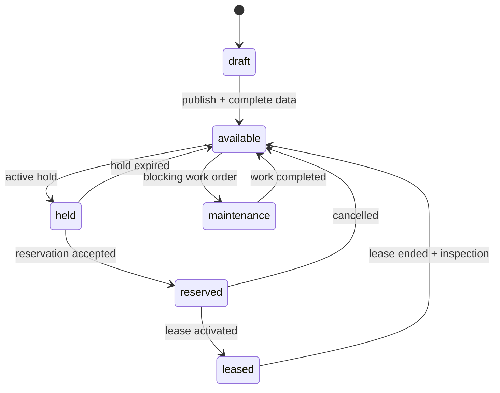

# معمارية BHD R

## الصورة العامة

النظام **Modular Monolith**: عملية API واحدة، لكن كل مجال له حدود واضحة، جداول وخدمات وسياسات وصول. هذا أخف تشغيلياً من microservices، ويمنع العودة إلى دمج نظامين متداخلين. يمكن استخراج وحدة مستقلة لاحقاً عبر عقود الأحداث من دون تغيير سلوك المستخدم.

## تطبيقات المستودع

- `apps/web`: الموقع العام واللوحات الأربع، عربي/إنجليزي وRTL/LTR.
- `apps/api`: نقطة الحقيقة للأذونات، حالات العقار، العقود، المالية والتدقيق.
- `apps/worker`: صور وعلامة مائية، PDF، إشعارات، transactional outbox وdead-letter.
- `packages/db`: المخطط، migrations، RLS والبذور.
- `packages/contracts`: DTOs وأحداث مشتركة لا تحتوي منطق الأعمال.
- `packages/domain`: قيم المجال والحسابات المالية الدقيقة.
- `packages/authz`: الصلاحيات والسياق المؤسسي.
- `packages/config`, `observability`, `ui`, `i18n`: قدرات مشتركة صغيرة.

## الوحدات المنطقية

1. **Identity & Access**: المستخدم، المؤسسة، العضوية، الدور، grant على مورد محدد، الجلسة وAPI key.
2. **Portfolio**: العقار، العنوان، الصور، الوحدة، المرافق والمطور.
3. **Marketplace**: listing، سياسة الظهور، البحث، hold والحجز.
4. **Leasing**: طلب الاستئجار، العقد، النسخة، التوقيع، الإيجار والتجديد.
5. **Finance**: invoice، line item، payment، allocation، refund وledger export.
6. **Maintenance**: البلاغ، SLA، الموعد، المورّد والمرفقات.
7. **Platform**: الباقات، entitlements، CMS، الإعلانات، الدعم والتقارير.
8. **Integration**: بوابات الدفع، webhooks، البريد، التخزين وBHD Identity.

## قواعد الملكية

- الوحدة `Unit` كيان أساسي دائماً. العقار الفردي يُنشئ وحدة واحدة تلقائياً؛ العقار متعدد الوحدات ينشئ عدداً من الوحدات.
- لا يكتب Web أو Worker مباشرةً في جداول مجال لا يملكها. API يكتب الحدث وبيانات المجال في transaction واحدة.
- المعرفات UUID، والتواريخ UTC. العرض يحول إلى المنطقة الزمنية الخاصة بحزمة الدولة.
- المبالغ مخزنة بقيمة Decimal/NUMERIC مع `currency`; لا تستخدم floating point.
- availability قيمة مشتقة من holds والحجوزات والإيجارات والصيانة، وليست زرّاً منفصلاً قابلاً للتعارض.
- كل استعلام مؤسسي يحمل `organization_id` ويخضع لسياسة مركزية وRLS كدفاع ثانٍ.

## حالات الوحدة والظهور

يظهر listing في الموقع فقط عندما يكون منشوراً، والعقار والوحدة فعّالين، والحالة الفعلية `available`، ووقت النشر ضمن المدى. حالات `held`, `reserved`, `leased`, `maintenance` تختفي من نتائج البحث آلياً. الرابط القديم يعرض أقل قدر من البيانات و`noindex` بدلاً من كشف تفاصيل المالك أو العقد.

## الاتساق والأحداث

الأوامر المالية، إصدار الفاتورة، hold والتوقيع تستخدم transaction وقفلاً مناسباً أو unique constraint. يُسجل event في `outbox_events` داخل نفس transaction. يقرأ Worker الصفوف بـ `FOR UPDATE SKIP LOCKED` ويستخدم `outbox.id` كـ BullMQ `jobId`; لذلك إعادة المحاولة آمنة ولا تنشئ رسالة ثانية.

## الاعتمادية

- HTTP stateless وقابل للتوسع أفقياً.
- PostgreSQL هو مصدر الحقيقة؛ Redis ليس مخزناً دائماً.
- S3 الخاص للأصول والعقود الأصلية، وS3 العام للصور المائية المشتقة فقط.
- timeouts وbounded retries مع jitter؛ لا retries غير محدودة.
- readiness يفشل إذا تعطلت تبعية ضرورية، liveness يقيس العملية فقط.
- graceful shutdown يوقف polling وينتظر jobs الجارية قبل إنهاء العملية.
