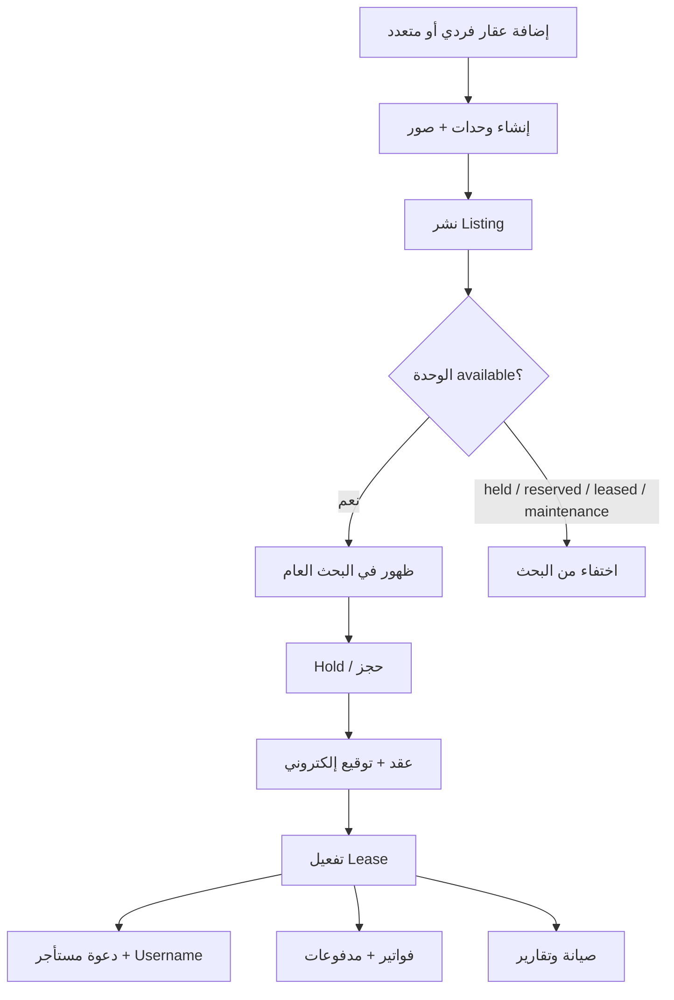
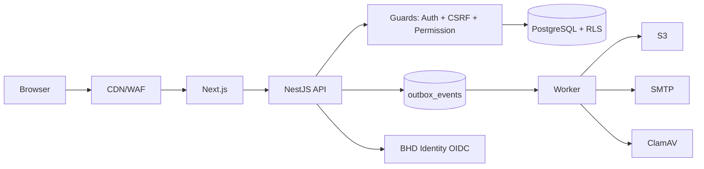

# توثيق مشروع BHD R — إدارة العقارات

**الإصدار:** 0.1.6

**التاريخ:** 24 أغسطس 2026

**المستودع المستهدف:** [ainoamn/BHD-R](https://github.com/ainoamn/BHD-R)

**النطاق المقترح:** `r.bhd-om.com`

**عميل الهوية:** `bhd-r`

**مسار SSO:** `/api/auth/bhd/start|callback|logout` · `admin-entry` — راجع [`BHD-R-SSO-COMPLIANCE.md`](./BHD-R-SSO-COMPLIANCE.md)

هذه الوثيقة هي المرجع الشامل للمنتج: ماذا يفعل، كيف يعمل، بنيته، وحداته، أمنه، وتشغيله. للتفاصيل التشغيلية راجع الفهرس في [`docs/README.md`](./README.md).

---

## 1. الخلاصة التنفيذية

**BHD R** منصة عمانية ثنائية اللغة (عربي / إنجليزي) لإدارة وتسويق العقارات والوحدات، العقود الإلكترونية، الفواتير والمدفوعات، الصيانة، والتقارير. الحرف **R** يعني **Real Estate Management — إدارة العقارات**.

بُنيت من الصفر كـ **Modular Monolith** داخل Monorepo، بهوية BHD الموحدة، دون دمج شيفرة النظام القديم `bhd-om`. الهدف: نفس السلوك التشغيلي المطلوب (عقار ← وحدة ← نشر ← حجز ← عقد ← توقيع ← إيجار ← فاتورة ← دفع ← صيانة)، بتقنيات أخف وأأمن وأوضح.

| البعد    | القرار                                                                              |
| -------- | ----------------------------------------------------------------------------------- |
| المنتج   | منصة عقارية متعددة الأدوار مع سوق عام                                               |
| الهوية   | BHD Identity OIDC (`bhd-r`) عبر `/api/auth/bhd/*` + جلسات Host-only `bhd_r_session` |
| الواجهة  | Next.js 16 + React 19 + Tailwind 4 + next-intl                                      |
| الـ API  | NestJS 11 على Fastify                                                               |
| البيانات | PostgreSQL 17 + PostGIS + Drizzle + RLS                                             |
| الخلفية  | Worker + Redis/BullMQ + Outbox                                                      |
| الوسائط  | S3 خاص للأصل + مشتقات عامة بعلامة مائية                                             |
| المال    | NUMERIC / Decimal — لا Float                                                        |
| اللغات   | ar (RTL) و en (LTR)                                                                 |
| العملات  | OMR, BHD, KWD, AED, SAR, QAR, USD + قابلية إضافة                                    |

---

## 2. أهداف المنتج

1. تمكين إدارة المنصة والمالك والمطور من إدارة محفظة عقارية منظمة.
2. عرض الوحدات المتاحة فقط للجمهور بعد اكتمال النشر والتوفر.
3. إدارة دورة الإيجار حتى التوقيع الإلكتروني والفوترة والتحصيل.
4. منح المستأجر بوابة مستقلة لعقوده وفواتيره وطلبات الصيانة.
5. عزل المؤسسات (tenants) بصلاحيات مركزية وRLS.
6. التوافق مع هوية ومنتجات BHD الأخرى (ألوان، دخول موحد، أسلوب تشغيل).
7. قابلية التوسع الخليجي والدولي عبر Country Packs.

---

## 3. من يستخدم النظام؟ (الأدوار واللوحات)

| اللوحة       | المسار النموذجي              | من يستخدمها       | ماذا ترى                                       |
| ------------ | ---------------------------- | ----------------- | ---------------------------------------------- |
| المنصة       | `/platform`                  | إدارة BHD R       | المؤسسات، الباقات، التدقيق، CMS، الدعم         |
| المالك       | `/owner`                     | فرد أو شركة مالكة | العقارات، العقود، الفواتير، الممثلين، التقارير |
| المطور       | `/developer`                 | مطور عقاري        | المشاريع، الوحدات، النشر، التحصيل              |
| المستأجر     | `/tenant`                    | مستأجر مفعّل      | عقوده، فواتيره، دفعاته، الصيانة                |
| الموقع العام | `/`, `/properties`, `/units` | الزائر            | الوحدات المتاحة فقط                            |

**قاعدة ذهبية:** الأدوار منفصلة؛ لا دور يرث الآخر ضمنياً. كل مستخدم يرى ما له فقط عبر permission registry + resource grants + organization context.

صلاحيات قابلة للاختبار (54): انظر `packages/authz` و[`product/phase-0/03-access-control-model.md`](./product/phase-0/03-access-control-model.md).

أدوار النظام الأساسية:

- `platform_admin`, `platform_support`
- `organization_owner`, `organization_admin`, `property_manager`
- `finance_manager`, `maintenance_agent`, `developer_admin`
- `tenant`, `auditor`

---

## 4. كيف يعمل البرنامج؟ (رحلة من طرف لطرف)



### 4.1 إضافة العقار

1. من لوحة المالك أو المطور أو المنصة يفتح معالج العقار (`property-wizard`).
2. يختار **فردي** (`single_unit`) أو **متعدد الوحدات** (`multi_unit`).
3. الفردي ينشئ وحدة واحدة تلقائياً؛ المتعدد يدخل تفاصيل كل وحدة (مساحة، غرف، إيجار، مرافق…).
4. تُرفع الصور عبر upload intent إلى التخزين الخاص، ثم يعالجها Worker (إعادة ترميز، إزالة EXIF، علامة مائية، AVIF/WebP).
5. لا يكفي زر النشر: الظهور العام يتطلب اكتمال البيانات + حالة توفر مشتقة `available`.

### 4.2 الظهور في الرئيسية

- Listing يظهر فقط إذا: منشور + عقار/وحدة فعّالان + الحالة `available` + ضمن نافذة النشر.
- حالات `held`, `reserved`, `leased`, `maintenance` تختفي من نتائج البحث آلياً.
- الرابط المباشر لوحدة غير متاحة يعرض صفحة مختصرة `noindex` بأقل بيانات ممكنة.

### 4.3 العقود والتوقيع

1. بعد الحجز/الطلب يُنشأ عقد بإصدار ثابت (versioned).
2. يُوقَّع إلكترونياً عبر OTP / إعادة مصادقة + Evidence Envelope وPDF hash.
3. عند اكتمال التوقيع يُفعَّل الـ Lease وتبدأ الفوترة.

### 4.4 تفعيل المستأجر

- النظام يمنح **اسم مستخدم** + **رابط/رمز تفعيل أحادي الاستخدام** داخل BHD Identity.
- لا تُرسل كلمة مرور دائمة بالبريد (قرار أمني معتمد).
- بعد التفعيل يدخل المستأجر لوحته فقط.

### 4.5 الممثلون والمشرفون

- المالك (فرد أو شركة) يعين مشرفين/ممثلين ضمن حدود الباقة (`entitlements`) وresource grants.
- كل ممثل يرى فقط الموارد الممنوحة له.

### 4.6 المالية والصيانة والتقارير

- فواتير بترقيم متزامن لكل مؤسسة/سنة، ومبالغ Decimal.
- مدفوعات مع `Idempotency-Key` وwebhooks موقّعة وunique `(provider, event_id)`.
- صيانة: بلاغ → تعيين → تقدم → إغلاق.
- تقارير من بيانات حقيقية عبر وحدة `reports` (ليست محاكاة).

---

## 5. البنية التقنية (Monorepo)

```
BHD-R/
├── apps/
│   ├── web/          # Next.js — موقع + 4 لوحات
│   ├── api/          # NestJS/Fastify — مصدر الحقيقة للأذونات والمعاملات
│   └── worker/       # صور، PDF، إشعارات، outbox
├── packages/
│   ├── db/           # Drizzle schema + migrations + RLS + seed
│   ├── domain/       # توفر، فواتير، مال، إسقاطات عامة
│   ├── authz/        # صلاحيات وأدوار وJWT/JWKS
│   ├── security/     # CSRF, TOTP, encryption, SSRF, XSS sanitize, API keys
│   ├── contracts/    # DTOs وأحداث مشتركة
│   ├── country-packs/# عمان أولاً + عملات الخليج وUSD
│   ├── i18n/         # رسائل ar/en
│   ├── ui/           # مكوّنات هوية BHD
│   ├── config/       # إعدادات مشتركة
│   └── observability/# سجلات مع redaction
├── docker/           # init PostgreSQL وأدوار التشغيل
├── docs/             # التوثيق الكامل
└── .github/workflows # CI + أمن + أداء
```

### 5.1 التقنيات الكاملة

| الطبقة        | التقنيات                                                 |
| ------------- | -------------------------------------------------------- |
| Runtime       | Node.js 24+, pnpm 10, Turbo                              |
| اللغة         | TypeScript 5.9 strict                                    |
| Web           | Next.js 16, React 19, Tailwind 4, next-intl, Playwright  |
| API           | NestJS 11, Fastify, Zod, Jose (OIDC/JWT)                 |
| DB            | PostgreSQL 17, PostGIS, Drizzle ORM, RLS                 |
| Queue         | Redis, BullMQ, Transactional Outbox                      |
| Storage       | S3-compatible (MinIO محلياً), Sharp                      |
| PDF           | Chromium + خطوط Noto للعربية                             |
| Security      | Helmet/CSP/HSTS, CSRF, TOTP, AES-GCM envelope encryption |
| Observability | OpenTelemetry adapters, Sentry DSN اختياري               |
| CI/CD         | GitHub Actions, Dependabot, Docker multi-image           |
| Tests         | Vitest (unit/integration), Playwright E2E, RLS suite     |

### 5.2 تدفق الطلب



حراس API المركزية (على كل المسارات تقريباً):

1. `ThrottlerGuard`
2. `AuthenticationGuard`
3. `CsrfGuard`
4. `PermissionGuard`
5. `IdempotencyInterceptor`
6. `AuditInterceptor` (مع redaction)

---

## 6. نموذج البيانات (ملخص)

مصدر الحقيقة: `packages/db/src/schema.ts` (~33 جدولاً أساسياً في V1، مع توسع مرحلي وفق ERD المرحلة صفر).

كيانات محورية:

| الكيان                           | الدور                               |
| -------------------------------- | ----------------------------------- |
| `organizations`                  | مؤسسة (فرد/شركة/مطور) مع عملة ودولة |
| `parties` / عضويات               | أشخاص وشركات وعضويات                |
| `properties`                     | عقار فردي أو متعدد                  |
| `units`                          | وحدة first-class دائماً             |
| `media_assets`                   | صور ومرفقات                         |
| `listings`                       | سياسة الظهور العام                  |
| `holds` / `reservations`         | حجز مؤقت / تأكيد                    |
| `contracts` / signatures         | عقد ونسخ وتوقيع                     |
| `leases`                         | إيجار فعّال                         |
| `invoices` / `payments`          | فوترة وتحصيل                        |
| `maintenance_requests`           | صيانة                               |
| `audit_events` / `outbox_events` | تدقيق وأحداث                        |
| `country_packs` / `currencies`   | التوسع الدولي                       |

**قواعد ملكية:**

- كل استعلام مؤسسي يحمل `organization_id`.
- المبالغ `NUMERIC` + رمز عملة.
- التوفر مشتق من آلة حالات، ليس زراً مستقلاً متعارضاً.
- المعرفات UUID؛ الزمن UTC؛ العرض حسب Country Pack.

---

## 7. الواجهات والصفحات (Web)

تحت `apps/web/src/app/[locale]/`:

| المسار                                                       | الوظيفة                    |
| ------------------------------------------------------------ | -------------------------- |
| `/`                                                          | الرئيسية والهوية العمانية  |
| `/properties`, `/properties/[id]`                            | بحث وتفاصيل عقار           |
| `/units/[id]`                                                | تفاصيل وحدة                |
| `/login`, `/forgot-password`, `/reset-password`, `/activate` | دخول واستعادة وتفعيل       |
| `/platform/*`                                                | لوحة المنصة                |
| `/owner/*`, `/owner/properties/new`                          | لوحة المالك + معالج عقار   |
| `/developer/*`                                               | لوحة المطور                |
| `/tenant/*`, `/tenant/contracts/[id]`                        | لوحة المستأجر والعقود      |
| `/invoice/[publicToken]`                                     | فاتورة عامة بحقول مُقلَّلة |
| `/privacy`, `/terms`, `/trust`, `/accessibility`             | صفحات الثقة والقانونية     |

SEO: `robots.ts`, `sitemap.ts`, Open Graph (`public/og.png`).

---

## 8. API (ملخص)

القاعدة: `/v1` — JSON UTF-8 — أخطاء موحّدة مع `correlationId`.

| المجال   | أمثلة                                            |
| -------- | ------------------------------------------------ |
| الهوية   | `/auth/*`, `/me`, `/sessions`                    |
| العقارات | `/properties`, `/units`, `/media/upload-intents` |
| السوق    | `/public/listings`, holds                        |
| العقود   | `/contracts`, signatures, `/leases`              |
| المالية  | `/invoices`, `/payments`, webhooks               |
| الصيانة  | `/maintenance-requests`                          |
| المنصة   | organizations, plans, entitlements               |
| الصحة    | `/health/live`, `/health/ready`                  |

التفاصيل: [`API_OVERVIEW.md`](./API_OVERVIEW.md).

---

## 9. الأمن — ماذا أُغلق في BHD R؟

انظر المصفوفة الكاملة: [`SECURITY_CHECKLIST_MATRIX_AR.md`](./SECURITY_CHECKLIST_MATRIX_AR.md).

أبرز الضوابط المنفذة في المصدر:

- منع تسرب الأسرار في السجلات/التدقيق (`packages/observability` redaction).
- صلاحيات مركزية على APIs (`authz` + guards).
- تطهير HTML/PDF ضد XSS (`packages/security/html`).
- Idempotency للمدفوعات والعمليات الحساسة + unique webhook events.
- فواتير عامة بـ opaque token وحقول مُقلَّلة.
- حماية SSRF لعناوين بوابات الدفع (`ssrf.ts` + host allowlist).
- استعادة كلمة المرور عبر Identity + إبطال جلسات (`session_version`).
- CSRF + TOTP مشدد + API keys hashed/scoped.
- تشفير envelope بإصدارات و`keyPurpose` وقابلية تدوير.
- ترقيم فواتير متزامن + Decimal مالي.
- عزل مؤسسات بـ RLS واختبارات cross-tenant.
- CSP/HSTS/nosniff والمرفقات المفحوصة (magic bytes + ClamAV).
- CI أمني: Dependabot, audit, workflows أمنية.

**ما يحتاج صلاحياتك الخارجية:** تدوير مفاتيح الإنتاج، DNS، Vercel/Neon/Redis/S3/Sentry/البريد، اعتماد قانوني، اختبار اختراق إنتاجي مفوّض.

---

## 10. التشغيل المحلي والنشر

### محلي

```bash
cp .env.example .env
docker compose up -d postgres redis minio minio-init mailpit clamav
pnpm install --frozen-lockfile
pnpm db:migrate
pnpm db:seed
pnpm dev
```

- Web: `http://localhost:3000`
- API: `http://localhost:4000/v1`

### فحوص

```bash
pnpm format:check
pnpm check
pnpm test:coverage
pnpm test:e2e
pnpm audit --audit-level=high
```

### Docker

صور منفصلة: `Dockerfile.web`, `Dockerfile.api`, `Dockerfile.worker`, `Dockerfile.migrate`.

### Vercel

دليل الربط: [`VERCEL_DEPLOYMENT_AR.md`](./VERCEL_DEPLOYMENT_AR.md).

Web على Vercel؛ API/Worker/DB عادة على منصة حاويات أو managed services (لأن Worker يحتاج Chromium وطوابير طويلة).

---

## 11. علاقة النظام القديم (BHD-OM)

BHD R **لا ينسخ** كود [ainoamn/bhd-om](https://github.com/ainoamn/bhd-om).

نُقلت دروس المراجعة الأمنية والوظيفية كتوثيق مرجعي تحت:

- [`legacy-reviews/BHD-OM-technical-security-audit-ar.md`](./legacy-reviews/BHD-OM-technical-security-audit-ar.md)
- [`legacy-reviews/BHD-OM-complete-functional-architecture-review-ar.md`](./legacy-reviews/BHD-OM-complete-functional-architecture-review-ar.md)
- كتالوجات CSV/JSON في `legacy-reviews/catalogs/`

الترحيل المستقبلي: ETL مطابق للاختبارات — انظر [`LEGACY_MIGRATION.md`](./LEGACY_MIGRATION.md).

---

## 12. حالة التحقق 0.1.6

حسب [`VERIFICATION.md`](./VERIFICATION.md):

- lint + TypeScript عبر الحزم
- Unit / Backend / Frontend / Integration / E2E
- 6 اختبارات قاعدة بيانات، منها RLS فعلي بحساب non-superuser
- بناء 48 صفحة Next.js
- صور Docker تعمل read-only
- `pnpm audit` نظيف وقت التسليم

---

## 13. خارطة ما بعد 0.1.6 (مقترحة)

1. ربط DNS + OIDC إنتاجي على `r.bhd-om.com`.
2. Staging كامل مع Neon/Redis/S3/Sentry.
3. Pilot مؤسسة واحدة + مطابقة دفعات قبل تفعيل gateway.
4. اختبار اختراق مفوّض.
5. توسيع Country Packs وتفعيل self-onboarding حسب الباقة.
6. قياس Core Web Vitals وضبط CDN/caching.

---

## 14. مراجع سريعة

| الوثيقة                                                              | المحتوى              |
| -------------------------------------------------------------------- | -------------------- |
| [ARCHITECTURE.md](./ARCHITECTURE.md)                                 | المعمارية            |
| [SECURITY_CONTROLS.md](./SECURITY_CONTROLS.md)                       | الضوابط              |
| [THREAT_MODEL.md](./THREAT_MODEL.md)                                 | نموذج التهديد        |
| [DEPLOYMENT.md](./DEPLOYMENT.md)                                     | النشر العام          |
| [PRODUCT_AND_DECISIONS.md](./PRODUCT_AND_DECISIONS.md)               | قرارات المنتج        |
| [product/BHD-R-BUILD-PLAN-AR.md](./product/BHD-R-BUILD-PLAN-AR.md)   | خطة البناء           |
| [SECURITY_CHECKLIST_MATRIX_AR.md](./SECURITY_CHECKLIST_MATRIX_AR.md) | مصفوفة بنودك الأمنية |
| [VERCEL_DEPLOYMENT_AR.md](./VERCEL_DEPLOYMENT_AR.md)                 | ربط Vercel           |
