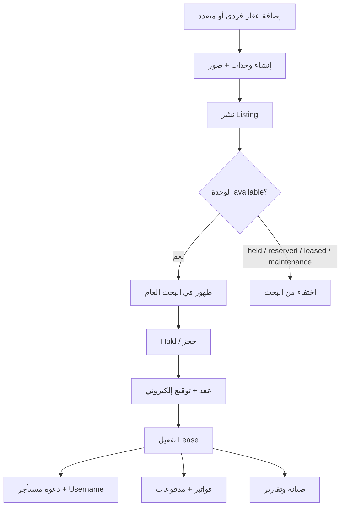
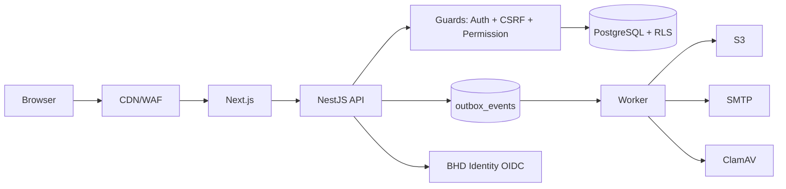

# توثيق مشروع BHD R — إدارة العقارات

**الإصدار:** 0.1.6

**التاريخ:** 24 أغسطس 2026

**المستودع المستهدف:** [ainoamn/BHD-R](https://github.com/ainoamn/BHD-R)

**النطاق المقترح:** `r.bhd-om.com`

**عميل الهوية:** `bhd-r`

**مسار SSO:** `/api/auth/bhd/start|callback|logout` · `admin-entry` — راجع [`BHD-R-SSO-COMPLIANCE.md`](./BHD-R-SSO-COMPLIANCE.md)

هذه الوثيقة هي المرجع الشامل للمنتج: ماذا يفعل، كيف يعمل، بنيته، وحداته، أمنه، وتشغيله. للتفاصيل التشغيلية راجع الفهرس في [`docs/README.md`](./README.md).

---

## 1. الخلاصة التنفيذية

**BHD R** منصة عمانية ثنائية اللغة (عربي / إنجليزي) لإدارة وتسويق العقارات والوحدات، العقود الإلكترونية، الفواتير والمدفوعات، الصيانة، والتقارير. الحرف **R** يعني **Real Estate Management — إدارة العقارات**.

بُنيت من الصفر كـ **Modular Monolith** داخل Monorepo، بهوية BHD الموحدة، دون دمج شيفرة النظام القديم `bhd-om`. الهدف: نفس السلوك التشغيلي المطلوب (عقار ← وحدة ← نشر ← حجز ← عقد ← توقيع ← إيجار ← فاتورة ← دفع ← صيانة)، بتقنيات أخف وأأمن وأوضح.

| البعد    | القرار                                                                              |
| -------- | ----------------------------------------------------------------------------------- |
| المنتج   | منصة عقارية متعددة الأدوار مع سوق عام                                               |
| الهوية   | BHD Identity OIDC (`bhd-r`) عبر `/api/auth/bhd/*` + جلسات Host-only `bhd_r_session` |
| الواجهة  | Next.js 16 + React 19 + Tailwind 4 + next-intl                                      |
| الـ API  | NestJS 11 على Fastify                                                               |
| البيانات | PostgreSQL 17 + PostGIS + Drizzle + RLS                                             |
| الخلفية  | Worker + Redis/BullMQ + Outbox                                                      |
| الوسائط  | S3 خاص للأصل + مشتقات عامة بعلامة مائية                                             |
| المال    | NUMERIC / Decimal — لا Float                                                        |
| اللغات   | ar (RTL) و en (LTR)                                                                 |
| العملات  | OMR, BHD, KWD, AED, SAR, QAR, USD + قابلية إضافة                                    |

---

## 2. أهداف المنتج

1. تمكين إدارة المنصة والمالك والمطور من إدارة محفظة عقارية منظمة.
2. عرض الوحدات المتاحة فقط للجمهور بعد اكتمال النشر والتوفر.
3. إدارة دورة الإيجار حتى التوقيع الإلكتروني والفوترة والتحصيل.
4. منح المستأجر بوابة مستقلة لعقوده وفواتيره وطلبات الصيانة.
5. عزل المؤسسات (tenants) بصلاحيات مركزية وRLS.
6. التوافق مع هوية ومنتجات BHD الأخرى (ألوان، دخول موحد، أسلوب تشغيل).
7. قابلية التوسع الخليجي والدولي عبر Country Packs.

---

## 3. من يستخدم النظام؟ (الأدوار واللوحات)

| اللوحة       | المسار النموذجي              | من يستخدمها       | ماذا ترى                                       |
| ------------ | ---------------------------- | ----------------- | ---------------------------------------------- |
| المنصة       | `/platform`                  | إدارة BHD R       | المؤسسات، الباقات، التدقيق، CMS، الدعم         |
| المالك       | `/owner`                     | فرد أو شركة مالكة | العقارات، العقود، الفواتير، الممثلين، التقارير |
| المطور       | `/developer`                 | مطور عقاري        | المشاريع، الوحدات، النشر، التحصيل              |
| المستأجر     | `/tenant`                    | مستأجر مفعّل      | عقوده، فواتيره، دفعاته، الصيانة                |
| الموقع العام | `/`, `/properties`, `/units` | الزائر            | الوحدات المتاحة فقط                            |

**قاعدة ذهبية:** الأدوار منفصلة؛ لا دور يرث الآخر ضمنياً. كل مستخدم يرى ما له فقط عبر permission registry + resource grants + organization context.

صلاحيات قابلة للاختبار (54): انظر `packages/authz` و[`product/phase-0/03-access-control-model.md`](./product/phase-0/03-access-control-model.md).

أدوار النظام الأساسية:

- `platform_admin`, `platform_support`
- `organization_owner`, `organization_admin`, `property_manager`
- `finance_manager`, `maintenance_agent`, `developer_admin`
- `tenant`, `auditor`

---

## 4. كيف يعمل البرنامج؟ (رحلة من طرف لطرف)


```mermaid
flowchart TD
  A[إضافة عقار فردي أو متعدد] --> B[إنشاء وحدات + صور]
  B --> C[نشر Listing]
  C --> D{الوحدة available؟}
  D -->|نعم| E[ظهور في البحث العام]
  D -->|held / reserved / leased / maintenance| F[اختفاء من البحث]
  E --> G[Hold / حجز]
  G --> H[عقد + توقيع إلكتروني]
  H --> I[تفعيل Lease]
  I --> J[دعوة مستأجر + Username]
  I --> K[فواتير + مدفوعات]
  I --> L[صيانة وتقارير]
```

### 4.1 إضافة العقار

1. من لوحة المالك أو المطور أو المنصة يفتح معالج العقار (`property-wizard`).
2. يختار **فردي** (`single_unit`) أو **متعدد الوحدات** (`multi_unit`).
3. الفردي ينشئ وحدة واحدة تلقائياً؛ المتعدد يدخل تفاصيل كل وحدة (مساحة، غرف، إيجار، مرافق…).
4. تُرفع الصور عبر upload intent إلى التخزين الخاص، ثم يعالجها Worker (إعادة ترميز، إزالة EXIF، علامة مائية، AVIF/WebP).
5. لا يكفي زر النشر: الظهور العام يتطلب اكتمال البيانات + حالة توفر مشتقة `available`.

#### صفحة إدارة العقار (0.4.97)

صفحة العقار في لوحة المالك/المطوّر (`/owner/properties/[id]`) مرتبة من الأعلى للأسفل:

1. **شريط «إجراءات هذا العقار»**: ثابت دائماً في الأعلى أثناء التمرير. فيه: الرجوع للمحفظة، تعديل العقار، عرض للجمهور، الإقامة اليومية، الحجوزات، العقود، الشروط والأحكام، التأجير، البيع، الصيانة، الفواتير، الحسابات.
2. **بطاقة العقار**: صورة الغلاف، الحالة، النوع، الرقم المتسلسل، العنوان، المالك، العربون، المساحة، سنة البناء.
3. **أرقام سريعة**: الوحدات والمنشورة منها، الإقامات النشطة، العقود، الصور.
4. **الحجوزات اليومية، والعقود والإيجارات، والوحدات** (السعر، حالة النشر، الإشغال)، وبجانبها «يحتاج انتباهك» والمالية.
5. **إجراءات حساسة** في الأسفل: أرشفة/استعادة وحذف نهائي.

التفاصيل: [implementation/RELEASE-0.4.97-AR.md](./implementation/RELEASE-0.4.97-AR.md).

### 4.2 الظهور في الرئيسية

- Listing يظهر فقط إذا: منشور + عقار/وحدة فعّالان + الحالة `available` + ضمن نافذة النشر.
- حالات `held`, `reserved`, `leased`, `maintenance` تختفي من نتائج البحث آلياً.
- الرابط المباشر لوحدة غير متاحة يعرض صفحة مختصرة `noindex` بأقل بيانات ممكنة.

### 4.3 العقود والتوقيع

1. بعد الحجز/الطلب يُنشأ عقد بإصدار ثابت (versioned).
2. يُوقَّع إلكترونياً عبر OTP / إعادة مصادقة + Evidence Envelope وPDF hash.
3. عند اكتمال التوقيع يُفعَّل الـ Lease وتبدأ الفوترة.

### 4.3.1 الحجز بالعربون وشروط المالك (0.4.89)

- من صفحة الوحدة: «أريد التأجير» / «أريد الشراء» ← الشروط ← بياناتك ← المراجعة ← دفع العربون عبر BHD Pay ← توقيع العقد مع صور الهوية والصورة الشخصية ← التأكيد.
- المالك يكتب الشروط والأحكام لكل عقار (بيع / إيجار شهري-سنوي / إيجار يومي) من «الشروط والأحكام للعقود» في إدارة العقار، مع إصدارات محفوظة.
- العميل لا يرى مربع الموافقة إلا بعد التمرير إلى آخر الشروط، والنص الذي وافق عليه يُحفظ في الحجز ويُطبع في العقد.
- «هل الحجز لك؟»: جلب بيانات المستخدم تلقائياً، أو الحجز لشخص آخر مع حفظه في ملف المستخدم لاختياره لاحقاً.
- التفاصيل: [implementation/RELEASE-0.4.89-AR.md](./implementation/RELEASE-0.4.89-AR.md).

#### الصيغة الموحدة للشروط والأحكام (0.4.90)

- في صفحة «الشروط والأحكام» (`/owner/terms`) يكتب المالك **صيغة موحدة** لكل نوع (بيع / إيجار شهري-سنوي / إيجار يومي) تستوردها جميع العقارات كما هي تلقائياً.
- يمكن **تخصيص** الشروط لعقار معيّن من «تخصيص الشروط»، ويمكن العودة للصيغة الموحدة في أي وقت.
- قائمة العقارات تعرض عقارين أولاً مع «عرض المزيد» و«عرض القائمة كاملة»، وفيها بحث بالاسم أو الرقم المتسلسل أو المالك أو المكان، وتصفية بالمالك والمكان ونوع العقد وحالة الشروط.
- ترتيب الشروط التي يراها العميل: الشروط المخصّصة للعقار ← الصيغة الموحدة ← الشروط الافتراضية للمنصة.
- التفاصيل: [implementation/RELEASE-0.4.90-AR.md](./implementation/RELEASE-0.4.90-AR.md).

#### تنظيم الشروط والطباعة (0.4.91)

- تُكتب الشروط على شكل **عناوين** و**بنود**، كل منها في إطار مستقل: العربية يميناً والإنجليزية يساراً.
- ترقيم تلقائي: العناوين بالحروف (أ، ب، ج / A، B، C) والبنود بالأرقام تحت كل عنوان، ولصق نص كامل يقسّمه النظام تلقائياً.
- العميل يرى الشروط بالتنسيق نفسه، ويستطيع طباعتها مع شعار الشركة واسمها في الأعلى وعنوانها في الأسفل (قسم «ترويسة الطباعة»).
- التفاصيل: [implementation/RELEASE-0.4.91-AR.md](./implementation/RELEASE-0.4.91-AR.md).

#### الشروط الأولية والذكاء الاصطناعي (0.4.92)

- شروط أولية قانونية ثنائية اللغة لكل نوع عقد:
  - الإيجار الشهري/السنوي، وتبدأ بقسم «وديعة الحجز غير قابلة للاسترداد»؛
  - البيع: العربون، والسداد، ونقل الملكية، وضمانات البائع، والمعاينة والتسليم؛
  - الإيجار اليومي.
- أدوات ✨ أسفل كل حقل: ترجمة قانونية فورية، وإعادة صياغة، وتدقيق لغوي مع قائمة التصحيحات؛ وزر لترجمة كل البنود الناقصة دفعة واحدة. التفعيل بمتغير `AI_GATEWAY_API_KEY` أو `OPENAI_API_KEY` في Vercel.
- نسخ البنود بضغطة واحدة بين البيع والإيجار الشهري/السنوي والإيجار اليومي.
- التفاصيل: [implementation/RELEASE-0.4.92-AR.md](./implementation/RELEASE-0.4.92-AR.md).
- **0.4.93:** الشروط الافتراضية للإيجار الشهري / السنوي أصبحت نص ملحق عقد الإيجار المعتمد لدى المالك حرفياً (17 عنواناً و52 بنداً)، والحد الأقصى 150 عنصراً لكل نوع عقد — [implementation/RELEASE-0.4.93-AR.md](./implementation/RELEASE-0.4.93-AR.md).

#### عربون حجز التأجير وعربون حجز الشراء (0.4.99)

- في صفحة تعديل العقار (الخطوة 2 «الوحدات») لكل وحدة حقلان منفصلان يظهران حسب أنماط العرض:
  - «عربون حجز التأجير» للإيجار الشهري/السنوي (`units.deposit_minor`)؛
  - «عربون حجز الشراء» للبيع، ويُخزَّن في `stay_policies` بالرمز `unit_deposit:sale:{unitId}` دون ترحيل.
- إن لم يُحدَّد عربون الشراء يُستخدم عربون التأجير.
- صفحة العقار العامة وصفحة الحجز والخادم وصفحة إدارة العقار تستخدم المبلغ الصحيح حسب «أريد التأجير» أو «أريد الشراء».
- التفاصيل: [implementation/RELEASE-0.4.99-AR.md](./implementation/RELEASE-0.4.99-AR.md).

### 4.3.2 الإيجار اليومي: الحجز والتقويم (0.4.94 – 0.5.6)

#### صفحة حجز الإقامة اليومية (0.4.94)

- الصفحة `/stays/[slug]/book` بنفس تصميم صفحة حجز الإيجار/الشراء: صورة أصغر ونموذج بيانات أكبر.
- العنوان «احجز إقامتك القادمة» مع شرح بأربع خطوات:
  1. اختيار التواريخ ونوع الإقامة؛
  2. إدخال بياناتك؛
  3. المراجعة والموافقة على الشروط؛
  4. الدفع والتوقيع.
- عبارة «ابدأ إجراءات الحجز الآن» مع سهم يشير إلى النموذج، وزر تبديل اللغة يحافظ على التواريخ والوحدة وعدد الضيوف.
- خطوة «بياناتك»: سؤال «هل الحجز لك؟»:
  - «نعم، الحجز لي»: تُجلب بيانات المستخدم تلقائياً؛
  - «لا، لشخص آخر»: اختيار شخص محفوظ أو إضافة شخص جديد، مع خيار حفظه في الملف لاستخدامه لاحقاً.
- الحجز يحفظ لمن هو (`bookingFor`) ومن قام به (`bookedBy`)، والعقد يعرض «تم الحجز بواسطة» عند الحجز لشخص آخر.
- حفظ الشخص يتم عبر `POST /api/public/booking-contacts` بعد إنشاء الحجز، وفشل الحفظ لا يوقف الحجز.
- التفاصيل: [implementation/RELEASE-0.4.94-AR.md](./implementation/RELEASE-0.4.94-AR.md).

#### الحجز الكلي والجزئي في التقويم (0.4.95)

- اليوم يُقسم إلى فترتين:
  - **الصباحية (ص)** = إقامة بدون مبيت؛
  - **المسائية (م)** = مبيت فقط.
- اليوم المحجوز **كلياً** يظهر محجوزاً بالكامل. اليوم المحجوز **جزئياً** (فترة واحدة) يظهر بلونين، مع شارتي «ص» و«م»: ✓ للفترة الشاغرة و✗ للمحجوزة، ومعهما **سعر الفترة المتبقية**.
- سعر الفترة المتبقية هو السعر الذي ضبطه المالك لتلك الفترة، وإن لم يضبطه فسعر الليلة.
- الضغط على اليوم الجزئي في صفحة العقار يختار الفترة الشاغرة فقط وينقلها لصفحة الحجز.
- يظهر ذلك في: صفحة العقار العامة، وتقويم المالك، وصفحة تفاصيل الحجز للمالك (صف «نطاق الحجز» وحالة الفترة الأخرى وسعرها).
- دليل التقويم يشرح الرموز: ص، م، ✓، ✗، والسعر.
- التفاصيل: [implementation/RELEASE-0.4.95-AR.md](./implementation/RELEASE-0.4.95-AR.md).

#### سرعة التقويم وتقويم المالك الموحّد (0.4.96)

- **السرعة:** كان التقويم يتأخر حتى ~20 ثانية لأن دوال الموقع كانت تعمل في واشنطن وقاعدة البيانات في لندن. نُقلت الدوال إلى لندن (`lhr1`):

  | القياس | قبل | بعد |
  |---|---|---|
  | طلب التقويم | ~1.9 ثانية | ~0.3 ثانية |
  | صفحة العقار | ~4 ثوانٍ | ~1.6 ثانية |
  | ظهور التقويم في المتصفح | ~9 ثوانٍ | ~3 ثوانٍ |

- **تقويم المالك/المطوّر** (`/owner/stays/calendar` و`/developer/stays/calendar`):
  - يعرض كل العقارات في تقويم واحد بشكل افتراضي؛
  - **الأحمر** = يوم فيه حجوزات (مع عددها)، **الأخضر** = يوم شاغر؛
  - الضغط على التاريخ يعرض حجوزات ذلك اليوم: العقار والوحدة، الضيف، الهاتف، الفترة، التواريخ، المبلغ، الحالة، المرجع، ورابط تفاصيل الحجز؛
  - قائمة منسدلة للعقارات مع بحث بالاسم أو الرمز؛ اختيار عقار يعرض حجوزاته فقط، ويُظهر أسفله «الأسعار وإغلاق الأيام» لتعديل السعر وإغلاق الأيام.
- التفاصيل: [implementation/RELEASE-0.4.96-AR.md](./implementation/RELEASE-0.4.96-AR.md).

#### مبلغ التأجير وعدد الضيوف وبيانات البطاقة (0.4.98)

- الخطوة 1 «الإقامة» تعرض بطاقة «مبلغ التأجير» تتحدث تلقائياً حسب التواريخ ونوع الإقامة وعدد الضيوف:
  - السعر الأساسي، والإيجار، ورسوم التنظيف، والإجمالي؛
  - ✓ متاح أو ✗ مع السبب.
- السعر يأتي من الخادم (`GET /api/public/stays/[slug]/availability` يعيد `estimate`) بنفس طريقة عرض السعر النهائي، دون إنشاء سجل.
- عدد البالغين والأطفال:
  - أرقام 1–9؛
  - ثم فئات «≥ 10 و < 20» حتى «≥ 90 و < 100»، وكل فئة تملأ أول رقم فيها ويمكن تعديله؛
  - ثم «≥ 100» مع إدخال العدد الإجمالي إلزامياً.
- الحد الأقصى للضيوف في النظام 999، والحد الفعلي لكل عقار يضبطه المالك.
- صفحة الدفع التجريبية: النص التوضيحي في مربعات بيانات البطاقة أصبح شفافاً حتى لا يبدو كبيانات مُدخلة.
- التفاصيل: [implementation/RELEASE-0.4.98-AR.md](./implementation/RELEASE-0.4.98-AR.md).

#### تعديل بيانات الإيجار اليومي من صفحة تعديل العقار (0.4.99)

- لوحة «إعدادات الإيجار اليومي» في آخر الخطوة 2 «الوحدات»، ببطاقة لكل وحدة لها إعداد إقامة يومية:
  - الضيوف والمدة: الحد الأقصى للضيوف في المبيت وبدون مبيت (حتى 999)، والحد الأدنى والأقصى لليالي؛
  - الأوقات: الدخول، والخروج لكل نوع إقامة، والحجز الفوري؛
  - الأسعار: الليلة، ونهاية الأسبوع، وبدون مبيت، والمبيت فقط، ومبلغ التأمين.
- كل بطاقة تُحفظ مستقلة عبر `POST /api/owner/stays/setup`، مع رابط للإعدادات المتقدمة (السياسات والتعليمات والنشر).
- إصلاح: صفحة التعديل أصبحت تقرأ `units.offering_modes`، فلا تتحول الوحدات اليومية إلى «إيجار شهري» عند الحفظ.
- التفاصيل: [implementation/RELEASE-0.4.99-AR.md](./implementation/RELEASE-0.4.99-AR.md).

#### شاشات الإقامات اليومية للمالك والمطوّر (0.5.0)

- شريط ثابت موحّد أعلى الشاشات الأربع: لوحة الإقامات، التقويم، الحجوزات اليومية، الأسعار والعروض، وزر «إضافة إقامة يومية».
- **لوحة الإقامات** (`/owner/stays`):
  - حركة اليوم بتوقيت مسقط (وصول، مغادرة، قادمة، تحتاج إجراء)؛
  - الحجوزات القادمة؛
  - الوحدات بأسعارها وحالة نشرها مع روابط التقويم والأسعار؛
  - أداء آخر 30 يوماً وملخص الحجوزات.
- **التقويم** (`/owner/stays/calendar`):
  - بطاقة واحدة متناسقة مع الشاشة؛
  - عند اختيار وحدة: زرّا «الحجوزات» و«الأسعار وإغلاق الأيام»؛
  - روابط `?unitId=` و`&view=prices`.
- **الأسعار والعروض** (`/owner/stays/rates`): كل الوحدات حسب العقار بأسعارها (الليلة، نهاية الأسبوع، بدون مبيت، مبيت فقط، التأمين) مع تعديل وحفظ في مكانها.
- **الحجوزات اليومية** (`/owner/bookings?tab=daily`):
  - دون أقسام الإيجار الشهري ودون بحث مكرر؛
  - بطاقات الأرقام هي أزرار التصفية.
- التفاصيل: [implementation/RELEASE-0.5.0-AR.md](./implementation/RELEASE-0.5.0-AR.md).

#### تواريخ الإقامة مع المبيت في صفحة الحجز (0.5.1)

- في `/stays/[slug]/book`، نوع «إقامة مع مبيت (يوم كامل)»:
  - الوصول افتراضياً هو تاريخ اليوم بتوقيت مسقط، والمغادرة هي الغد؛
  - التاريخ القادم الصالح في الرابط يُحترم، أما الماضي فيُستبدل بتاريخ اليوم.
- الضيف يغيّر التاريخين يدوياً، أو يمدّد ويقصّر بعدّاد الليالي (− / +) حتى 90 ليلة.
- تصحيح تلقائي للمغادرة لتكون بعد الوصول دائماً. «بدون مبيت» و«مبيت فقط» تبقى في يوم واحد.
- التفاصيل: [implementation/RELEASE-0.5.1-AR.md](./implementation/RELEASE-0.5.1-AR.md).

#### سرعة تحديث المبلغ في صفحة الحجز (0.5.2)

- **ذاكرة مؤقتة في المتصفح:** تقدير المبلغ (`/api/public/stays/[slug]/availability`) يُحفظ لمدة دقيقة، مع منع الطلبات المكررة.
- **جلب مسبق:** مبلغ ليلة وليلتين إضافيتين وليلة أقل يُجلب في الخلفية، فيتحدث المبلغ فوراً عند + / −.
- **بدون وميض:** المبلغ السابق يبقى ظاهراً أثناء التحديث، والمربع لا يتغير حجمه.
- **الخادم:** حساب السعر والتوافر بالتوازي.
- **السعر النهائي:** خطوة المراجعة تتحقق من الخادم مباشرة دون الذاكرة المؤقتة.
- التفاصيل: [implementation/RELEASE-0.5.2-AR.md](./implementation/RELEASE-0.5.2-AR.md).

#### تصميم صفحة الحجز (0.5.3)

- **الهيكل:** `.stay-book`، بطاقة عقار مصوّرة مع نموذج الحجز.
  - **على الشاشات الكبيرة:** البطاقة على الجانب وثابتة أثناء التمرير، بزوايا دائرية.
  - **على الجوال:** صورة علوية يتداخل معها النموذج.
- **بطاقة العقار تعرض:** الاسم، والموقع، والمزايا (الغرف، دورات المياه، الضيوف، المساحة)، والسعر من / الليلة، والتقييم، وأوقات الوصول والمغادرة.
- **خطوة «الإقامة»** في ثلاثة أقسام:
  - نوع الإقامة: بطاقات اختيار بأسعارها من `offer`؛
  - التواريخ: مربع واحد وعدّاد مدة؛
  - الضيوف.
- **لون رئيسي واحد** بدل الحدود الملوّنة المتعددة.
- **صفحة حجز الإيجار الشهري** (`/book/[unitId]`) ما زالت على `.stays-book-shell`.
- التفاصيل: [implementation/RELEASE-0.5.3-AR.md](./implementation/RELEASE-0.5.3-AR.md).

#### الدفع الفوري ورسائل الدفع (0.5.4)

- **حجز الإقامة من الموقع فوري دائماً:** يُنشأ بحالة `payment_pending` ويُحوَّل الضيف إلى الدفع مباشرة، بغض النظر عن `instant_book`.
  - السبب: لا يوجد بعد انتقال اعتماد من المالك (`request_pending` إلى `payment_pending`)، فكان حجز «طلب الحجز» لا يُدفع أبداً.
- **رسائل الدفع حسب رمز الخطأ** (`paymentErrorMessage` في `stay-checkout.tsx`) بدل اعتبار كل خطأ 409 «بوابة غير مفعّلة».
- **إعدادات المالك:** خانة «حجز فوري» استُبدلت بملاحظة؛ القيمة المخزّنة باقية لنظام موافقة مستقبلي.
- التفاصيل: [implementation/RELEASE-0.5.4-AR.md](./implementation/RELEASE-0.5.4-AR.md).

#### صورة أصغر وحقول أكبر في صفحة الحجز (0.5.5)

- **الصورة:** على الشاشات الكبيرة عمود أضيق `clamp(19rem, 30vw, 26rem)` وارتفاع حتى 36rem؛ على الجوال 13–15rem، ويُخفى شريط الأوقات تحت 600px.
- **النموذج:** بطاقة حتى 48rem، وحقول 3.4rem بخط 1.05rem، وبطاقات نوع الإقامة وأزرار المدة وزر المتابعة أكبر.
- التفاصيل: [implementation/RELEASE-0.5.5-AR.md](./implementation/RELEASE-0.5.5-AR.md).

#### بطاقة ملخّص الإقامة في صفحة الحجز (0.5.6)

- **البنية:** `.stay-book__bar` (شريط علوي: العودة، الشعار، اللغة) ثم `.stay-book__layout` بمنطقتين `summary` و`panel`، وحاوية بعرض أقصى 76rem.
- **البطاقة** `.stay-book__summary`: الصورة `.stay-book__media`، والتفاصيل `.stay-book__info`، والأوقات والثقة `.stay-book__extra`.
- **الشاشات الكبيرة (1000px فأكثر):** النموذج ثم البطاقة بجانبه (20–23.5rem)، والصورة 16:10، والبطاقة ثابتة أثناء التمرير.
- **أقل من 1000px:** بطاقة أفقية فوق النموذج بصورة جانبية (6.5–11rem).
- حلّت محل الصورة الخلفية القديمة `.stay-book__hero*`.
- التفاصيل: [implementation/RELEASE-0.5.6-AR.md](./implementation/RELEASE-0.5.6-AR.md).

### 4.4 تفعيل المستأجر

- النظام يمنح **اسم مستخدم** + **رابط/رمز تفعيل أحادي الاستخدام** داخل BHD Identity.
- لا تُرسل كلمة مرور دائمة بالبريد (قرار أمني معتمد).
- بعد التفعيل يدخل المستأجر لوحته فقط.

### 4.5 الممثلون والمشرفون

- المالك (فرد أو شركة) يعين مشرفين/ممثلين ضمن حدود الباقة (`entitlements`) وresource grants.
- كل ممثل يرى فقط الموارد الممنوحة له.

### 4.6 المالية والصيانة والتقارير

- فواتير بترقيم متزامن لكل مؤسسة/سنة، ومبالغ Decimal.
- مدفوعات مع `Idempotency-Key` وwebhooks موقّعة وunique `(provider, event_id)`.
- صيانة: بلاغ → تعيين → تقدم → إغلاق.
- تقارير من بيانات حقيقية عبر وحدة `reports` (ليست محاكاة).

---

## 5. البنية التقنية (Monorepo)

```
BHD-R/
├── apps/
│   ├── web/          # Next.js — موقع + 4 لوحات
│   ├── api/          # NestJS/Fastify — مصدر الحقيقة للأذونات والمعاملات
│   └── worker/       # صور، PDF، إشعارات، outbox
├── packages/
│   ├── db/           # Drizzle schema + migrations + RLS + seed
│   ├── domain/       # توفر، فواتير، مال، إسقاطات عامة
│   ├── authz/        # صلاحيات وأدوار وJWT/JWKS
│   ├── security/     # CSRF, TOTP, encryption, SSRF, XSS sanitize, API keys
│   ├── contracts/    # DTOs وأحداث مشتركة
│   ├── country-packs/# عمان أولاً + عملات الخليج وUSD
│   ├── i18n/         # رسائل ar/en
│   ├── ui/           # مكوّنات هوية BHD
│   ├── config/       # إعدادات مشتركة
│   └── observability/# سجلات مع redaction
├── docker/           # init PostgreSQL وأدوار التشغيل
├── docs/             # التوثيق الكامل
└── .github/workflows # CI + أمن + أداء
```

### 5.1 التقنيات الكاملة

| الطبقة        | التقنيات                                                 |
| ------------- | -------------------------------------------------------- |
| Runtime       | Node.js 24+, pnpm 10, Turbo                              |
| اللغة         | TypeScript 5.9 strict                                    |
| Web           | Next.js 16, React 19, Tailwind 4, next-intl, Playwright  |
| API           | NestJS 11, Fastify, Zod, Jose (OIDC/JWT)                 |
| DB            | PostgreSQL 17, PostGIS, Drizzle ORM, RLS                 |
| Queue         | Redis, BullMQ, Transactional Outbox                      |
| Storage       | S3-compatible (MinIO محلياً), Sharp                      |
| PDF           | Chromium + خطوط Noto للعربية                             |
| Security      | Helmet/CSP/HSTS, CSRF, TOTP, AES-GCM envelope encryption |
| Observability | OpenTelemetry adapters, Sentry DSN اختياري               |
| CI/CD         | GitHub Actions, Dependabot, Docker multi-image           |
| Tests         | Vitest (unit/integration), Playwright E2E, RLS suite     |

### 5.2 تدفق الطلب


```mermaid
flowchart LR
  Browser --> CDN[CDN/WAF]
  CDN --> Web[Next.js]
  Web --> API[NestJS API]
  API --> AuthZ[Guards: Auth + CSRF + Permission]
  AuthZ --> DB[(PostgreSQL + RLS)]
  API --> Outbox[(outbox_events)]
  Outbox --> Worker
  Worker --> S3
  Worker --> SMTP
  Worker --> ClamAV
  API --> Identity[BHD Identity OIDC]
```

حراس API المركزية (على كل المسارات تقريباً):

1. `ThrottlerGuard`
2. `AuthenticationGuard`
3. `CsrfGuard`
4. `PermissionGuard`
5. `IdempotencyInterceptor`
6. `AuditInterceptor` (مع redaction)

---

## 6. نموذج البيانات (ملخص)

مصدر الحقيقة: `packages/db/src/schema.ts` (~33 جدولاً أساسياً في V1، مع توسع مرحلي وفق ERD المرحلة صفر).

كيانات محورية:

| الكيان                           | الدور                               |
| -------------------------------- | ----------------------------------- |
| `organizations`                  | مؤسسة (فرد/شركة/مطور) مع عملة ودولة |
| `parties` / عضويات               | أشخاص وشركات وعضويات                |
| `properties`                     | عقار فردي أو متعدد                  |
| `units`                          | وحدة first-class دائماً             |
| `media_assets`                   | صور ومرفقات                         |
| `listings`                       | سياسة الظهور العام                  |
| `holds` / `reservations`         | حجز مؤقت / تأكيد                    |
| `contracts` / signatures         | عقد ونسخ وتوقيع                     |
| `leases`                         | إيجار فعّال                         |
| `invoices` / `payments`          | فوترة وتحصيل                        |
| `maintenance_requests`           | صيانة                               |
| `audit_events` / `outbox_events` | تدقيق وأحداث                        |
| `country_packs` / `currencies`   | التوسع الدولي                       |

**قواعد ملكية:**

- كل استعلام مؤسسي يحمل `organization_id`.
- المبالغ `NUMERIC` + رمز عملة.
- التوفر مشتق من آلة حالات، ليس زراً مستقلاً متعارضاً.
- المعرفات UUID؛ الزمن UTC؛ العرض حسب Country Pack.

---

## 7. الواجهات والصفحات (Web)

تحت `apps/web/src/app/[locale]/`:

| المسار                                                       | الوظيفة                    |
| ------------------------------------------------------------ | -------------------------- |
| `/`                                                          | الرئيسية والهوية العمانية  |
| `/properties`, `/properties/[id]`                            | بحث وتفاصيل عقار           |
| `/units/[id]`                                                | تفاصيل وحدة                |
| `/login`, `/forgot-password`, `/reset-password`, `/activate` | دخول واستعادة وتفعيل       |
| `/platform/*`                                                | لوحة المنصة                |
| `/owner/*`, `/owner/properties/new`                          | لوحة المالك + معالج عقار   |
| `/developer/*`                                               | لوحة المطور                |
| `/tenant/*`, `/tenant/contracts/[id]`                        | لوحة المستأجر والعقود      |
| `/invoice/[publicToken]`                                     | فاتورة عامة بحقول مُقلَّلة |
| `/privacy`, `/terms`, `/trust`, `/accessibility`             | صفحات الثقة والقانونية     |

SEO: `robots.ts`, `sitemap.ts`, Open Graph (`public/og.png`).

---

## 8. API (ملخص)

القاعدة: `/v1` — JSON UTF-8 — أخطاء موحّدة مع `correlationId`.

| المجال   | أمثلة                                            |
| -------- | ------------------------------------------------ |
| الهوية   | `/auth/*`, `/me`, `/sessions`                    |
| العقارات | `/properties`, `/units`, `/media/upload-intents` |
| السوق    | `/public/listings`, holds                        |
| العقود   | `/contracts`, signatures, `/leases`              |
| المالية  | `/invoices`, `/payments`, webhooks               |
| الصيانة  | `/maintenance-requests`                          |
| المنصة   | organizations, plans, entitlements               |
| الصحة    | `/health/live`, `/health/ready`                  |

التفاصيل: [`API_OVERVIEW.md`](./API_OVERVIEW.md).

---

## 9. الأمن — ماذا أُغلق في BHD R؟

انظر المصفوفة الكاملة: [`SECURITY_CHECKLIST_MATRIX_AR.md`](./SECURITY_CHECKLIST_MATRIX_AR.md).

أبرز الضوابط المنفذة في المصدر:

- منع تسرب الأسرار في السجلات/التدقيق (`packages/observability` redaction).
- صلاحيات مركزية على APIs (`authz` + guards).
- تطهير HTML/PDF ضد XSS (`packages/security/html`).
- Idempotency للمدفوعات والعمليات الحساسة + unique webhook events.
- فواتير عامة بـ opaque token وحقول مُقلَّلة.
- حماية SSRF لعناوين بوابات الدفع (`ssrf.ts` + host allowlist).
- استعادة كلمة المرور عبر Identity + إبطال جلسات (`session_version`).
- CSRF + TOTP مشدد + API keys hashed/scoped.
- تشفير envelope بإصدارات و`keyPurpose` وقابلية تدوير.
- ترقيم فواتير متزامن + Decimal مالي.
- عزل مؤسسات بـ RLS واختبارات cross-tenant.
- CSP/HSTS/nosniff والمرفقات المفحوصة (magic bytes + ClamAV).
- CI أمني: Dependabot, audit, workflows أمنية.

**ما يحتاج صلاحياتك الخارجية:** تدوير مفاتيح الإنتاج، DNS، Vercel/Neon/Redis/S3/Sentry/البريد، اعتماد قانوني، اختبار اختراق إنتاجي مفوّض.

---

## 10. التشغيل المحلي والنشر

### محلي

```bash
cp .env.example .env
docker compose up -d postgres redis minio minio-init mailpit clamav
pnpm install --frozen-lockfile
pnpm db:migrate
pnpm db:seed
pnpm dev
```

- Web: `http://localhost:3000`
- API: `http://localhost:4000/v1`

### فحوص

```bash
pnpm format:check
pnpm check
pnpm test:coverage
pnpm test:e2e
pnpm audit --audit-level=high
```

### Docker

صور منفصلة: `Dockerfile.web`, `Dockerfile.api`, `Dockerfile.worker`, `Dockerfile.migrate`.

### Vercel

دليل الربط: [`VERCEL_DEPLOYMENT_AR.md`](./VERCEL_DEPLOYMENT_AR.md).

منطقة الدوال: `apps/web/vercel.json` يحدد `"regions": ["lhr1"]` (لندن) لتكون الدوال بجانب قاعدة بيانات Neon في `eu-west-2`. لا تغيّر المنطقة دون نقل قاعدة البيانات معها، وإلا يعود بطء التقويم والصفحات (منذ 0.4.96).

Web على Vercel؛ API/Worker/DB عادة على منصة حاويات أو managed services (لأن Worker يحتاج Chromium وطوابير طويلة).

---

## 11. علاقة النظام القديم (BHD-OM)

BHD R **لا ينسخ** كود [ainoamn/bhd-om](https://github.com/ainoamn/bhd-om).

نُقلت دروس المراجعة الأمنية والوظيفية كتوثيق مرجعي تحت:

- [`legacy-reviews/BHD-OM-technical-security-audit-ar.md`](./legacy-reviews/BHD-OM-technical-security-audit-ar.md)
- [`legacy-reviews/BHD-OM-complete-functional-architecture-review-ar.md`](./legacy-reviews/BHD-OM-complete-functional-architecture-review-ar.md)
- كتالوجات CSV/JSON في `legacy-reviews/catalogs/`

الترحيل المستقبلي: ETL مطابق للاختبارات — انظر [`LEGACY_MIGRATION.md`](./LEGACY_MIGRATION.md).

---

## 12. حالة التحقق 0.1.6

حسب [`VERIFICATION.md`](./VERIFICATION.md):

- lint + TypeScript عبر الحزم
- Unit / Backend / Frontend / Integration / E2E
- 6 اختبارات قاعدة بيانات، منها RLS فعلي بحساب non-superuser
- بناء 48 صفحة Next.js
- صور Docker تعمل read-only
- `pnpm audit` نظيف وقت التسليم

---

## 13. خارطة ما بعد 0.1.6 (مقترحة)

1. ربط DNS + OIDC إنتاجي على `r.bhd-om.com`.
2. Staging كامل مع Neon/Redis/S3/Sentry.
3. Pilot مؤسسة واحدة + مطابقة دفعات قبل تفعيل gateway.
4. اختبار اختراق مفوّض.
5. توسيع Country Packs وتفعيل self-onboarding حسب الباقة.
6. قياس Core Web Vitals وضبط CDN/caching.

---

## 14. مراجع سريعة

| الوثيقة                                                                      | المحتوى                     |
| ---------------------------------------------------------------------------- | --------------------------- |
| [ARCHITECTURE.md](./ARCHITECTURE.md)                                         | المعمارية                   |
| [SECURITY_CONTROLS.md](./SECURITY_CONTROLS.md)                               | الضوابط                     |
| [THREAT_MODEL.md](./THREAT_MODEL.md)                                         | نموذج التهديد               |
| [DEPLOYMENT.md](./DEPLOYMENT.md)                                             | النشر العام                 |
| [PRODUCT_AND_DECISIONS.md](./PRODUCT_AND_DECISIONS.md)                       | قرارات المنتج               |
| [product/BHD-R-BUILD-PLAN-AR.md](./product/BHD-R-BUILD-PLAN-AR.md)           | خطة البناء                  |
| [SECURITY_CHECKLIST_MATRIX_AR.md](./SECURITY_CHECKLIST_MATRIX_AR.md)         | مصفوفة بنودك الأمنية        |
| [VERCEL_DEPLOYMENT_AR.md](./VERCEL_DEPLOYMENT_AR.md)                         | ربط Vercel                  |
| [implementation/RELEASE-0.4.89-AR.md](./implementation/RELEASE-0.4.89-AR.md) | الحجز بالعربون وشروط المالك |
