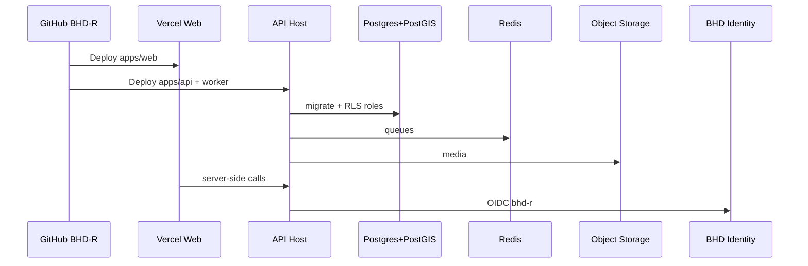

# ربط BHD R على Vercel — دليل تمهيدي

**المستودع:** [ainoamn/BHD-R](https://github.com/ainoamn/BHD-R)  
**منصة الواجهة المقترحة:** [Vercel](https://vercel.com/)  
**النطاق المقترح:** `r.bhd-om.com`

هذا الدليل يجهّز الربط. تنفيذ الإعداد على حسابات Vercel/Neon/Redis/S3 يحتاج صلاحياتك.

---

## 1. ماذا يُنشر أين؟

BHD R Monorepo متعدد الخدمات. **Vercel مناسب أساساً لـ `apps/web`**.

| المكوّن | التوصية |
| --- | --- |
| `apps/web` (Next.js 16) | **Vercel** |
| `apps/api` (NestJS/Fastify طويل الأمد) | حاوية / Render / Fly / VM / Kubernetes — ليس Serverless صرفاً إن احتجت WebSockets طويلة أو اتصال DB دائم كثيف |
| `apps/worker` (Chromium + طوابير) | **ليس على Vercel Serverless** — يحتاج حاوية مع Chromium وRedis |
| PostgreSQL + PostGIS | Neon أو RDS أو Managed PG مع PostGIS |
| Redis | Upstash أو Redis Cloud |
| S3 | AWS S3 / Cloudflare R2 / متوافق |
| البريد | مزود SMTP إنتاجي |

يمكن لاحقاً وضع API على Vercel عبر adapter مخصص، لكن التصميم الافتراضي للإصدار 0.1.0 يفترض API وWorker كخدمات طويلة الأمد.

---

## 2. إعداد مشروع Vercel (Web)

> **مهم جداً:** Root Directory يجب أن يكون `apps/web` فقط.  
> إذا تُرك فارغاً أو ضُبط على `apps/api` سيظهر الخطأ:  
> `No Next.js version detected` لأن جذر المستودع و`apps/api` لا يحتويان على حزمة `next`.

1. ادفع المستودع إلى GitHub: `https://github.com/ainoamn/BHD-R`.
2. في [vercel.com](https://vercel.com/) → **Add New Project** → استورد `ainoamn/BHD-R`.
3. في **Settings → General → Root Directory** اختر **`apps/web`** واحفظ.
4. فعّل **Include source files outside of the Root Directory** (للـ monorepo / workspace packages).
5. إعدادات البناء المقترحة (أو اتركها لتقرأ من `apps/web/vercel.json`):

| الحقل | القيمة |
| --- | --- |
| Framework Preset | Next.js |
| Root Directory | `apps/web` |
| Install Command | `cd ../.. && pnpm install --frozen-lockfile` |
| Build Command | `cd ../.. && pnpm --filter @bhd-r/web... build` |
| Output Directory | (اترك افتراضي Next — لا تملأه يدوياً) |
| Node.js Version | 24.x |

ملف الإعداد داخل المستودع: [`apps/web/vercel.json`](../apps/web/vercel.json).

4. اربط النطاق المخصص `r.bhd-om.com` بعد التحقق من DNS.
5. فعّل HTTPS؛ لا تعطّل HSTS بعد التحقق الكامل من كل الـ subdomains ذات الصلة.

---

## 3. متغيرات البيئة على Vercel (Web فقط)

ضع في Vercel **قيم الواجهة العامة وبروكسي API** فقط. لا تضع أسرار قاعدة البيانات أو مفاتيح التشفير في `NEXT_PUBLIC_*`.

أمثلة شائعة للويب:

```env
NEXT_PUBLIC_SITE_URL=https://r.bhd-om.com
PUBLIC_SITE_URL=https://r.bhd-om.com
NEXT_PUBLIC_API_ORIGIN=https://r.bhd-om.com
PUBLIC_API_ORIGIN=https://r.bhd-om.com
API_INTERNAL_ORIGIN=https://api.r.bhd-om.com
PUBLIC_MEDIA_BASE_URL=https://cdn.example.com/bhd-r-public
COOKIE_SECURE=true
```

أسرار الجلسة/OIDC/DB تُحقن في خدمة **API** وليس في Bundle المتصفح.

القائمة الكاملة المرجعية: [`.env.example`](../.env.example).

---

## 4. ترتيب الربط الموصى به



1. أنشئ قواعد Staging منفصلة عن Production.
2. شغّل migrations بحساب migrator (ليس حساب runtime).
3. انشر API وWorker وصحّح `/health/ready`.
4. انشر Web على Vercel ووجّه `API_INTERNAL_ORIGIN`.
5. سجّل عميل OIDC `bhd-r` مع redirect URIs الدقيقة.
6. Smoke: دخول، بحث عام، رفض cross-tenant، إنشاء عقار، فاتورة تجريبية، طابور وسائط.

---

## 5. Checklist قبل الإنتاج على Vercel

- [ ] المستودع على GitHub متصل بالمشروع
- [ ] Root/Install/Build صحيحة لـ monorepo + pnpm
- [ ] لا أسرار في `NEXT_PUBLIC_*`
- [ ] نطاق DNS وTLS جاهزان
- [ ] API وWorker يعملان خارج Serverless إن لزم
- [ ] PostGIS مفعّل على قاعدة البيانات
- [ ] CORS allowlist يطابق أصل Vercel فقط
- [ ] CSP/HSTS مجرّبان على staging
- [ ] OIDC callbacks مطابقة
- [ ] مراقبة Sentry/OTEL (اختياري لكن موصى)

تفاصيل طوبولوجيا أشمل: [`DEPLOYMENT.md`](./DEPLOYMENT.md).

---

## 6. حدود هذا الدليل

لا يعدّل هذا المستودع حساب Vercel نيابة عنك، ولا يدوّر مفاتيح، ولا يضبط DNS. بعد منحك الصلاحيات أو تنفيذ الخطوات يدوياً، يصبح الربط جاهزاً للنشر المستمر من فرع `main`.
