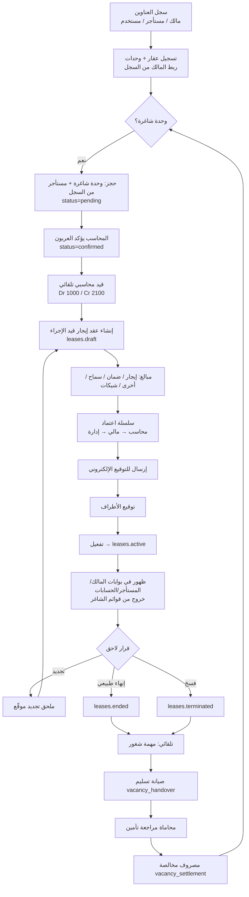
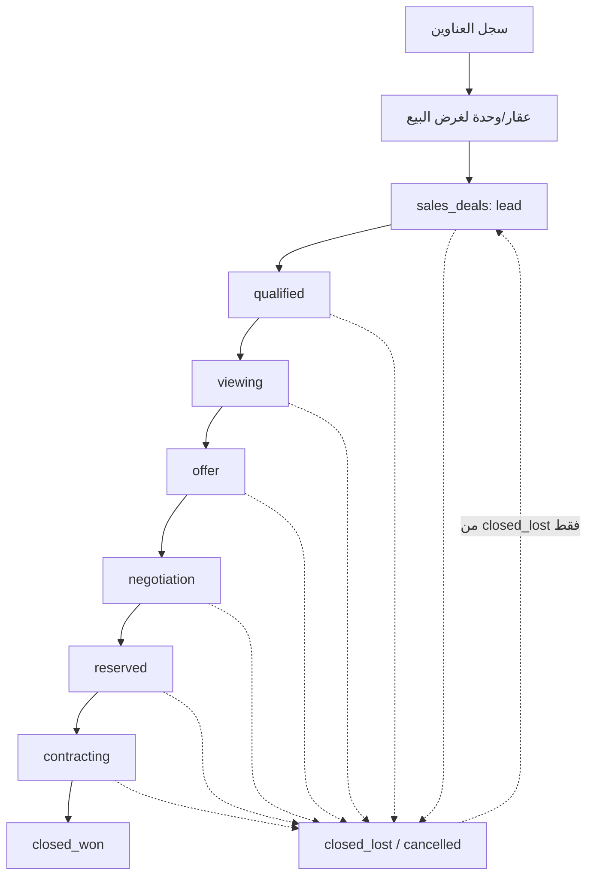
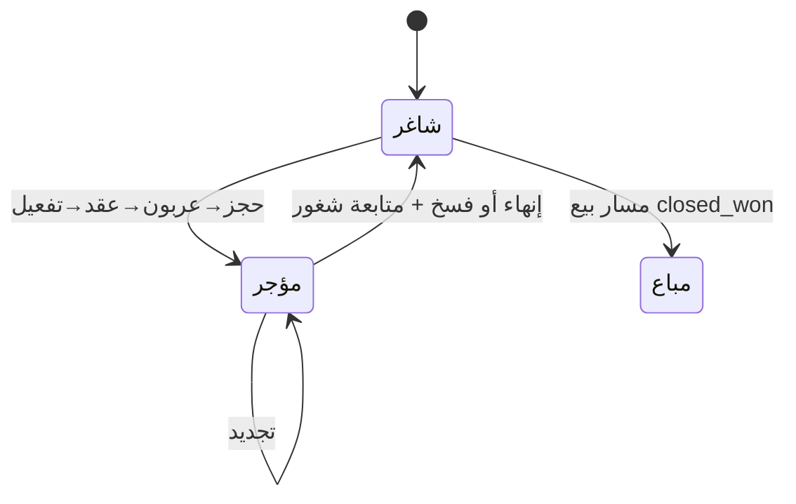

# خارطة مسار المعاملة — BHD-R (للمراجعة)

**التاريخ:** 2026-08-25  
**الغرض:** مراجعة بشرية للمسار التشغيلي (إيجار / بيع / إعادة تأجير) قبل أي تصحيح.

## كيف تستعرض المخطط

1. **الأسهل:** افتح الملف التالي في المتصفح (Chrome أو Edge):  
   [`TRANSACTION-FLOW-MAP.html`](./TRANSACTION-FLOW-MAP.html)  
   مسار كامل على جهازك:  
   `BHD-R\docs\implementation\TRANSACTION-FLOW-MAP.html`
2. **أو** ابقَ على هذا الملف Markdown — رسوم Mermaid تظهر إذا فعّلت معاينة Markdown في Cursor (`Ctrl+Shift+V`).
3. ملف Canvas داخل Cursor قد لا يظهر في كل الإصدارات؛ تجاهله واستخدم HTML أعلاه.

---

## أ) مسار الإيجار (من تخزين العقار حتى الشغور ثم الإيجار من جديد)

### حالات الإيجار المختصرة

| المرحلة | الكود في النظام | المسؤول |
|---------|------------------|---------|
| حجز معلّق | `reservations.pending` | عمليات |
| عربون مؤكد | `reservations.confirmed` + قيد `reservation_deposit` | محاسب |
| قيد الإجراء | `leases.draft` + اعتمادات + شيكات | محاسب/مالي/إدارة |
| ساري | `leases.active` بعد توقيع | عمليات |
| تجديد | ملحق → يعود لدورة مسودة/ساري | عمليات |
| منتهٍ / مفسوخ | `ended` / `terminated` | عمليات |
| شاغر مرة أخرى | مهمة + صيانة + محاماة + مصروف | تلقائي ثم متابعة |

---

## ب) مسار البيع (منفصل عن الإيجار)

### حالات البيع المختصرة

| المرحلة | الكود | ملاحظة |
|---------|-------|--------|
| عميل محتمل | `lead` | بداية الصفقة |
| مؤهل | `qualified` | |
| معاينة | `viewing` | قد ترتبط بطلب معاينة تشغيلي |
| عرض / تفاوض | `offer` → `negotiation` | |
| محجوز بيع | `reserved` | ليس نفس حجز الإيجار |
| تعاقد | `contracting` | |
| ناجح | `closed_won` | نهاية سعيدة |
| خسارة | `closed_lost` | يمكن الرجوع لـ `lead` |
| ملغى | `cancelled` | نهاية |

---

## ج) حلقة حياة الوحدة

---

## د) نقاط أعتقد أنها تحتاج مراجعتك

1. **بيع بعد `closed_won`:** هل تريد نقل ملكية تلقائي في النظام أم إجراء يدوي خارجي؟
2. **التجديد:** هل يكفي ملحق موقّع ثم تفعيل، أم جدول شيكات/فوترة جديد إلزامي كل مرة؟
3. **الفسخ مقابل الإنهاء:** هل مخالصة التأمين تختلف بينهما؟
4. **البيع من وحدة كانت مؤجرة:** هل يُمنع البيع إلا بعد إنهاء الإيجار؟
5. **Nest على الإنتاج:** بدون `API_INTERNAL_ORIGIN` المسار التشغيلي لا يكتمل على Vercel.

---

## هـ) اكتب تصحيحاتك هنا (أو في المحادثة)

- مرحلة ناقصة: …
- ترتيب خاطئ: …
- مسار بيع ناقص: …
- قاعدة عمل جديدة: …
