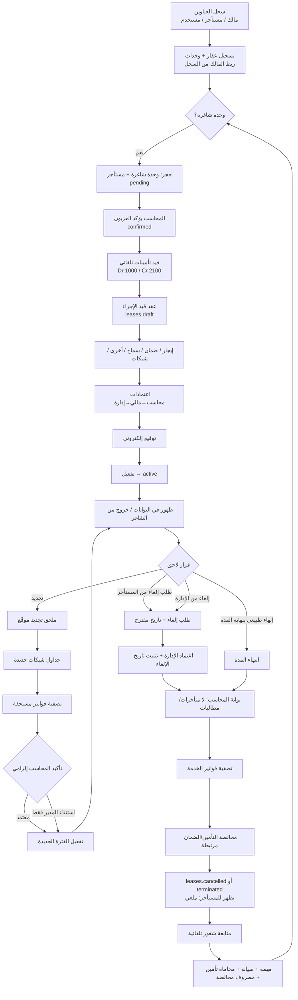
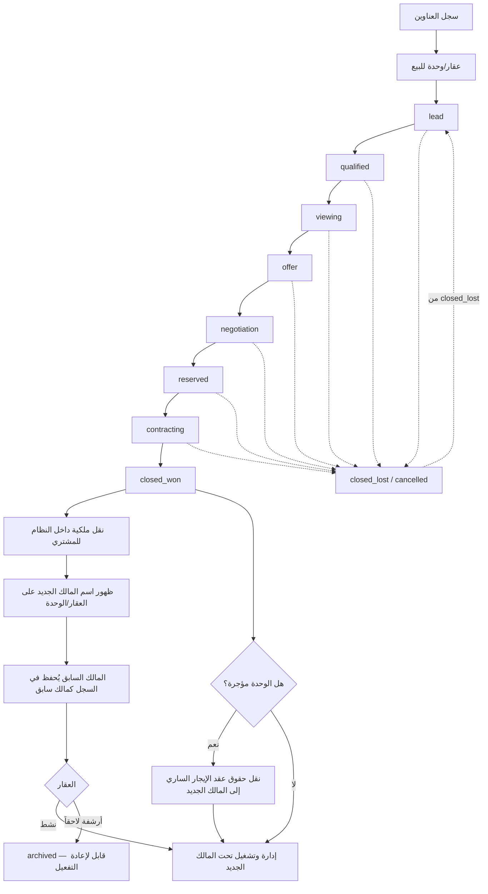
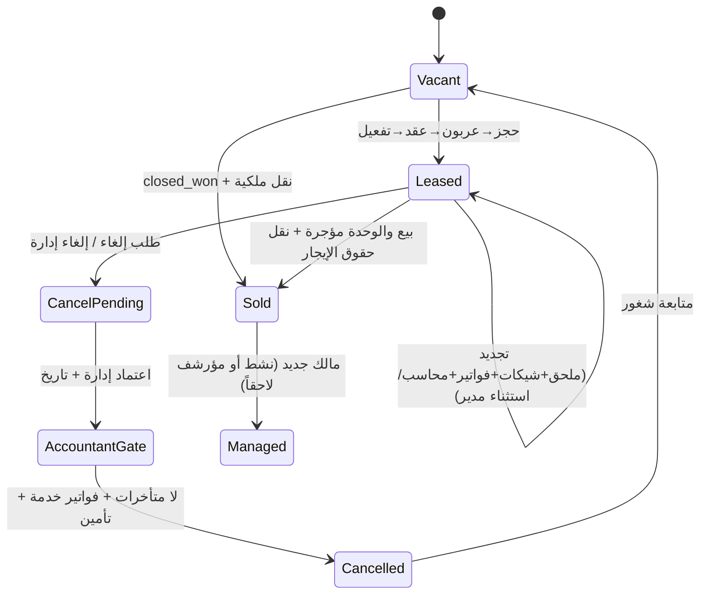

# خارطة مسار المعاملة — BHD-R (معتمدة للمراجعة والتطوير)

**الإصدار:** 1.1  
**تاريخ الاعتماد (قرارات العمل):** 2026-08-25  
**الحالة:** مرجع رسمي للدورة التشغيلية — يُحدَّث عند كل قرار عمل جديد  
**الاستعراض:** افتح [`TRANSACTION-FLOW-MAP.html`](./TRANSACTION-FLOW-MAP.html) في المتصفح، أو معاينة Markdown (`Ctrl+Shift+V`).

> أي تغيير على الدورة يُوثَّق هنا أولاً (رقم الإصدار + التاريخ + ملخص القرار)، ثم يُنفَّذ في الكود.

---

## قرارات العمل المعتمدة (1.1)

| # | الموضوع | القرار |
|---|---------|--------|
| R1 | إلغاء / فسخ الإيجار | المستأجر يقدّم **طلب إلغاء** مع وصوله للإدارة للاعتماد وتحديد **تاريخ الإلغاء**. الإدارة أيضاً تستطيع بدء الإلغاء. قبل ظهور الحالة «ملغي» للمستأجر: **اعتماد المحاسب** بأنه لا متأخرات/مطالبات، وأن **فواتير الخدمة صُفّيت**. بعدها تظهر للمستأجر **ملغي**. |
| R2 | التأمين / الضمان | في **كل** حالات الخروج (إنهاء طبيعي أو فسخ/إلغاء) التأمين **مرتبط** بالمخالصة. |
| R3 | التجديد | ملحق **موقّع** ثم إلزاماً: جداول الشيكات + تصفية الفواتير + **تأكيد المحاسب**. يمكن **تجاهل** هذا المسار فقط باستثناء/موافقة **المدير**. |
| R4 | بيع ناجح | نقل ملكية **داخل النظام** للمشتري؛ يظهر اسم المالك الجديد؛ يمكن لاحقاً أرشفة العقار أو تفعيله وإدارته؛ الربط بالمالك الجديد مع **الإبقاء على المالك السابق** في السجلات كمالك سابق. |
| R5 | بيع وحدة مؤجرة | **مسموح**. تُنقل حقوق ملكية الإيجار (العقد الساري) إلى المالك الجديد دون اشتراط إنهاء الإيجار أولاً. |

---

## أ) مسار الإيجار الكامل

### حالات الإيجار (بعد القرار 1.1)

| المرحلة | الحالة المتوقعة | المسؤول |
|---------|------------------|---------|
| حجز معلّق | `reservations.pending` | عمليات |
| عربون مؤكد | `confirmed` + قيد `reservation_deposit` | محاسب |
| قيد الإجراء | `leases.draft` + اعتمادات/شيكات/توقيع | محاسب/مالي/إدارة |
| ساري | `leases.active` | عمليات |
| طلب إلغاء | طلب من المستأجر أو الإدارة + تاريخ إلغاء | مستأجر / إدارة |
| بانتظار المحاسب قبل الإلغاء | تحقق: لا متأخرات، فواتير خدمة مصفاة، مخالصة تأمين | محاسب |
| ملغي (ظاهر للمستأجر) | بعد اعتماد المحاسب | نظام |
| تجديد | ملحق موقّع → شيكات → فواتير → تأكيد محاسب (أو استثناء مدير) | عمليات + محاسب (+ مدير للاستثناء) |
| شاغر مرة أخرى | مهمة/صيانة/محاماة/مصروف | تلقائي ثم متابعة |

---

## ب) مسار البيع + نقل الملكية

### قواعد البيع المعتمدة

1. البيع **لا يُمنع** بسبب وجود إيجار ساري.
2. عند البيع والوحدة مؤجرة: تُنقل **حقوق ملكية الإيجار** (المالك كطرف في العقد) إلى المالك الجديد؛ المستأجر يبقى على عقده ما لم يُلغَ بمسار الإلغاء المعتمد.
3. بعد `closed_won`: نقل ملكية داخل النظام + سجل تاريخي للملاك.

---

## ج) حلقة حياة الوحدة (محدّثة)

---

## د) فجوة التنفيذ مقابل القرار (للتطوير لاحقاً)

| القرار | في الكود اليوم | المطلوب لاحقاً |
|--------|----------------|-----------------|
| R1 طلب إلغاء + تاريخ + اعتماد إدارة ثم محاسب | `end`/`terminate` مباشر من ops | مسار طلب → إدارة → محاسب → ثم ملغي للمستأجر |
| R2 تأمين في كل خروج | مخالصة/مهمة شغور جزئياً | ربط إلزامي بمخالصة التأمين قبل الإغلاق |
| R3 تجديد بشيكات+فواتير+محاسب/استثناء مدير | ملحق تجديد موقّع | بوابة محاسب إلزامية + استثناء مدير |
| R4 نقل ملكية داخل النظام | بيع صفقة بدون نقل ملكية كامل | نقل `ownerPartyId` + تاريخ ملاك سابقين |
| R5 بيع مؤجّر + نقل حقوق الإيجار | غير مكتمل | تحديث `ownerPartyId` على العقد/الوحدات مع بقاء المستأجر |

---

## هـ) سجل الإصدارات

| الإصدار | التاريخ | التغيير |
|---------|---------|---------|
| 1.0 | 2026-08-25 | مسودة أولية للمراجعة |
| 1.1 | 2026-08-25 | اعتماد: مسار إلغاء بطلب+محاسب؛ تجديد بشيكات/فواتير؛ نقل ملكية عند البيع؛ بيع مؤجّر مسموح؛ تأمين في كل خروج |

---

## و) كيف نحدّث هذا الملف لاحقاً

1. اكتب القرار الجديد في المحادثة أو في قسم «قرارات العمل».
2. زد رقم الإصدار (1.2، 1.3…).
3. عدّل مخططات Mermaid + الجداول.
4. حدّث [`TRANSACTION-FLOW-MAP.html`](./TRANSACTION-FLOW-MAP.html) بنفس المحتوى.
5. عند التنفيذ في الكود: حدّث عمود «فجوة التنفيذ» و`STATUS.md`.
