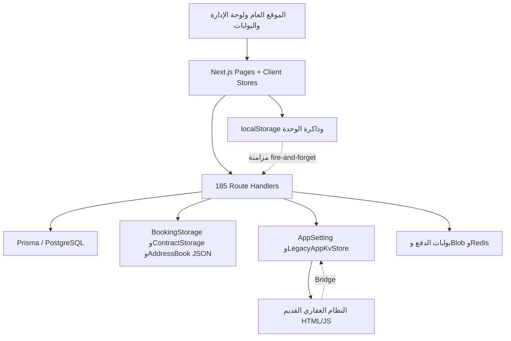
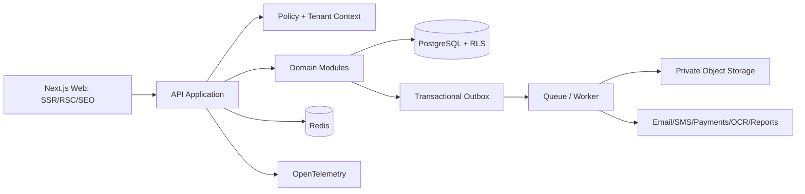

# المراجعة الوظيفية والمعمارية الشاملة لمنصة BHD‑OM

**تاريخ المراجعة:** 23 أغسطس 2026  
**المستودع:** [ainoamn/bhd-om](https://github.com/ainoamn/bhd-om)  
**الإصدار المثبّت للمراجعة:** [`8ec962d59a6a814c0b047cab8202ad6f832e470a`](https://github.com/ainoamn/bhd-om/commit/8ec962d59a6a814c0b047cab8202ad6f832e470a)  
**آخر تعديل في الإصدار:** 20 أغسطس 2026 — إضافة دخول BHD الموحّد وكتالوج تطبيقات المكتب  
**طبيعة التقرير:** تحليل مصدر، وتتبع وظيفي، وفهرسة آلية لكل الملفات المتعقبة، واختبارات بناء وجودة واعتماديات. ليس اختبار اختراق للإنتاج ولا شهادة امتثال.

---

## 1. الحكم التنفيذي

المشروع ليس مجرد موقع لعرض العقارات. هو محاولة لبناء منصة تشغيل عقاري متكاملة تجمع:

- موقعاً عاماً للتسويق والعقارات والمشاريع والخدمات.
- إدارة العقارات والوحدات والحجوزات والمعاينات.
- دفتر عناوين للأفراد والشركات والمستأجرين والملاك والموردين والمفوّضين.
- جمع المستندات والشيكات ومراجعتها.
- إنشاء عقود الإيجار والبيع والاستثمار والموافقات والتوقيعات.
- بوابات للمستأجر والمالك.
- محاسبة مزدوجة القيد ومدفوعات واشتراكات.
- صيانة وإشعارات ومهام وتقييم مستأجر.
- محتوى الموقع والإعلانات والقوالب والتقارير والنسخ الاحتياطي والأرشفة.
- نظام عقاري قديم كبير مضمن داخل النظام الحديث.

الفكرة التجارية قوية والنطاق الوظيفي واسع، والتقنيات الأمامية حديثة. لكن التنفيذ الحالي **ليس منصة موحدة ذات مصدر حقيقة واحد**. إنه أربعة أنظمة بيانات تعمل معاً بدرجات متفاوتة:

1. جداول PostgreSQL طبيعية عبر Prisma.
2. جداول تخزن كائنات JSON مشفرة أو شبه مشفرة.
3. إعدادات عامة ومخزن Legacy KV.
4. مخازن داخل ذاكرة المتصفح و`localStorage` مع مزامنة غير مضمونة.

هذه هي المشكلة المركزية التي تتفرع منها معظم الأعطال: قد ينشئ المستخدم عقاراً في الواجهة ولا يصبح سجلاً دائماً، وقد ترى الإدارة بيانات من مصدر بينما يرى الموقع العام بيانات ثابتة من مصدر آخر، وللعقود نموذجان مختلفان للحالة، وبعض التقارير مجرد واجهات تجريبية لا تقارير فعلية.

**قرار المراجعة:** لا أنصح باستنساخ الكود الحالي أو توسيع النظام القديم كما هو. الأنسب لبناء الموقع الأفضل هو الاحتفاظ بقواعد العمل النافعة، وتصميم منصة جديدة بمصدر حقيقة واحد ووحدات واضحة، ثم ترحيل البيانات والتدفقات تدريجياً. ويمكن استعمال أجزاء محددة من المشروع مرجعاً أو إعادة استخدامها بعد عزلها، خصوصاً واجهات العرض، وقواعد العقود، ومولد الأرقام الذري، وأجزاء المحاسبة.

---

## 2. ماذا تعني «مراجعة المشروع كاملاً» هنا؟

تمت فهرسة **كل ملف متعقب في Git**، وقراءة كل ملف نصي آلياً لاستخراج الحجم واللغة والاستيرادات والتصديرات ومسارات الصفحات وواجهات API واستعمال Prisma والتخزين المحلي. ثم تم تتبع المسارات الوظيفية الحرجة يدوياً من الواجهة إلى API ثم التخزين.

| المقياس                                |               النتيجة |
| -------------------------------------- | --------------------: |
| الملفات المتعقبة                       |                 1,235 |
| الملفات النصية المقروءة آلياً          |                 1,122 |
| ملفات المصدر                           |                   905 |
| ملفات المصدر النشطة خارج النظام القديم |                   820 |
| أسطر المصدر النشطة                     |               134,116 |
| صفحات Next.js                          |                    84 |
| صفحات عميلة بالكامل                    |                    64 |
| مسارات API                             |                   185 |
| عمليات HTTP المكتشفة                   |                   241 |
| نماذج Prisma                           |                    49 |
| حقول Prisma                            |                   598 |
| Enums                                  | 29، وبداخلها 146 قيمة |

يوجد أيضاً مجلد `legacy` يحوي 212 ملفاً ونحو 538 ألف سطر نصي، أغلبها نسخ HTML/JavaScript ضخمة أو أدوات تشغيل قديمة. لذلك عبارة «حرفاً حرفاً» لا تعني أن كل بايت في صورة أو PDF حصل على تفسير بشري مستقل؛ بل تعني أن كل الملفات دخلت الفهرس، وكل المصادر النصية دخلت المسح، ثم فُحصت يدوياً الوحدات التي تصنع السلوك الحقيقي. لا يجوز مهنياً الادعاء أن مراجعة واحدة تثبت انعدام الأخطاء أو الثغرات.

### مرفقات المراجعة القابلة للفرز

- `BHD-OM-code-inventory.csv`: كل ملف، حجمه، أسطره، وهل هو عميل، واستيراداته وتخزينه وإشاراته التقنية.
- `BHD-OM-page-catalog.csv`: كل صفحة ومسارها وحجمها واعتمادها على العميل والتخزين المحلي.
- `BHD-OM-api-catalog.csv`: كل API وعملياتها والحراس الظاهرون وموديلات Prisma المستعملة.
- `BHD-OM-prisma-usage.csv`: خريطة استعمال كل نموذج Prisma في الكود.
- `BHD-OM-data-model.csv`: قاموس كل نموذج وحقل وفهرس وقيد في Prisma.
- `BHD-OM-enums.csv`: جميع قيم الحالات والأدوار والأنواع.
- `BHD-OM-inventory-summary.json` و`BHD-OM-schema-summary.json`: ملخصات آلية.

---

## 3. هدف البرنامج كما يظهر من الكود

اسم الشركة والمحتوى الافتراضي يقدمان «بن حمود للتطوير» كشركة عمانية للتطوير والاستثمار وإدارة العقارات. الهدف الفعلي للمنصة أوسع من الإعلان:

1. جذب الزائر بعقارات للإيجار أو البيع ومشاريع وخدمات.
2. تحويل الزائر إلى حجز أو طلب معاينة.
3. جمع هوية الفرد أو الشركة والمفوّضين والمستندات والشيكات.
4. التحقق من الدفع وموافقة المحاسب.
5. إنشاء عقد وإدارته حتى موافقات الإدارة والمستأجر والمالك والتوقيع.
6. تحويل العلاقة إلى تشغيل مستمر: استحقاقات، إيصالات، صيانة، تنبيهات، مهام وتجديد أو إلغاء.
7. تمكين المالك والإدارة من متابعة المحفظة.
8. ربط العمليات بدفتر عناوين ومحاسبة واشتراكات وأرشيف.
9. تقديم المنصة كأحد تطبيقات مجموعة BHD مع دخول موحد وتبديل بين التطبيقات.

هذا تصور منتج جيد: **CRM عقاري + PMS لإدارة الممتلكات + عقود ومدفوعات + محاسبة + بوابات أصحاب العلاقة**. المشكلة ليست في الفكرة، بل في أن حدود هذه المنتجات لم تُفصل تقنياً، فاختلطت بيانات العرض التجريبية ببيانات التشغيل الحقيقية.

---

## 4. التقنيات واللغات المستعملة

| الطبقة          | التقنية الحالية                                                                                        | الملاحظة                                              |
| --------------- | ------------------------------------------------------------------------------------------------------ | ----------------------------------------------------- |
| الواجهة والخادم | Next.js 16 App Router                                                                                  | يجمع الصفحات وRoute Handlers في تطبيق واحد            |
| الواجهة         | React 19 + TypeScript 5                                                                                | حديث، لكن عدد كبير من الصفحات `use client`            |
| التصميم         | Tailwind CSS 4 + CSS مخصص                                                                              | RTL وعربي/إنجليزي                                     |
| الترجمة         | `next-intl`                                                                                            | لغتان ثابتتان: العربية والإنجليزية                    |
| البيانات        | PostgreSQL + Prisma 7 + `@prisma/adapter-pg`                                                           | توجد فجوة إصدارات بين Prisma CLI/Client/Adapters      |
| المصادقة        | NextAuth 4 Credentials + Google/Azure اختيارياً + BHD OIDC مخصص                                        | أكثر من مسار دخول ينشئ جلسة بطرق مختلفة               |
| التحقق          | Zod في بعض المسارات + تحقق يدوي في أخرى                                                                | لا توجد DTOs موحدة لكل API                            |
| التخزين السريع  | Upstash Redis اختيارياً                                                                                | يستعمل أساساً للـrate limiting/cache                  |
| الملفات         | Vercel Blob أو تخزين محلي/قديم                                                                         | لا يوجد File Service موحد بسياسة ملكية وفحص واحدة     |
| الدفع           | Stripe وThawani وPayPal وTelr وCMI وNetwork International وHyperPay وPayFort وMyFatoorah وPayTabs وTap | 11 موصلاً، لكن طبقة الاعتمادية والتسوية تحتاج إصلاحاً |
| OCR             | Tesseract و`pdf-parse`                                                                                 | الاستخراج اقتراح أولي وليس ذكاء محاسبياً موثوقاً      |
| الاختبارات      | Node test runner + Playwright                                                                          | وحدة وE2E أولية، بلا تغطية كافية للمخاطر              |
| النشر المتوقع   | Vercel + PostgreSQL/Neon                                                                               | البناء الحالي يربط الهجرة بالبناء                     |

### ملاحظة مهمة عن حداثة التقنية

استخدام أحدث إطار لا يجعل النظام تلقائياً أفضل. Next.js وReact في المشروع حديثان فعلاً؛ التحسين الأكبر المطلوب ليس تبديل React، بل إصلاح نموذج البيانات والصلاحيات والمعاملات وفصل العمليات الثقيلة عن طلب المستخدم.

---

## 5. الخريطة المعمارية الحالية



### مصادر البيانات الأربعة

| المصدر       | أمثلة                                                                  | المشكلة                                        |
| ------------ | ---------------------------------------------------------------------- | ---------------------------------------------- |
| جداول طبيعية | User, Property, Project, Accounting*, Subscription, MaintenanceRequest | أفضل جزء، لكن `tenantId` وDecimal غير شاملين   |
| JSON تشغيلي  | BookingStorage, ContractStorage, AddressBookContact                    | البحث والتفرد والعلاقات والصلاحيات تصبح أصعب   |
| إعدادات/KV   | AppSetting, LegacyAppKvStore                                           | مفيد للإعدادات، لكنه استعمل كقاعدة أعمال كاملة |
| المتصفح      | عقارات وحجوزات وعقود وقوالب وتقارير                                    | قد يفشل التزامن أو تختلف البيانات بين الأجهزة  |

الوثائق الداخلية تقول إن PostgreSQL هو مصدر الحقيقة، لكن الكود الفعلي لا يحقق ذلك في جميع الوحدات.

---

## 6. أنواع المستخدمين والصلاحيات

### أدوار Prisma الفعلية

- `ADMIN`: إدارة النظام، وقد يكون super admin أو ذا صلاحيات جزئية.
- `COMPANY`: حساب شركة.
- `CLIENT`: عميل/مستأجر في أغلب التدفقات.
- `OWNER`: مالك عقار.
- `ORG_MANAGER`: مدير مؤسسة.

توجد أسماء أخرى في طبقات TypeScript مثل `SUPER_ADMIN` و`ACCOUNTANT` و`PROPERTY_MANAGER` و`SALES_AGENT` و`LANDLORD` و`SUBSCRIPTION_ADMIN`، لكنها ليست كلها قيماً في enum قاعدة البيانات. هذا يخلق ترجمة متكررة وغير متطابقة بين الدور المخزن والدور المتوقع.

### الصلاحيات الإدارية المعلنة

إدارة المستخدمين، العقارات، الجهات، الحجوزات، المحاسبة، التقارير، التحليلات، الإعدادات، المؤسسات، الأرشفة والاستعادة، أو وصول كامل.

### ما يحدث فعلياً

- توجد حراس جيدة في بعض المسارات مثل إدارة مشاريع وعقارات Prisma.
- توجد مسارات تكتفي بأن المستخدم مسجل، ثم تعيد بيانات واسعة مثل العقود ودفتر العناوين.
- رؤية عنصر في القائمة الجانبية ليست تفويضاً أمنياً، لكن بعض التصميم يتعامل معها كأنها طبقة صلاحية.
- الإعداد الافتراضي لأنواع دفتر العناوين يمنح كل أقسام لوحة التحكم تقريباً لكل الأنواع، ثم تعتمد الواجهة على الإخفاء.
- طبقة المحاسبة تحول `ADMIN → ADMIN` و`OWNER → APPROVER` وكل دور آخر تقريباً إلى `ACCOUNTANT`. بذلك قد يحصل عميل عادي أو حساب شركة على صلاحية محاسبية لا تناسب دوره.
- `COMPANY` و`ORG_MANAGER` لا يحصلان في API الحجوزات على نطاق المؤسسة؛ لأن أي مستخدم غير `ADMIN` يُرشح بعد تحميل البيانات بالبريد/الهاتف غالباً.

**الخلاصة:** يوجد نظام أدوار، لكنه ليس Policy Engine مركزياً ولا يضمن `user + tenant + resource + action` على كل API.

---

## 7. كيف يعمل الموقع العام؟

الموقع العام يدعم العربية والإنجليزية ويحتوي:

- الصفحة الرئيسية.
- نبذة عن الشركة.
- الخدمات.
- المشاريع وقائمة/تفاصيل المشروع.
- العقارات وقائمة/تفاصيل العقار.
- الحجز والمعاينة وشروط العقد ورفع المستندات والإيصال.
- التواصل.
- الباقات والاشتراكات.
- تسجيل الدخول والتسجيل ونسيت كلمة المرور.
- صفحات مسح QR للمستخدم وجهة الاتصال والعقار.
- صفحة توقيع برمز.

يمكن للمدير التحكم في محتوى الموقع الأساسي، ظهور الصفحات، والإعلانات من لوحة الإدارة. لكن المحتوى الافتراضي والمشاريع والعقارات العامة ما زال جزء معتبر منها ثابتاً داخل ملفات TypeScript ويُدمج مع overrides من المتصفح/الإعدادات. لذلك ليس لدينا CMS حقيقي مكتمل.

### SEO الحالي

يوجد `robots.txt` و`sitemap.xml` وJSON-LD أولي ومسارات لغتين. لكن sitemap لا يبني فهرس العقارات والمشاريع المنشورة بصورة موثوقة، وصفحات المصادقة قد تدخل الفهرسة، ولا توجد canonical/hreflang وmetadata عقارية مكتملة لكل سجل. كما لا توجد صفحات قانونية وثقة وخصوصية مكتملة.

---

## 8. إضافة العقارات وإدارتها — بالتفصيل

### 8.1 نموذج إضافة العقار

صفحة `/admin/properties/new` تستعمل نموذجاً من أربع مراحل:

1. **البيانات الأساسية**
   - الاسم العربي والإنجليزي.
   - رقم قطعة الأرض ورقم العقار ورقم الرسم المساحي.
   - العملية: إيجار، بيع، أو استثمار.
   - النوع: فيلا، شقة، أرض، مبنى، محل، معرض، مستودع، مزرعة/شاليه وغيرها.
   - النوع الفرعي ووصف العقار.

2. **الموقع والتفاصيل**
   - المحافظة والولاية والمنطقة والقرية.
   - الشارع والمبنى والعنوان الكامل والخريطة.
   - المساحة والسعر والغرف والحمامات والمواقف والتجهيزات بحسب النوع.
   - المبنى متعدد الوحدات: محلات ومعارض وشقق بأرقام وأسعار وتفاصيل منفصلة.

3. **الوسائط**
   - صورة رئيسية وصور إضافية وبيانات عرض.

4. **المراجعة والحفظ**
   - حفظ كمسودة أو نشر.

### 8.2 ماذا يحدث عند الضغط على الحفظ؟

هنا أكبر عيب وظيفي في المشروع:

- الصفحة تستدعي `createProperty()` داخل `lib/data/properties.ts`.
- الدالة تحسب `maxId + 1` وتبني رقماً مثل `PRP-R-2025-000x` بسنة ثابتة 2025.
- ثم تضيف العقار إلى مصفوفة TypeScript في ذاكرة العملية: `properties.push(newProp)`.
- ما يُحفظ إلى `localStorage` و`/api/settings/property-overrides` هو التعديل/الحالة، وليس سجل العقار الأساسي الكامل القابل لإعادة بنائه.
- `/api/admin/properties` لديه GET فقط في ملف القائمة، ولا يوجد POST ينشئ `prisma.property` لهذا النموذج.

**الأثر:** قد يظهر العقار فوراً بعد إضافته في الجلسة الحالية، ثم يختفي بعد إعادة تحميل كاملة أو على جهاز آخر؛ كما أن لوحة Prisma والموقع العام قد يعرضان قائمتين مختلفتين. هذا ليس مجرد تحسين مستقبلي، بل خلل أساسي في وظيفة «إضافة عقار».

### 8.3 عرض العقارات العامة

قائمة العقارات العامة تقرأ مصفوفة العقارات الثابتة، ثم تدمج حالة النشر والتعديلات. المباني متعددة الوحدات تتحول إلى إعلانات منفصلة لكل محل/معرض/شقة متاحة. الحالة قد تكون `AVAILABLE` أو `RESERVED` أو `RENTED` أو `SOLD`، ويُفترض ألا تظهر الوحدة غير المتاحة.

هذا المنطق التجاري مفيد ويمكن نقله إلى النظام الجديد، لكن يجب أن يعمل فوق جداول `Property → Building → Unit → Listing` حقيقية، لا مصفوفة ثابتة وoverrides.

### 8.4 الإدارة والملكية

نموذج Prisma للعقار يدعم المنشئ والمالك والمؤسسة، وصفحة الإدارة تجلب عقارات DB بنطاق وصول أفضل نسبياً. ويمكن تعديل بيانات المالك في API خاص بالعقار. لكن هذه المنظومة لا تتصل بصورة موحدة بنموذج الإضافة العام أعلاه.

### 8.5 المشاريع

إضافة المشروع أفضل من إضافة العقار: صفحة المشروع ترسل POST إلى `/api/admin/projects`، وتُنشئ سجلاً في Prisma برقم متسلسل ذري. لكن صفحات المشاريع العامة تستورد قائمة ثابتة من `lib/data/projects.ts`. أي أن المشروع الجديد في DB لا يضمن ظهوره في الموقع العام. لدينا الانقسام نفسه، وإن كان أقل سوءاً.

### التصميم الصحيح في النسخة الجديدة

- `Property` يمثل الأصل القانوني.
- `Building` يمثل المبنى إن وجد.
- `Unit` يمثل الوحدة القابلة للتأجير/البيع.
- `Listing` يمثل الإعلان العام وحالة النشر والسعر والصور وSEO.
- `Ownership` يمثل المالك ونسبته وفترة الملكية.
- كل عملية إنشاء داخل transaction، ورقم العقار من counter ذري بالسنة والنوع.
- لا بيانات عقارية تشغيلية في `localStorage`؛ يسمح فقط بمسودة مؤقتة غير معتمدة.

---

## 9. دفتر العناوين — كيف يضيف العناوين والأشخاص والشركات؟

دفتر العناوين واحد من أغنى أجزاء النظام وظيفياً. يدعم التصنيفات:

- عميل.
- مستأجر.
- مالك.
- مورد.
- شريك.
- جهة حكومية.
- مفوض بالتوقيع.
- أخرى.

### 9.1 جهة فردية

تتضمن:

- أجزاء الاسم بالعربية والاسم الإنجليزي.
- الجنس والجنسية.
- البريد والهواتف.
- الرقم المدني والجواز وتواريخ الانتهاء.
- جهة العمل والمسمى الوظيفي.
- العنوان العماني: محافظة، ولاية، منطقة، قرية، شارع، مبنى، طابق.
- ملاحظات ووسوم وروابط بمستخدم أو عقار أو وحدة.

توجد تنبيهات لانتهاء البطاقة المدنية قريباً خلال 30 يوماً والجواز خلال 90 يوماً، والتحقق من الهاتف وبعض حالات التكرار.

### 9.2 جهة شركة

تتضمن:

- الاسم العربي والإنجليزي.
- رقم السجل التجاري وتاريخ الانتهاء والتأسيس.
- عنوان الشركة ووسائل الاتصال.
- قائمة مفوضين بالتوقيع، ولكل مفوض هوية وهاتف ومنصب.
- إمكانية إنشاء المفوضين كجهات شخصية منفصلة وربطهم بالشركة.

### 9.3 دورة الحياة

- إنشاء رقم مثل `CNT-...` مع رمز للتصنيف.
- تعديل وتصنيف وبحث ودمج تكرارات.
- أرشفة بدلاً من الحذف المباشر في الواجهة.
- استيراد CSV ومزامنة من المستخدمين والحجوزات.
- إنشاء مستخدم من جهة اتصال، أو إنشاء جهة مرتبطة تلقائياً عند إنشاء المستخدم.
- إرفاق ملفات وعرض QR عام ببيانات مقنعة جزئياً.

### 9.4 التخزين والمشكلة الأمنية

الواجهة تستعمل مخزناً في الذاكرة و`localStorage` ثم تزامن JSON مع `AddressBookContact`. API GET يشترط جلسة فقط ثم يعيد دفتر العناوين الواسع، ولا يفرض مؤسسة/تصنيف/ملكية. وPOST يسمح لأي مستخدم مسجل بإرسال جهة، مع حماية محدودة فقط عند ربط `userId` مختلف.

**الأثر:** الوظيفة غنية، لكن عزل البيانات غير كافٍ. دفتر العناوين يحوي PII شديدة الحساسية ويجب أن يكون الوصول فيه حسب المؤسسة والغرض والتصنيف، مع field-level masking وسجل استعمال.

### التصميم الصحيح

افصل `Party` عن `Person` و`Organization` و`ContactPoint` و`Address` و`IdentityDocument` و`PartyRole` و`RepresentationAuthority`. يمكن للشخص أن يكون مستأجراً ومفوّضاً في الوقت نفسه دون نسخ سجله. كل حقل حساس مشفر ومفهرس بهاش بحث مملح خاص بالمؤسسة، وكل ملف خاص وله مالك وسياسة وصول.

---

## 10. الحجز والمعاينة — الرحلة الكاملة

### 10.1 ما يدخله العميل

من صفحة العقار يستطيع اختيار:

- حجز الوحدة أو طلب معاينة.
- فرد أو شركة.
- الاسم والبريد والهاتف والرقم المدني/الجواز.
- بيانات الشركة ومفوّضيها عند الحاجة.
- الوحدة داخل المبنى متعدد الوحدات.
- موعد المعاينة إن كان الطلب معاينة.
- طريقة الدفع ومرجعه وتفاصيل البنك/البطاقة بحسب التدفق.
- الموافقة على الشروط.

### 10.2 قواعد الحجز الحالية

- لا يفترض السماح لنفس المستخدم بحجز الوحدة النشطة مرتين.
- يسمح بحد أقصى لحاجزين نشطين مختلفين على الوحدة في منطق العميل.
- للحجز حالات: `PENDING`, `CONFIRMED`, `CANCELLED`, `RENTED`, `SOLD`.
- النوع `BOOKING` أو `VIEWING`.
- تحفظ لقطة السعر والعقار والوحدة والعقد وبيانات الدفع.

### 10.3 الحفظ على الخادم

الواجهة تنشئ الحجز في مخزن العميل ثم ترسل POST إلى `/api/bookings` غالباً دون انتظار صارم لكل نتيجة. الخادم:

1. يولد رقم BKG ذرياً.
2. يحمل الحجوزات ويفحص التكرار في JSON.
3. يعمل upsert في `BookingStorage` مع JSON مشفر وحقول مفهرسة محدودة.
4. إذا كان مدفوعاً، يحاول إنشاء إيصال محاسبي.

فحص التكرار ثم الحفظ ليسا transaction واحدة ولا يحميهما قيد unique يعبر عن «حجز نشط لنفس العميل/الوحدة»، لذلك توجد race condition. كما أن المسح الواسع لصفوف JSON لا يتوسع جيداً.

### 10.4 إدارة الحجز

صفحة الإدارة تعرض الطلبات، حالة الدفع، المستندات، الشيكات، الملاحظات والإلغاء. بعد تأكيد المحاسب للدفع وقبول المستندات المطلوبة يمكن إنشاء العقد. طلب الإلغاء المرتبط مالياً يتحول إلى طلب إعدادات ينتظر المحاسب لتسجيل الاسترداد أو الخصم؛ أما غير المرتبط فقد يلغى مباشرة.

### 10.5 حالة مقترحة واضحة

```text
DRAFT → SUBMITTED → PAYMENT_PENDING → PAYMENT_CONFIRMED
      → DOCUMENTS_PENDING → READY_FOR_CONTRACT → CONVERTED
      ↘ REJECTED / EXPIRED / CANCEL_REQUESTED → CANCELLED / REFUNDED
```

المعاينة يجب أن تكون Aggregate منفصلاً بحالات `REQUESTED → SCHEDULED → COMPLETED/NO_SHOW/CANCELLED`، لا حجزاً مالياً يحمل الحقول نفسها.

---

## 11. المستندات والشيكات

النظام يدعم قائمة مستندات مطلوبة قابلة للإعداد بحسب الفرد أو الشركة، مثل:

- البطاقة المدنية والجواز.
- السجل التجاري.
- بطاقات المفوضين.
- مستندات مالك حساب الشيك إن كان شخصاً/شركة مختلفة.
- رسالة ضمان دفع الإيجار.
- مستندات إضافية يحددها المدير.

يمكن للعميل الرفع، وللإدارة قبول أو رفض الملف وطلب بديل. ويدعم النظام بيانات الشيكات ومالكها والبنك والتواريخ والمبالغ والصور/المرفقات.

وظيفياً هذه بداية جيدة، لكن الملفات موزعة بين Vercel Blob وتخزين DB/قديم، والتحقق لا يوحد magic bytes وMIME والحجم ومكافحة البرمجيات الخبيثة وملكية الملف. يجب أن تصبح الملفات خدمة مستقلة بجدول metadata، وتخزين خاص، وsigned URLs قصيرة، وAV/CDR، وتدقيق لكل تنزيل.

---

## 12. العقود — الإنشاء والموافقات والتفعيل

### 12.1 أنواع العقود وبياناتها

واجهة `RentalContract` لا تقتصر على الإيجار؛ تحمل أكثر من مئتي حقل تقريباً تشمل:

- الإيجار والبيع والاستثمار.
- هوية المستأجر والمالك والعمل والعناوين.
- الإيجار الشهري/السنوي والتأمين والرسوم والضريبة والإنترنت والعدادات.
- جداول الدفعات والشيكات.
- سعر البيع والأقساط والعمولات.
- التواريخ والمستندات والملاحظات.
- موافقات الإدارة والمستأجر والمالك والتوقيعات.

### 12.2 مسار الحالة في الواجهة

```text
DRAFT
  → ADMIN_APPROVED
  → TENANT_APPROVED و/أو LANDLORD_APPROVED
  → APPROVED
  ↘ CANCELLED
```

- موافقة الإدارة تتطلب اكتمال الحقول والفحوص.
- موافقة المستأجر بعد موافقة الإدارة.
- موافقة المالك قد تكمل الاعتماد.
- توجد إمكانية اعتماد نهائي إداري.
- عند التفعيل تحاول الواجهة تحويل حالة العقار/الوحدة إلى مؤجر وحالة الحجز إلى `RENTED`.

### 12.3 ما يفعله الخادم

- POST `/api/contracts` يتطلب مستخدماً مسجلاً وحجزاً أكد المحاسب دفعه.
- يحفظ العقد JSON في `ContractStorage` ويزامن لقطة العقد وحالته إلى `BookingStorage`.
- GET `/api/contracts` يعيد قائمة العقود لمستخدم مسجل بلا نطاق ملكية/مؤسسة واضح.
- PATCH `/api/contracts/[id]` يتطلب تسجيل الدخول فقط، ثم يقبل patch واسعاً وحالة يرسلها العميل. لا يطبق دوراً محدداً ولا ملكية العقد ولا transitions مسموحة بصورة مركزية.

هذه واحدة من أخطر الفجوات: يمكن لمستخدم مصادق أن يحاول قراءة أو تغيير عقد لا يخصه إذا عرف المعرّف، لأن التفويض الفعلي موجود غالباً في الواجهة لا الخدمة.

### 12.4 العقد القديم الموازي

النظام العقاري القديم يحتفظ بعقود في مفاتيح KV منفصلة، ويحسب حالات مثل:

- عقد نشط لكن بياناته ناقصة.
- مستندات ناقصة.
- محاسبة/شيكات/تأمين ناقصة.
- مكتمل ونشط.

كما يدمج التجديدات حسب رقم الاتفاقية والوحدة. هذا نموذج حالة ثانٍ مختلف عن `RentalContract` الحديث. وقد تظهر الوحدة مؤجرة في النظام القديم بينما عقدها في النظام الحديث ما زال في حالة أخرى.

### التصميم الصحيح

يجب فصل:

- `Contract` للهوية والنوع والأطراف والوحدة.
- `ContractVersion` لكل نسخة غير قابلة للتعديل بعد التوقيع.
- `ContractTerm` و`PaymentSchedule` و`Deposit` و`Cheque`.
- `Approval` و`SignatureEnvelope` و`DocumentRequirement`.
- state machine خادمية تمنع الانتقال غير المسموح.
- optimistic locking برقم version.
- transaction واحدة عند التفعيل تحدث العقد والوحدة والحجز والجداول المالية وتكتب outbox event.

---

## 13. إدارة المستأجرين والملاك

### بوابة المستأجر

يوجد إصداران v1 وv2. الإصدار الثاني يعرض:

- العقود.
- الدفعات والاستحقاقات.
- التنبيهات والمهام.
- طلبات الصيانة.
- تقييم المستأجر.
- تقويم/ملخص، والدفع من بوابات الدفع.
- التوقيع الذكي.

تقييم المستأجر ليس نموذج ذكاء اصطناعي؛ هو قواعد تستنتج درجة من تأخر الإيجار والفواتير وتكرار الصيانة. وهذا مقبول إذا سُمي «تقييم قواعد» مع تفسير وعدالة وإمكانية اعتراض، لكنه مضلل إذا قُدم كذكاء متقدم.

### بوابة المالك

تعرض عقارات `ownerId` والعقود والمصروفات وبعض مؤشرات المستأجرين. لكن `totalIncome` في v2 يساوي عدد العقود في أحد المواضع، لا مجموع الإيرادات؛ لذلك بعض الأرقام placeholders وليست KPIs مالية.

### الإدارة اليومية

- مدير النظام يرى لوحة إحصاءات حديثة من DB للحجوزات والمستخدمين والمشاريع والاشتراكات والصيانة والرسائل.
- COMPANY/ORG_MANAGER يفترض أن يديرا مؤسستهما وعقاراتهما.
- OWNER يفترض أن يراقب محفظته ولا يعدل كل شيء.
- CLIENT يتابع حجوزاته وعقوده وفواتيره وإيصالاته وصيانته.

لكن التنفيذ لا يفرض هذا النموذج بالتساوي في كل API. النظام الجديد يجب أن يعتبر `Tenant` المؤسسة، و`Party` الطرف، و`Membership` عضوية المستخدم، ويطبق policy موحدة لكل مورد.

---

## 14. الصيانة والإشعارات والمهام

- يمكن للعميل/المالك إنشاء طلب صيانة يخصه.
- يحدد العقار/الوحدة والوصف والأولوية، وتدير الإدارة الحالة والملاحظات.
- الحالات والتفاصيل مخزنة في Prisma.
- توجد إشعارات تُنشأ أو تزامن من الحجوزات والعقود، ويمكن تعليمها كمقروءة.
- توجد مهام وتنبيهات في بوابة المستأجر.

المطلوب في المنصة الجديدة:

- ربط الطلب بعقد ووحدة ومؤسسة إلزامياً.
- SLA وأولوية ومورد/فني وتكلفة وموافقة المالك.
- timeline للأحداث والمرفقات.
- workflow للتقدير والموافقة والتنفيذ والفاتورة والإغلاق والتقييم.
- إشعارات عبر outbox وqueue، لا side effects داخل GET أو طلب المستخدم.

---

## 15. المدفوعات والاشتراكات

### المدفوعات

يوجد abstraction لاختيار البوابة، وإنشاء جلسة، ثم إعادة التوجيه، ثم التحقق/الـwebhook وتسجيل العملية وربطها بالمحاسبة أو الاستحقاق. هذه بنية مبدئية جيدة، لكن توجد مشكلات حرجة:

- webhook العام لا يتحقق من توقيع مزود بصورة موحدة، ويقبل GET بتحويله إلى POST.
- لا يوجد جدول `WebhookEvent` بقيد unique على `provider + eventId`.
- التسجيل المالي يستعمل في بعض المواضع نمط `find ثم create` و`count()+1` بلا transaction.
- لا توجد idempotency key إجبارية من العميل إلى الدفع إلى المستند المحاسبي.
- صفحة نجاح دفع المستأجر تثبت session دفع، لكنها تعتمد أيضاً على query parameters مثل `dueId/userId` لربط النتيجة؛ يجب اشتقاقها حصراً من metadata موثقة عند الإنشاء.

### الاشتراكات

توجد باقات Basic/Standard/Premium/Enterprise، شهرية أو سنوية، بعملة OMR وميزات وحدود JSON. وتوجد:

- باقات عامة.
- إسناد اشتراك وتاريخ تغييرات.
- ترقية/تخفيض وطلبات تغيير.
- دفع وإيصال واسترداد.
- تنبيهات قرب الانتهاء.

لكن إنفاذ limits غير شامل، وبعض GETs تغير حالة الاشتراك المنتهي؛ والقراءة لا ينبغي أن تنفذ business mutation. كما أن أسعار الباقات والعملة `Float`/number.

### النموذج الصحيح للدفع

```text
PaymentIntent(unique idempotency key)
  → ProviderSession
  → signed WebhookEvent(unique provider event id)
  → PaymentAttempt
  → Captured/Failed/Refunded
  → immutable Ledger Posting + Outbox
```

كل مبلغ `Decimal/Numeric` مع عملة ISO 4217 وعدد المنازل العشرية الصحيح، وكل transition داخل transaction مع replay-safe handlers.

---

## 16. المحاسبة — ما هو حقيقي وما هو تجريبي؟

### الأجزاء الحقيقية

توجد محاسبة مزدوجة القيد تشمل:

- دليل حسابات: أصول، خصوم، حقوق ملكية، إيرادات، مصروفات.
- قيود يومية وأسطر مدين/دائن.
- مستندات بيع وشراء وفواتير وإيصالات ومدفوعات.
- فترات مالية وإغلاق/قفل.
- اعتماد وإلغاء وسجل تدقيق.
- ربط حجز مدفوع بإيصال وقيد.
- تسوية/مطابقة بنكية من CSV.
- توقعات بخط انحدار ومتوسطات، وليست نموذج AI خارجي.
- OCR لاستخراج رقم/تاريخ/مبلغ/ضريبة من نص الفاتورة.
- اقتراح حساب القيد بكلمات مفتاحية وقواعد.

### التقارير المحاسبية الفعلية

- ميزان المراجعة.
- قائمة الدخل والأرباح والخسائر.
- الميزانية العمومية.
- التدفق النقدي.
- كشف الحساب البنكي.
- كشف العقار أو المستأجر.
- ضريبة القيمة المضافة وتصدير XML/JSON.
- أعمار الذمم المدينة والدائنة.
- مطابقة البنك.
- مقارنة الفترات.

### المشكلات

- المال مخزن `Float` ويحسب بأرقام JavaScript.
- معظم الجداول المالية بلا tenant key شامل.
- صلاحية المحاسبة تعطي كل مستخدم مصادق تقريباً دور `ACCOUNTANT` إن لم يطابق حالة خاصة.
- لا توجد قيود DB كافية لضمان توازن القيد وتفرد الأرقام داخل المؤسسة والسنة.
- خدمة DB المركزية كبيرة (أكثر من 1,300 سطر) وتمزج queries وقواعد الأعمال والترحيل.
- يوجد نظام محاسبة عميل/Legacy آخر بالتوازي.

المحاسبة من الأجزاء التي تستحق الاحتفاظ بقواعدها وتقاريرها، لكن يجب إعادة بناء طبقة التفويض والمال والمعاملات قبل الاعتماد المالي الحقيقي.

---

## 17. التقارير والتحليلات — الحقيقة الدقيقة

يوجد ثلاثة أشياء مختلفة تحت اسم التقارير:

1. **التقارير المحاسبية:** حقيقية وتحسب من الحسابات والقيود كما في القسم السابق.
2. **التقارير المخصصة CSV:** حقيقية جزئياً؛ تجلب حتى 500 حجز أو جهة أو طلب صيانة أو رسالة وتصدر أعمدة مختارة في المتصفح.
3. **صفحة التقارير المتقدمة:** النماذج «تقرير مالي شامل، أداء العقارات، تحليل المستخدمين، الامتثال» لا تنشئ PDF فعلياً. الكود يكتب «محاكاة إنشاء التقرير»، ينتظر 3 ثوانٍ، يولد حجماً عشوائياً، ويحفظ رابطاً مثل `/reports/{id}.pdf` في `localStorage`.
4. **صفحة التحليلات:** بيانات الإيرادات والعقارات والمستخدمين مولدة بمحاكاة محلية، والواجهة نفسها تقول إنه يمكن إضافة Chart.js/Recharts لاحقاً.

كذلك جدولة التقارير تحفظ schedule محلياً وفي AppSetting، لكن لا يوجد دليل على worker يقرأ الجداول ويرسلها في وقتها.

**النتيجة:** لا يجوز اتخاذ قرارات تشغيلية من صفحة «التحليلات الذكية» أو اعتبار تقارير PDF مكتملة. في المنصة الجديدة يجب أن يكون لكل KPI تعريف موثق، query/warehouse موثوق، تاريخ تحديث، نطاق tenant، وإمكانية drill-down إلى السجلات الأصلية.

---

## 18. إدارة المحتوى والإعلانات والقوالب

توجد APIs وإعدادات لـ:

- محتوى الموقع والشركة.
- ظهور الصفحات.
- الإعلانات.
- بيانات الحسابات البنكية.
- شروط الحجز وقوائم المستندات والشيكات.
- قوالب التواصل والمستندات والطباعة.
- إعدادات لوحة التحكم وتصنيفات الجهات.
- إعدادات الملاك والتقارير.

تخزن معظمها كـJSON داخل `AppSetting` وتُنسخ أحياناً إلى `localStorage`. هذا مناسب للإعدادات الصغيرة ذات schema وإصدار، لكنه لا يصلح بديلاً عن كيانات أساسية. يلزم Validation versioned وaudit وdraft/publish وإمكانية rollback.

---

## 19. النظام العقاري القديم المضمّن

المجلد `legacy` ليس مجرد ملفات مهجورة. توجد صفحة API فعالة `/api/admin/legacy-real-estate/[[...path]]` تقدم HTML/JS القديم وتحقن جلسة المستخدم وبيانات bridge. ويحتوي القديم وحدات:

- لوحة عقارية ووحدات وعقود وحجوزات.
- محاسبة وصيانة وإشعارات.
- دفتر عناوين وملفات.
- بوابات دفع.

تُحفظ بياناته في `LegacyAppKvStore` و`LegacyStoredFile`، وتوجد جسور للمزامنة والإصلاح. كما توجد بقايا Electron وSQLite وExpress/Postgres وتصميم SaaS أقدم ليست كلها مسار التشغيل الحالي.

**القرار المقترح:** لا تنقل HTML/JS القديم إلى المنتج الجديد. استخرج منه فقط قواعد العمل والبيانات، واكتب adapters قراءة/ترحيل، ثم أغلق كل شاشة بعد وصول البديل إلى التكافؤ واختبارات مقارنة.

---

## 20. النسخ الاحتياطي والأرشفة والأمان الإداري

### النسخ والتصفير

توجد صفحات/API لأخذ snapshot واستعادته وتصفير البيانات مع الإبقاء على العقارات. لكنها عمليات شديدة الحساسية. دالة التصفير تستعمل افتراضياً `admin@bhd-om.com / admin123` إذا لم تمرر البيئة كلمة بديلة، ثم تعيد بناء مدير. يجب إزالة الافتراض تماماً واستعمال break-glass workflow بموافقتين وتسجيل غير قابل للتعديل.

### الأرشفة

يمكن أرشفة عقار أو مستند أو حساب أو عقد أو حجز أو مستخدم. تحفظ snapshot مشفرة وchecksum، وتوجد سياسات auto-archive وrestore log. لكن:

- snapshot قد تأتي من المدخل بدلاً من إعادة بنائها من المصدر الموثوق.
- `ArchiveRecord` لا يعزل tenant منهجياً.
- البحث يفك snapshot ويعيدها على نطاق واسع.
- `restoreEntity` يسجل نجاح الاستعادة لكنه لا يعيد الكيان فعلياً إلى جدوله.
- يمكن إعادة أرشفة الكيان نفسه بلا state machine/unique version محكم.

### التشفير

AES-256-GCM اختيار جيد، لكن التطبيق يشتق مفتاحاً واحداً من `ENCRYPTION_MASTER_KEY` وsalt ثابت. سجلات `EncryptionKey` تحتوي hashes لمفاتيح مولدة لكنها لا تدخل فعلياً في تشفير البيانات. تدوير المفتاح يغير سجل الحالة فقط ولا يعيد تشفير ciphertext ولا يضع key version في النص. بعض مخازن JSON القديمة تسمح بالنص الصريح أو fail-open للحفاظ على التوافق.

التصميم المطلوب هو envelope encryption بإصدار و`keyId` وAAD يربط tenant/entity/field، مع KMS، ومفتاح بيانات لكل نطاق، وdual-read/جديد-write ثم backfill قابل للاستئناف.

---

## 21. نموذج البيانات الحالي

النماذج الـ49 تنقسم تقريباً إلى:

| المجال                 | النماذج الرئيسية                                                                                               |
| ---------------------- | -------------------------------------------------------------------------------------------------------------- |
| الهوية والمؤسسات       | User, Organization                                                                                             |
| العقارات والمشاريع     | Property, PropertyBooking, Project, Task, Document                                                             |
| التخزين الهجين         | BookingStorage, ContractStorage, PaymentPendingStorage, AppSetting, LegacyAppKvStore                           |
| دفتر العناوين والملفات | AddressBookContact, AddressBookContactFile, BookingDocumentFile/Storage, BookingCheckStorage, LegacyStoredFile |
| المحاسبة               | AccountingAccount, JournalEntry, JournalLine, Document, FiscalPeriod, AuditLog, UserAccountingRole             |
| الاشتراكات             | Plan, Subscription, SubscriptionHistory, SubscriptionChangeRequest                                             |
| التشغيل                | Notification, MaintenanceRequest, TenantScore/Alert/Task, DueAmount, SmartSignature, AutoUserAccount           |
| الأرشفة والتشفير       | ArchiveRecord, ArchiveRestoreLog, ArchivePolicy, EncryptionKey, AuditLog                                       |
| الدفع                  | PaymentGatewayConfig                                                                                           |

قاموس الحقول الكامل موجود في `BHD-OM-data-model.csv`. أهم ملاحظتين على المخطط:

1. `tenantId/organizationId` ليس مفتاح ملكية إلزامياً في كل الجداول.
2. الحقول المالية في عدة نماذج `Float` وليست `Decimal/Numeric`.

---

## 22. نقاط القوة التي تستحق الحفاظ عليها

- فهم واسع لدورة العمل العقارية في عُمان، خصوصاً الشيكات والمفوّضين والسجل التجاري والوحدات المتعددة.
- دعم جيد للعربية وRTL مع الإنجليزية.
- واجهة عامة وإدارية واسعة تغطي معظم احتياجات المنتج المتوقع.
- اختيار تقني حديث، وNext build ينجح فعلياً.
- مولد أرقام BHD ذري موجود ويمكن تعميمه.
- محاسبة مزدوجة القيد وتقارير أساسية حقيقية.
- تكاملات دفع متعددة خلف manager واحد.
- بوابات مستأجر ومالك وصيانة وإشعارات.
- تشفير AES-GCM لبعض البيانات، وTOTP وrate limiting كبدايات أمنية.
- وجود migrations وCI واختبارات Unit وPlaywright أولية.
- وجود أدوات backfill/repair يدل على وعي بمشكلات الترحيل.
- استعمال pagination وcache headers في بعض APIs وتحسينات حديثة في dashboard.
- SSO الجديد يستعمل Authorization Code + PKCE وstate وnonce وHttpOnly cookies.

هذه نقاط بناء حقيقية، لكنها تحتاج منصة بيانات وصلاحيات أكثر صرامة.

---

## 23. أهم العيوب والمخاطر مرتبة بالأولوية

### P0 — تمنع الاعتماد الإنتاجي أو تهدد البيانات/المال

| المشكلة                                                                    | الأثر                                               | الإصلاح المطلوب                                                                                  |
| -------------------------------------------------------------------------- | --------------------------------------------------- | ------------------------------------------------------------------------------------------------ |
| إنشاء العقار يضيفه إلى مصفوفة في الذاكرة ولا ينشئ Prisma Property          | فقدان/اختلاف العقار بعد refresh وبين الأجهزة        | POST خادمي transactional إلى Property/Unit/Listing، ثم حذف المصدر الثابت من التشغيل              |
| GET/PATCH العقود يتطلبان جلسة فقط بلا tenant/ownership/role policy         | IDOR وقراءة أو تعديل عقد مستخدم آخر                 | Contract authorization مركزي، DTO محدود، policy لكل action، واختبارات A/B tenants                |
| GET دفتر العناوين يعيد كل الجهات لأي مستخدم مسجل                           | تسرب PII للأفراد والشركات                           | tenant scope إلزامي، party permissions، masking وfield-level audit                               |
| تحويل معظم المستخدمين إلى `ACCOUNTANT` في RBAC المحاسبة                    | عميل عادي قد يصل لوظائف مالية                       | أدوار محاسبية مخزنة لكل Membership ومؤسسة، deny-by-default                                       |
| Webhook عام غير موحد التوقيع ويقبل GET ولا يملك event id فريداً            | دفع/استرداد مكرر أو مزور وقيود مزدوجة               | تحقق raw-body signature لكل مزود، WebhookEvent unique، transaction وidempotency/outbox           |
| OIDC يفك JWT ويفحص claims لكنه لا يتحقق من توقيع JWS/JWKS                  | قبول هوية غير موقعة إذا أمكن إدخال token في المسار  | استعمال مكتبة OIDC مع discovery/JWKS والتحقق من `alg/kid/signature/iss/aud/exp/iat/nonce`        |
| seed يعيد تعيين المدير إلى `admin123` ويطبعها، والتصفير لديه الافتراض نفسه | استيلاء إداري وتسريب أسرار                          | فصل reference seed عن bootstrap، منع production افتراضياً، سر عشوائي one-time وعدم طباعته        |
| `dev.db` متعقب في مستودع عام ويحوي سجلات مستخدمين                          | حادث خصوصية محتمل                                   | incident triage، تحديد حقيقة البيانات، تدوير ما يلزم، وإزالة الملف من HEAD والتاريخ بخطة منسقة   |
| HTML الطباعة يدخل بيانات في `document.write/innerHTML` بلا تنقية كافية     | Stored/DOM XSS في الفاتورة والإيصال والعقد/التقارير | templates typed، escaping افتراضي، sanitizer allowlist، PDF server-side وCSP nonce/Trusted Types |

### P1 — مخاطر عالية وفجوات جوهرية

| المشكلة                                       | الملاحظة والإصلاح                                                                                                                  |
| --------------------------------------------- | ---------------------------------------------------------------------------------------------------------------------------------- |
| لا عزل شركات شامل                             | أضف `tenantId NOT NULL` لكل سجل مملوك وفهرس/unique مركب، وrepository لا يعمل بلا TenantContext، وRLS كدفاع ثانٍ                    |
| روابط عامة واسعة                              | `bookingId` أو بريد/هاتف/رقم مدني قد يفتح bundle؛ استبدله بـshare token عشوائي hashed، scope وTTL وone-time/audience، وأعد أقل DTO |
| استعادة كلمة المرور غير موجودة ذاتياً         | الصفحة تطلب الاتصال بالمدير؛ أضف reset token hashed قصير، rate limit، إشعاراً، `sessionVersion` وإبطال كل الجلسات                  |
| CSRF غير منهجي                                | طبّق SameSite المناسب + Origin/Referer + Fetch Metadata + CSRF token للطلبات الحساسة، ولا تعتمد على إخفاء المسار                   |
| TOTP محدود                                    | اجعله إلزامياً للأدوار الحساسة، امنع replay لنفس time-step، recovery codes hashed، re-auth وإشعارات تغيير                          |
| لا دورة حياة API Keys                         | أنشئ keys scoped/tenant-bound، prefix فقط للعرض، hash في DB، expires/lastUsed/rotate/revoke ورصد إساءة الاستخدام                   |
| التشفير بلا فصل/إصدار/تدوير حقيقي             | Envelope encryption عبر KMS، `keyId/version`, AAD، dual-read وnew-write ثم backfill ومقاييس فشل                                    |
| المال `Float`                                 | PostgreSQL `numeric(p,s)` + Decimal في التطبيق، منع أي `number` داخل domain المالي، migration expand/backfill/switch               |
| الترقيم غير موحد                              | استعمل counter الذري الموجود لكل invoice/receipt/payment/journal، مع unique tenant+type+year+sequence                              |
| المرفقات غير موحدة                            | private object storage، magic bytes، الحجم والعدد، AV/CDR، منع/rasterize SVG، authorization لكل تنزيل                              |
| نظامان أو أكثر لكل من العقار والعقد والمحاسبة | اختر canonical model، وشغّل legacy adapter للقراءة/المقارنة فقط ثم أزله تدريجياً                                                   |
| التقارير المتقدمة والتحليلات محاكاة           | ضع شارة Demo فوراً أو عطّلها، ثم ابنِ queries حقيقية وworker للتصدير والجدولة                                                      |
| سجل التدقيق يقبل details حرة                  | Secure logger مع redaction recursive وallowlist schema، وعدم قبول أسرار أو request body الخام، مع regression tests                 |
| إعدادات gateway URLs بلا allowlist قوية       | URL parser، HTTPS فقط، hosts ثابتة لكل مزود، منع private/link-local/redirects وDNS rebinding عند أي server fetch                   |
| الاعتماديات الأمنية                           | التحديث فوراً إلى patches الآمنة مع lockfile موحد، ثم SCA/Dependabot/CodeQL وSBOM                                                  |

### P2 — جودة وأداء وقابلية صيانة

- 64 من 84 صفحة هي Client Components، ما يزيد JavaScript والترطيب.
- ملفات ضخمة جداً: صفحة العقد 4,013 سطراً، شروط العقد 3,182، دفتر العناوين 2,660، والحجوزات 1,662.
- `localStorage` والمزامنة `fetch(...).catch(() => {})` تخفي الفشل بدلاً من معالجته.
- استعمال واسع لـ`no-store`/dynamic وقراءة JSON في الذاكرة يقللان فاعلية cache والفهارس.
- README يصف المشروع كنظام أرشفة وتشفير ويذكر ملفات/اختبارات غير موجودة، ولا يشرح المنتج الحقيقي.
- لا توجد طبقة OpenAPI/عقود API موحدة ولا versioning واضح.
- accessibility وSEO وصفحات الثقة والخصوصية غير مكتملة.
- لا يوجد release train وrollback/runbooks وfeature flags منظمة.

---

## 24. مصفوفة التحقق من متطلبات الأمان والهندسة المطلوبة

| المتطلب                                    | الحالة في الإصدار الحالي                                      | ما يغلقه فعلياً                                                             |
| ------------------------------------------ | ------------------------------------------------------------- | --------------------------------------------------------------------------- |
| منع تسرب الأسرار إلى التدقيق مع regression | **غير متحقق**                                                 | redactor مركزي + schemas + اختبارات nested secrets/Sentry/stdout            |
| فرض الوحدات والأدوار مركزياً على كل APIs   | **غير متحقق**                                                 | route manifest + Policy Engine + TenantContext + اختبارات deny لكل endpoint |
| إغلاق XSS في الفواتير وPOS والمطعم         | **غير متحقق للفواتير؛ POS/المطعم غير ظاهرين في هذا المستودع** | safe rendering/PDF؛ يلزم مستودع الوحدات الأخرى إن كانت منفصلة               |
| منع تكرار الدفعات وسباقات webhook          | **غير متحقق**                                                 | signed events + unique constraints + idempotency + transaction/outbox       |
| تقليل بيانات روابط الفواتير العامة         | **غير متحقق**                                                 | scoped share tokens وminimal DTO وaccess logs                               |
| إغلاق SSRF في إعدادات بوابات الدفع         | **جزئي/خطر كامن**                                             | provider host allowlist وIP/DNS/redirect protections                        |
| تغيير/استعادة كلمة المرور وإلغاء الجلسات   | **غير متحقق**                                                 | reset/change flows وsessionVersion/revoke-all                               |
| CSRF وTOTP وAPI Keys                       | **جزئي ضعيف**                                                 | حماية منهجية ودورة حياة مفاتيح وسياسة MFA                                   |
| فصل مفاتيح التشفير والإصدارات والتدوير     | **غير متحقق**                                                 | KMS envelope encryption وversioned ciphertext/backfill                      |
| ترقيم متزامن وDecimal                      | **جزئي**                                                      | توحيد counter الذري وnumeric/Decimal وDB constraints                        |
| عزل الشركات واختبارات cross-tenant         | **غير متحقق**                                                 | tenant columns/repositories/RLS ومصفوفة A/B tests                           |
| تحديث الاعتماديات                          | **غير متحقق**                                                 | patch upgrades ثم audit gate وسياسة استثناء مؤقتة                           |
| Backend/Frontend/Integration/E2E           | **جزئي**                                                      | هرم اختبارات شامل، fixtures معزولة، coverage للمخاطر                        |
| CI/CD وDocker والهجرات والإصدار            | **جزئي**                                                      | فصل build/migrate/release، image immutable، canary/rollback                 |
| CSP ورؤوس الأمن والمرفقات                  | **جزئي**                                                      | nonce CSP، Trusted Types، file service خاص، CORP/COEP حسب الحاجة            |
| Accessibility والواجهة والثقة والخصوصية    | **غير مكتمل**                                                 | WCAG 2.2 AA، axe/keyboard، صفحات قانونية بمراجعة قانونية                    |
| إعادة تنظيم الخدمات تدريجياً               | **بدأت المحاسبة فقط**                                         | strangler + characterization tests + feature flags                          |
| Country Packs والعملات والترجمة            | **غير متحقق**                                                 | CountryPack/CLDR/ISO Money وtranslation QA                                  |
| التوثيق وRunbooks وThreat Model            | **جزئي ومتناقض**                                              | C4/ADRs/STRIDE/data classification/runbooks/SLOs                            |

---

## 25. نتائج الاختبارات والتحقق في 23 أغسطس 2026

| الفحص                        | النتيجة           | التفاصيل                                                                                                           |
| ---------------------------- | ----------------- | ------------------------------------------------------------------------------------------------------------------ |
| تحديث المستودع               | نجح               | المراجعة على آخر `master`، commit `8ec962d`                                                                        |
| `prisma generate`            | نجح               | كشف أن العميل المحلي كان أقدم من schema قبل التوليد                                                                |
| `prisma validate`            | نجح               | schema صالح بنيوياً                                                                                                |
| اختبارات الوحدة              | **54/54 ناجحة**   | 14 suites                                                                                                          |
| `tsc --noEmit` بعد generate  | **فشل بـ7 أخطاء** | fixtures محاسبة ناقصة `createdAt/updatedAt/totalDebit/totalCredit`                                                 |
| ESLint للشفرة النشطة المحددة | **فشل**           | 807 ملفات، 294 خطأ و269 تحذيراً؛ 9 أخطاء فقط قابلة للإصلاح الآلي                                                   |
| `next build` مستقل           | **نجح**           | compile في نحو 39 ثانية، TypeScript الخاص بالبناء نحو 28 ثانية، وتوليد 251 صفحة ثابتة                              |
| `npm run build`              | لم يُشغّل عمداً   | لأنه يشغل `prisma migrate deploy` قبل البناء ويتطلب قاعدة ويغير حالتها؛ هذا اقتران يجب إزالته                      |
| `npm audit`                  | **فشل أمني**      | 16 تنبيهاً: 1 حرج، 10 عالية، 5 متوسطة ضمن 701 dependency                                                           |
| E2E محلي                     | لم يُشغّل         | Docker/PostgreSQL غير متاحان في بيئة المراجعة                                                                      |
| ملفات E2E                    | موجودة جزئياً     | 8 ملفات و83 تعريف `test()`، لكن لم يصل CI إليها                                                                    |
| آخر GitHub Actions           | **فشل**           | [E2E verify 32358173347](https://github.com/ainoamn/bhd-om/actions/runs/32358173347) فشل في `Install dependencies` |

نجاح `next build` مع فشل `tsc` ليس تناقضاً: إعداد بناء Next لا يدخل كل fixtures الاختبارات في فحصه، بينما الفحص الكامل يدخلها. كذلك اختبارات الوحدة الناجحة لا تمر على جميع APIs وقواعد البيانات والصلاحيات.

### الاعتماديات

التدقيق الحالي يشمل تنبيهاً حرجاً في `next-auth` وتنبيهات عالية تمس `next` وأدوات Prisma و`postcss` و`sharp` وحزماً انتقالية. كما أن النسخ المثبتة غير متسقة: Prisma CLI 7.8.0، Client 7.3.0، وadapter-pg 7.4.2، بينما أظهر الفحص توفر 7.9.1. ينبغي تثبيت جميع حزم Prisma على الإصدار نفسه، وتحديث Next إلى patch آمن ثم إعادة البناء والاختبارات.

---

## 26. كيف نجعل الموقع «سريعاً كسرعة البرق» بصورة قابلة للقياس؟

لا يمكن ضمان السرعة من فحص المصدر وحده، ولا توجد قياسات إنتاج RUM في المستودع. المطلوب ميزانية أداء تمنع التراجع:

| المقياس المستهدف              | هدف إطلاق مقترح عند p75/p95             |
| ----------------------------- | --------------------------------------- |
| LCP للصفحات العامة عند p75    | أقل من 2.0 ثانية على هاتف متوسط/4G      |
| INP عند p75                   | أقل من 150ms                            |
| CLS                           | أقل من 0.05                             |
| TTFB عام cached عند p75       | أقل من 200ms في المنطقة المستهدفة       |
| API قراءة بسيطة p95           | أقل من 250ms                            |
| API كتابة عادية p95           | أقل من 500ms، والمهام الثقيلة إلى queue |
| JavaScript أولي للصفحة العامة | أقل من 120KB gzip قدر الإمكان           |
| أخطاء الواجهة/الـAPI          | أقل من SLO متفق عليه مع error budget    |

### أعلى التحسينات أثراً

1. اجعل الصفحات العامة وواجهات العرض Server Components، ولا تستخدم `use client` إلا للنموذج أو الزر التفاعلي.
2. قسم العقد ودفتر العناوين والحجوزات إلى route-level chunks وdynamic imports؛ لا تحمل المحرر وOCR والرسوم قبل فتحها.
3. ألغِ hydration من `localStorage` كمصدر بيانات. جلب Server-side يقلل flicker والطلبات المتكررة.
4. استعمل ISR/cache tags للعقارات والمشاريع والمحتوى العام، مع invalidation عند publish؛ ولا تخزن بيانات الحساب الخاصة في CDN.
5. انقل البحث والترشيح والتجميع من فك JSON إلى أعمدة PostgreSQL مفهرسة وcursor pagination.
6. أضف فهارس من traces: `(tenant_id,status,created_at)`, unit availability, booking lifecycle, contract dates, payment provider ids.
7. استعمل CDN للصور العامة، AVIF/WebP، `srcset/sizes`، blur placeholders، وتحجيم من المصدر.
8. استعمل private signed delivery للمستندات، ولا تمرر الملفات الكبيرة عبر عملية Next بلا حاجة.
9. انقل OCR/PDF/report export/email/notifications/archive إلى worker وqueue.
10. طبّق connection pooling مضبوطاً، وافحص N+1 وquery plans، ولا تنفذ `findMany` شامل ثم ترشح في JavaScript.
11. أضف OpenTelemetry traces وRUM Web Vitals وslow-query logs وdashboards p50/p95/p99.
12. اجعل Lighthouse، bundle size، API benchmark وk6/Artillery load tests بوابات CI لا تقريراً يدوياً.

### اختبارات الحمل المطلوبة قبل الإطلاق

- تصفح 1,000+ إعلان مع فلاتر وموقع وخريطة.
- 100 حجز متزامن على الوحدة نفسها: يجب أن يفوز العدد المسموح فقط.
- 100 webhook مكرر ومتوازٍ: ينتج دفعاً وقيداً واحداً.
- 50 تقريراً كبيراً: تعمل في queue ولا تسقط الواجهة.
- tenants A/B في البحث والتصدير والملفات.
- استعادة cache وDB/provider outage مع backpressure وcircuit breaker.

---

## 27. تحسين الأرشفة في محركات البحث

1. sitemap ديناميكي للعقارات والمشاريع المنشورة فقط، مع `lastmod` الحقيقي وتقسيم sitemap عند الكبر.
2. `noindex` للمصادقة والإدارة والبوابات والدفع والروابط المشتركة وصفحات الاختبار.
3. canonical لكل صفحة، و`hreflang` للعربية والإنجليزية و`x-default`.
4. metadata ديناميكية للعنوان والوصف وOpenGraph والصورة لكل عقار/مشروع.
5. JSON-LD آمن لـOrganization وBreadcrumbList وRealEstateListing/Offer حيث ينطبق، بلا PII.
6. URLs ثابتة من slug، وتحويلات 301 عند تغييره وجدول redirects.
7. محتوى عربي/إنجليزي حقيقي لا ترجمة ناقصة، ومراجعة duplicate/thin content.
8. صفحات ثقة: الخصوصية، الشروط، سياسة الكوكيز، الأمان، الإبلاغ عن ثغرة، التواصل القانوني.
9. Search Console وBing وقياس crawl/index/404/redirect/canonical conflicts.
10. Core Web Vitals جزء من SEO، لذلك يجب ألا تكون صفحة العقار Client bundle ضخمة.

---

## 28. Accessibility وتجربة الاستخدام

الهدف يجب أن يكون WCAG 2.2 AA للعربية والإنجليزية:

- semantic HTML وأزرار/روابط صحيحة بدلاً من `div onClick`.
- label وتعليمات ورسالة خطأ مرتبطة بكل حقل.
- تنقل كامل بلوحة المفاتيح وfocus واضح وfocus trap/restore للنوافذ.
- skip link وعناوين مرتبة وlandmarks.
- live regions لحالة الرفع والدفع والحفظ.
- contrast وحجم هدف لمس وreduced motion.
- RTL صحيح للأرقام والعملة والهواتف والحقول ثنائية اللغة.
- عدم الاعتماد على اللون وحده للحالات.
- اختبار axe في Playwright، ثم مراجعة يدوية بـNVDA وVoiceOver.
- تبسيط نموذج العقد الطويل إلى خطوات مع autosave خادمي، validation summary وإمكانية الاستكمال لاحقاً.

---

## 29. ما الذي يمكن إعادة استعماله، وما الذي يعاد بناؤه؟

| الجزء                               | القرار                                                         | السبب                                             |
| ----------------------------------- | -------------------------------------------------------------- | ------------------------------------------------- |
| الهوية البصرية وبعض المكونات العامة | إعادة استعمال بعد accessibility/performance review             | توفر وقتاً ولا تحمل قواعد بيانات                  |
| محتوى الشركة والخدمات               | ترحيل إلى CMS/Content schema                                   | المحتوى صالح لكن التخزين الحالي مشتت              |
| قواعد أنواع العقار والوحدات         | إعادة صياغة في Domain Models                                   | معرفة تجارية جيدة، التخزين غير صالح               |
| PropertyForm الحالي                 | مرجع UX، لا يستعمل مباشرة                                      | ضخم ويرتبط بمصفوفة محلية                          |
| دفتر العناوين                       | استخراج المتطلبات، إعادة بناء البيانات/API                     | أغنى وظيفياً لكنه يحمل PII وتخزيناً هجيناً        |
| الحجوزات والعقود                    | استخراج state/fields واختبارات characterization، ثم إعادة بناء | الصلاحيات والمعاملات والحالات غير آمنة            |
| مولد الأرقام الذري                  | إعادة استعمال/تعميم                                            | تصميم أفضل من `count()+1`                         |
| تقارير المحاسبة وقواعد posting      | إعادة استعمال بعد Decimal/tenant tests                         | قيمة حقيقية موجودة                                |
| RBAC المحاسبة الحالي                | استبدال                                                        | mapping خطير                                      |
| بوابات الدفع adapters               | إعادة استعمال جزئي خلف Payment Orchestrator جديد               | توفر جهداً، لكن webhook/idempotency يحتاجان إعادة |
| التقارير المتقدمة/Analytics         | استبدال                                                        | محاكاة لا منتج مكتمل                              |
| النظام `legacy`                     | Adapter قراءة وترحيل فقط                                       | لا يصلح قاعدة منتج جديد                           |
| التشفير/الأرشيف الحالي              | استبدال تدريجي مع قارئ legacy                                  | لا يوجد key rotation/restore حقيقي                |

---

## 30. البنية المقترحة للموقع الأفضل

### القرار المعماري

ابدأ **Modular Monolith منضبطاً** لا عشرات microservices. افصل worker للمهام الخلفية، واجعل حدود الوحدات وعقودها واضحة بحيث يمكن فصل وحدة لاحقاً عند وجود سبب قياسي.



### تنظيم monorepo المقترح

```text
apps/
  web/       Next.js للصفحات العامة والبوابات
  api/       API modular (NestJS/Fastify أو Fastify منظم)
  worker/    queues, webhooks, OCR, reports, notifications
packages/
  domain/    Money, IDs, state machines, policies
  contracts/ OpenAPI/Zod DTOs وclient مولد
  db/        schema, migrations, tenant-aware repositories
  ui/        design system accessible RTL/LTR
  country-packs/
  observability/
```

يمكن أيضاً إبقاء API داخل Next في المرحلة الأولى إذا كان الفريق صغيراً، بشرط تطبيق حدود packages/repositories/policies نفسها. الفصل إلى تطبيق API مستقل يصبح مفيداً عندما تحتاج webhooks وmobile/public API وإصدارات مستقلة.

### البنية التحتية

- PostgreSQL إصدار مدعوم مع PITR وread replica عند الحاجة.
- Redis للـrate limiting والcache والqueues فقط، لا كمصدر حقيقة عقود.
- Object storage خاص متوافق S3 مع CDN للعام وKMS.
- Queue مثل BullMQ، أو Temporal إذا أصبحت workflows العقود/الدفع طويلة ومعقدة فعلاً.
- OIDC provider موثوق أو BHD Identity بمعيار مكتمل.
- OpenTelemetry + Sentry/APM + structured logs مع redaction.
- Terraform/Pulumi للبنية، وsecrets في KMS/secret manager.

---

## 31. الوحدات المقترحة وحدودها

1. **Identity & Access**: مستخدم، جلسة، MFA، API key، membership، role/policy، impersonation مضبوط.
2. **Tenancy & Organizations**: المؤسسة، الفروع، الفرق، الباقات والحدود.
3. **Parties & CRM**: شخص، شركة، عناوين، وسائل اتصال، هويات، أدوار وعلاقات ومفوّضون.
4. **Property Portfolio**: أصل، مبنى، وحدة، ملكية، إدارة، مرافق ووثائق.
5. **Listings & Content**: إعلان، نشر، أسعار، صور، SEO وCMS.
6. **Leads & Viewings**: طلب اهتمام، جدولة، متابعة، conversion.
7. **Bookings**: حجز، holds، دفع أولي، مستندات، إلغاء وانتهاء.
8. **Contracts**: نسخ، أطراف، شروط، موافقات، توقيع، تفعيل وتجديد/إنهاء.
9. **Files & Compliance**: ملفات، متطلبات، فحص، retention وlegal hold.
10. **Billing & Payments**: intent/attempt/webhook/refund/idempotency.
11. **Accounting**: مستندات وقيود وفترات وتقارير وتسوية.
12. **Property Operations**: استحقاقات، تحصيل، صيانة، فنيون وSLA.
13. **Portals & Notifications**: tenant/owner dashboards وقنوات الاتصال.
14. **Reporting & Analytics**: read models/materialized views/exports/schedules.
15. **Audit & Archive**: سجل غير قابل للعبث، سياسات retention، restore فعلي.
16. **Localization & Country Packs**: العنوان والمال والضريبة والقوالب والدفع لكل دولة.

لا تستورد وحدة جداول وحدة أخرى مباشرة. تتعامل عبر application service أو event/read model، مع transaction داخل aggregate واحد وoutbox للآثار الخارجية.

---

## 32. نموذج البيانات المقترح للنسخة الجديدة

### الهوية والعزل

- `Tenant`, `User`, `Membership`, `Role`, `Permission`, `PolicyBinding`, `Session`, `ApiKey`.
- كل جدول مملوك يحتوي `tenant_id` إلزامياً.
- كل unique يدخل tenant حيث يلزم.
- repository يتطلب `TenantContext`; حساب DB للتطبيق محدود، وRLS دفاع ثانٍ.

### الأطراف والعناوين

- `Party` أساس مشترك.
- `PersonProfile`, `OrganizationProfile`.
- `PartyRole` مثل tenant/landlord/supplier/authorized-representative.
- `ContactPoint`, `Address`, `IdentityDocument`, `RepresentationAuthority`.
- منع النسخ: الشخص الواحد يمكن أن يحمل أدواراً متعددة.

### العقار

- `Property`, `Building`, `Unit`, `UnitFeature`, `Ownership`, `ManagementMandate`.
- `Listing`, `ListingTranslation`, `ListingMedia`, `AvailabilityPeriod`, `Price`.

### الرحلة التجارية

- `Lead`, `Viewing`, `Booking`, `BookingHold`, `BookingParty`.
- `Requirement`, `SubmittedDocument`, `ReviewDecision`.
- `Contract`, `ContractVersion`, `ContractParty`, `ContractTerm`, `Approval`, `SignatureEnvelope`.

### المال

- `Money` من `amount numeric` و`currency`.
- `PaymentIntent`, `PaymentAttempt`, `WebhookEvent`, `Refund`, `IdempotencyRecord`.
- `Invoice`, `Receipt`, `JournalEntry`, `JournalLine`, `FiscalPeriod`, `Reconciliation`.
- قيود DB للتفرد، وdeferred constraint/trigger أو تحقق transaction لتوازن القيد.

### التشغيل

- `DueSchedule`, `MaintenanceRequest`, `WorkOrder`, `VendorAssignment`, `Notification`, `Task`.
- `AuditEvent`, `OutboxEvent`, `FileObject`, `ArchiveSnapshot`.

---

## 33. Country Packs والتوسع الدولي

حالياً عُمان وOMR والعربية/الإنجليزية مضمنة في نصوص كثيرة. التصميم المقترح:

```ts
interface CountryPack {
  countryCode: string;
  locales: string[];
  currency: { code: string; minorUnits: number };
  addressSchema: unknown;
  identityDocumentTypes: string[];
  taxRulesVersion: string;
  invoiceNumberingPolicy: string;
  paymentProviders: string[];
  bankingRules: unknown;
  legalTemplateSet: string;
  holidayCalendar: string;
}
```

- ابدأ بـ`OM` كحزمة مكتملة.
- المال يحمل العملة دائماً ولا يفترض OMR.
- التنسيق عبر `Intl/CLDR`، لا `ر.ع` متناثرة.
- القواعد الضريبية والقانونية versioned بتاريخ سريان.
- النصوص في ملفات ترجمة typed، وفحص missing/unused في CI.
- اختبر دولة ثانية تختلف في الضريبة وعدد المنازل العشرية والعنوان قبل إعلان التعميم.

---

## 34. خطة البناء والترحيل المقترحة

### المرحلة 0 — تثبيت القرارات والنطاق

- تحديد هل المنتج لشركة واحدة أم SaaS متعدد الشركات؛ أوصي بتصميم multi-tenant حتى لو بدأ بمؤسسة واحدة.
- تحديد الأطراف والعمليات القانونية وبوابات الدفع الإنتاجية وسياسة البيانات.
- اعتماد glossary وحالات موحدة للعقار والحجز والعقد والدفع.
- أخذ snapshot وdata profiling للـDB وKV وlocal exports، من دون حذف أو تعديل إنتاج.
- كتابة C4 وThreat Model وADRs الأولى.

### المرحلة 1 — الأساس الأمني والهندسي

- monorepo، CI، environments، observability، migrations مستقلة.
- Tenant/User/Membership/Policy/Session/MFA/API keys.
- Party/Person/Organization/Address/File Service.
- audit redaction وidempotency/outbox وMoney/Decimal.
- design system عربي/إنجليزي accessible.

### المرحلة 2 — العقارات وCRM والموقع العام

- Portfolio/Building/Unit/Ownership/Listing.
- CMS والنشر وSEO والصور.
- استيراد العقارات والمشاريع الثابتة وPrisma وKV مع تقارير reconciliation.
- بحث سريع وفلاتر وخرائط وcache/CDN.

### المرحلة 3 — المعاينات والحجوزات والعقود

- Leads/Viewings/Bookings state machines.
- Requirements/Documents/Checks.
- Contract versioning/approvals/signatures/activation.
- Characterization tests تقارن نتائج القديم والجديد، وfeature flags لكل tenant.

### المرحلة 4 — الدفع والمحاسبة

- Payment Orchestrator وsigned webhooks/idempotency/refunds.
- Decimal ledger، الترقيم، الضرائب، التسوية والتقارير المحاسبية.
- dual-run للقيود مع مقارنة يومية؛ لا switch قبل تطابق الأرصدة.

### المرحلة 5 — البوابات والتشغيل والتقارير

- بوابة مستأجر ومالك من read models موثوقة.
- الصيانة والتحصيل والإشعارات.
- Analytics حقيقية وscheduled exports عبر worker.
- Country Pack Oman.

### المرحلة 6 — الترحيل والإغلاق

- backfills قابلة للاستئناف وchecksums وعدّ السجلات والفروق المالية.
- shadow reads ثم canary tenants ثم cutover.
- نافذة rollback على مستوى الكود، وforward-fix للهجرات بنمط expand/contract.
- تحويل النظام القديم إلى read-only ثم إيقاف كل وحدة بعد توقيع القبول.

---

## 35. CI/CD وDocker والإصدارات المطلوبة

### Pull Request

- format/lint و`tsc` كامل.
- unit وintegration مع PostgreSQL حقيقية.
- contract tests للـAPI والبوابات.
- Playwright للتدفقات الحرجة وaxe.
- tenant A/B وIDOR وCSRF/XSS/webhook replay tests.
- npm audit/SCA وCodeQL وsecret scan وSBOM.
- migration lint/dry-run وschema drift.
- bundle/Lighthouse/load smoke budgets.

### Build

- `prisma generate` ثم build artifact فقط.
- لا اتصال بقاعدة البيانات ولا migration داخل `npm run build`.
- Docker multi-stage، user غير root، read-only filesystem، image minimal ومثبتة digest، health/readiness.

### Release

- backup/PITR check.
- migration job بقفل وموافقة واحدة فقط.
- canary وsmoke ثم promote.
- release notes وmigration notes وfeature flags.
- rollback للكود، وforward migration للإصلاح، مع runbook مجرب.

---

## 36. الاختبارات التي يجب كتابتها قبل اعتبار النظام الجديد جاهزاً

### Unit/Domain

- حالات الحجز والعقد والدفع والاسترداد.
- حساب Decimal والضريبة والتقريب وتوازن القيود.
- policy decisions لكل role/action/resource.
- أرقام المستندات والتزامن.
- country pack والتواريخ والعملات.

### Integration

- transactions والقيود الفريدة وRLS.
- webhook signatures/replay/out-of-order events.
- file ownership/magic bytes/virus status.
- outbox والworker retry/dead-letter.
- encryption version/rotation/backfill.

### E2E

- زائر → معاينة/حجز → دفع sandbox → مستندات → عقد → توقيع → بوابة.
- شركة ومفوّض ومالك ومحاسب وإدارة.
- إلغاء واسترداد وتجديد وإنهاء وصيانة.
- tenants A/B لكل قراءة وتعديل وبحث وتصدير وملف ورابط عام.
- keyboard/screen reader/RTL ولغتان.

### Regression الأمني المطلوب صراحة

- السر لا يظهر في log أو audit أو Sentry ولو كان متداخلاً أو داخل array/header/body.
- HTML خبيث لا ينفذ في preview/print/PDF.
- 100 webhook متطابق ينتج سجلاً مالياً واحداً.
- تغيير كلمة المرور/الدور/التعطيل يبطل الجلسات القديمة.
- الرابط العام لا يعيد إلا الحقول المصرح بها وينتهي ويُلغى.
- SSRF payloads إلى localhost/private/link-local/IPv6/redirect/DNS rebinding ترفض.
- تدوير مفتاح يقرأ القديم ويكتب الجديد ويكمل backfill ويمكن استئنافه.

---

## 37. بوابات القبول النهائية

لا تعتبر أي عبارة «أُغلقت المشكلة» صحيحة حتى يوجد دليل آلي:

- كل API في manifest، وحالتها `public/authenticated/role/tenant/resource` واختبار deny.
- لا critical/high بلا استثناء مكتوب ومالك وموعد انتهاء.
- صفر فرق مالي غير مفسر بين المصدر القديم والجديد.
- كل journal متوازن وكل رقم فريد تحت التزامن.
- مستأجر A لا يرى أي مورد أو ملف أو export أو event لـB.
- لا plaintext جديد بعد تفعيل encryption v2، ومعدل fallback يساوي صفراً.
- restore قاعدة البيانات والأرشيف مجرب من نسخة فعلية.
- CI أخضر على branch محمي، ولا يمكن merge عند فشل quality/security gates.
- SLOs وalerts وon-call/runbooks مجربة في tabletop.
- performance/accessibility/SEO budgets لا تتراجع.

---

## 38. التوثيق التشغيلي المطلوب

- Product glossary وstate diagrams.
- C4 context/container/component وخرائط تدفق PII والمال والملفات.
- Threat Model بأسلوب STRIDE لكل trust boundary.
- Data classification وretention/deletion/legal hold.
- ADRs للـtenancy والمال والتشفير والهوية والدفع والملفات.
- Runbooks: تسرب سر/PII، takeover، webhook متوقف، دفع مزدوج، provider outage، تسوية، key rotation، migration failure، PITR/restore، malware file، rollback.
- SLO/SLI: login، API latency، webhook lag، queue age، DB saturation، journal imbalance، cross-tenant denials، encryption fallback.
- RACI ومراجعة صلاحيات دورية وسياسة break-glass.
- OpenAPI وSDK وأمثلة integration.
- README حقيقي يشرح المنتج والتشغيل المحلي والبيئات والاختبارات، بدلاً من وصف أرشفة قديم غير مطابق.

---

## 39. ما لا يمكن إثباته أو تنفيذه من المستودع وحده

- تدوير مفاتيح الدفع الحقيقية أو حذف سجلات من قاعدة الإنتاج.
- تعديل Vercel/Render/Neon وDNS وRedis وS3 وSentry والبريد من دون صلاحياتها.
- إثبات أن متغيرات الإنتاج مضبوطة أو أن backfills شُغلت بنجاح.
- اعتماد سياسة قانونية نهائية أو منح PCI/SOC 2/ISO.
- اختبار اختراق كامل للإنتاج بلا تفويض مكتوب وبيئة وحسابات متعددة وخطة بيانات.
- ضمان انعدام الثغرات 100%؛ الممكن هو تقليل المخاطر وقياسها وإثبات الإصلاحات بالاختبارات والمراقبة.

---

## 40. القرارات المطلوبة قبل أن نبدأ بناء البديل

1. هل النظام الجديد SaaS لعدة شركات أم منصة داخلية لشركة بن حمود فقط؟
2. ما بوابات الدفع التي ستدخل الإنتاج فعلاً، وما sandbox وتوقيع webhook لكل منها؟
3. هل بيانات `dev.db` وKV والحجوزات الحالية حقيقية، وما سياسة الحادث والترحيل؟
4. ما المرجع القانوني للعقود والتوقيع والاحتفاظ والخصوصية في عُمان؟
5. هل المحاسبة دفتر قانوني رئيسي أم تكامل مع نظام محاسبي خارجي؟
6. ما الدول والعملات التالية بعد عُمان؟
7. ما ميزانية البنية وSLO وحجم العقارات والمستخدمين والمدفوعات المتوقع؟
8. ما الأولوية التجارية للإطلاق الأول: العرض والحجز، أم الإدارة الكاملة، أم المحاسبة؟

---

## 41. التوصية النهائية

المشروع الحالي ممتاز كمصدر متطلبات وتجربة واسعة، لكنه غير مناسب ليكون الأساس المباشر لمنصة مالية عقارية متعددة الشركات من دون إعادة تأسيس جوهره. أفضل مسار هو:

1. إيقاف توسيع مصادر البيانات المحلية وLegacy فوراً.
2. معالجة P0 في النسخة الحالية إذا ستبقى قيد التشغيل، خصوصاً العقود ودفتر العناوين والدفع وSSO والحساب الإداري وXSS.
3. بناء الأساس الجديد: tenant/party/property/unit/money/policy/files/outbox.
4. نقل الوظائف واحدة واحدة خلف feature flags، لا نسخ الشاشات والكود دفعة واحدة.
5. جعل PostgreSQL المصدر الوحيد للحقيقة، وRedis/المتصفح cache لا أكثر.
6. إطلاق أول vertical slice حقيقي: عقار منشور → معاينة/حجز → دفع sandbox → مستندات → عقد وتوقيع → إيصال وبوابة.
7. لا يطلق الإنتاج المالي قبل نجاح concurrency وtenant isolation وsecurity regression والتسوية.

بهذا نحصل على موقع أفضل فعلاً: أسرع، أكثر أماناً، قابل للتوسع الدولي، ومفهوم هندسياً؛ لا مجرد واجهة أحدث فوق المشكلات نفسها.

---

## 42. خريطة الأدلة في الكود

الروابط التالية مثبتة على commit المراجع حتى لا تتغير أرقام الأسطر:

| النتيجة                                                                      | موضع الدليل                                                                                                                                                                                            |
| ---------------------------------------------------------------------------- | ------------------------------------------------------------------------------------------------------------------------------------------------------------------------------------------------------ |
| نموذج إضافة العقار يستدعي الدالة المحلية                                     | [`admin/properties/new/page.tsx#L78`](https://github.com/ainoamn/bhd-om/blob/8ec962d59a6a814c0b047cab8202ad6f832e470a/app/%5Blocale%5D/admin/properties/new/page.tsx#L78)                              |
| `createProperty` يحسب ID/سنة ثابتة ويدفع إلى المصفوفة                        | [`lib/data/properties.ts#L599-L654`](https://github.com/ainoamn/bhd-om/blob/8ec962d59a6a814c0b047cab8202ad6f832e470a/lib/data/properties.ts#L599-L654)                                                 |
| API قائمة العقارات لا يعرّف POST                                             | [`app/api/admin/properties/route.ts`](https://github.com/ainoamn/bhd-om/blob/8ec962d59a6a814c0b047cab8202ad6f832e470a/app/api/admin/properties/route.ts)                                               |
| المشروع الإداري ينشأ في Prisma                                               | [`app/api/admin/projects/route.ts#L79-L119`](https://github.com/ainoamn/bhd-om/blob/8ec962d59a6a814c0b047cab8202ad6f832e470a/app/api/admin/projects/route.ts#L79-L119)                                 |
| قائمة المشاريع العامة ثابتة                                                  | [`lib/data/projects.ts#L5`](https://github.com/ainoamn/bhd-om/blob/8ec962d59a6a814c0b047cab8202ad6f832e470a/lib/data/projects.ts#L5)                                                                   |
| فحص الحجز يحمل الصفوف ثم يعمل upsert منفصلاً                                 | [`lib/server/persistBooking.ts#L27-L42`](https://github.com/ainoamn/bhd-om/blob/8ec962d59a6a814c0b047cab8202ad6f832e470a/lib/server/persistBooking.ts#L27-L42)                                         |
| قائمة العقود تتطلب auth فقط                                                  | [`app/api/contracts/route.ts#L42-L83`](https://github.com/ainoamn/bhd-om/blob/8ec962d59a6a814c0b047cab8202ad6f832e470a/app/api/contracts/route.ts#L42-L83)                                             |
| تعديل العقد بلا role/resource policy مركزي                                   | [`app/api/contracts/[id]/route.ts#L48-L135`](https://github.com/ainoamn/bhd-om/blob/8ec962d59a6a814c0b047cab8202ad6f832e470a/app/api/contracts/%5Bid%5D/route.ts#L48-L135)                             |
| دفتر العناوين يعيد القائمة بعد session فقط                                   | [`app/api/address-book/route.ts#L60-L131`](https://github.com/ainoamn/bhd-om/blob/8ec962d59a6a814c0b047cab8202ad6f832e470a/app/api/address-book/route.ts#L60-L131)                                     |
| دفتر العناوين يسمح POST واسعاً للمستخدم المسجل                               | [`app/api/address-book/route.ts#L178-L250`](https://github.com/ainoamn/bhd-om/blob/8ec962d59a6a814c0b047cab8202ad6f832e470a/app/api/address-book/route.ts#L178-L250)                                   |
| الدور المحاسبي الافتراضي `ACCOUNTANT` والمالك `APPROVER`                     | [`lib/accounting/rbac/permissions.ts#L64-L70`](https://github.com/ainoamn/bhd-om/blob/8ec962d59a6a814c0b047cab8202ad6f832e470a/lib/accounting/rbac/permissions.ts#L64-L70)                             |
| fallback آخر يعطي أي session دور محاسب                                       | [`lib/accounting/rbac/apiAuth.ts#L69-L76`](https://github.com/ainoamn/bhd-om/blob/8ec962d59a6a814c0b047cab8202ad6f832e470a/lib/accounting/rbac/apiAuth.ts#L69-L76)                                     |
| تقرير PDF المتقدم محاكاة وحجم عشوائي                                         | [`components/admin/AdvancedReports.tsx#L210-L258`](https://github.com/ainoamn/bhd-om/blob/8ec962d59a6a814c0b047cab8202ad6f832e470a/components/admin/AdvancedReports.tsx#L210-L258)                     |
| التحليلات تولد إيرادات وعقارات عشوائية                                       | [`components/admin/AnalyticsCharts.tsx#L74-L138`](https://github.com/ainoamn/bhd-om/blob/8ec962d59a6a814c0b047cab8202ad6f832e470a/components/admin/AnalyticsCharts.tsx#L74-L138)                       |
| OIDC يفك payload ثم يفحص claims فقط                                          | [`lib/bhd/identity.ts#L119-L159`](https://github.com/ainoamn/bhd-om/blob/8ec962d59a6a814c0b047cab8202ad6f832e470a/lib/bhd/identity.ts#L119-L159)                                                       |
| webhook العام يقبل POST وGET                                                 | [`app/api/webhooks/payment/route.ts#L10-L103`](https://github.com/ainoamn/bhd-om/blob/8ec962d59a6a814c0b047cab8202ad6f832e470a/app/api/webhooks/payment/route.ts#L10-L103)                             |
| رابط الإيصال يعتمد bookingId                                                 | [`app/api/bookings/public-receipt/route.ts#L1-L22`](https://github.com/ainoamn/bhd-om/blob/8ec962d59a6a814c0b047cab8202ad6f832e470a/app/api/bookings/public-receipt/route.ts#L1-L22)                   |
| وصول العقد العام يقبل bookingId أو حقلاً هوياتياً                            | [`app/api/bookings/public-contract-access/route.ts#L18-L45`](https://github.com/ainoamn/bhd-om/blob/8ec962d59a6a814c0b047cab8202ad6f832e470a/app/api/bookings/public-contract-access/route.ts#L18-L45) |
| seed يثبت `admin123` ويطبعها                                                 | [`prisma/seed.ts#L14-L53`](https://github.com/ainoamn/bhd-om/blob/8ec962d59a6a814c0b047cab8202ad6f832e470a/prisma/seed.ts#L14-L53)                                                                     |
| تصفير البيانات لديه كلمة المدير الافتراضية نفسها                             | [`lib/server/dataResetKeepProperties.ts#L30-L42`](https://github.com/ainoamn/bhd-om/blob/8ec962d59a6a814c0b047cab8202ad6f832e470a/lib/server/dataResetKeepProperties.ts#L30-L42)                       |
| مسار debug يفحص `admin123` خارج production                                   | [`app/api/debug-auth/route.ts#L8-L32`](https://github.com/ainoamn/bhd-om/blob/8ec962d59a6a814c0b047cab8202ad6f832e470a/app/api/debug-auth/route.ts#L8-L32)                                             |
| سجل المحاسبة يسلسل details الحرة                                             | [`lib/audit.ts#L10-L22`](https://github.com/ainoamn/bhd-om/blob/8ec962d59a6a814c0b047cab8202ad6f832e470a/lib/audit.ts#L10-L22)                                                                         |
| سجل الأمن يسلسل details الحرة                                                | [`lib/server/securityAudit.ts#L11-L21`](https://github.com/ainoamn/bhd-om/blob/8ec962d59a6a814c0b047cab8202ad6f832e470a/lib/server/securityAudit.ts#L11-L21)                                           |
| طباعة الفاتورة تبني HTML وتستخدم `document.write` و`dangerouslySetInnerHTML` | [`components/admin/InvoicePrint.tsx#L244-L383`](https://github.com/ainoamn/bhd-om/blob/8ec962d59a6a814c0b047cab8202ad6f832e470a/components/admin/InvoicePrint.tsx#L244-L383)                           |
| طباعة الإيصال تستخدم `document.write`                                        | [`lib/utils/receiptPrint.ts#L95-L157`](https://github.com/ainoamn/bhd-om/blob/8ec962d59a6a814c0b047cab8202ad6f832e470a/lib/utils/receiptPrint.ts#L95-L157)                                             |
| مفتاح واحد وsalt ثابت في التشفير                                             | [`lib/encryption/index.ts#L40-L53`](https://github.com/ainoamn/bhd-om/blob/8ec962d59a6a814c0b047cab8202ad6f832e470a/lib/encryption/index.ts#L40-L53)                                                   |
| rotation يغير سجل المفتاح ولا يعيد تشفير البيانات                            | [`lib/encryption/index.ts#L133-L164`](https://github.com/ainoamn/bhd-om/blob/8ec962d59a6a814c0b047cab8202ad6f832e470a/lib/encryption/index.ts#L133-L164)                                               |
| restore يسجل العملية ولا يعيد الكيان                                         | [`lib/archive/index.ts#L145-L173`](https://github.com/ainoamn/bhd-om/blob/8ec962d59a6a814c0b047cab8202ad6f832e470a/lib/archive/index.ts#L145-L173)                                                     |
| CSP يسمح `unsafe-inline`                                                     | [`next.config.ts#L40-L53`](https://github.com/ainoamn/bhd-om/blob/8ec962d59a6a814c0b047cab8202ad6f832e470a/next.config.ts#L40-L53)                                                                     |
| البناء يشغل migrations                                                       | [`package.json#L14`](https://github.com/ainoamn/bhd-om/blob/8ec962d59a6a814c0b047cab8202ad6f832e470a/package.json#L14)                                                                                 |
