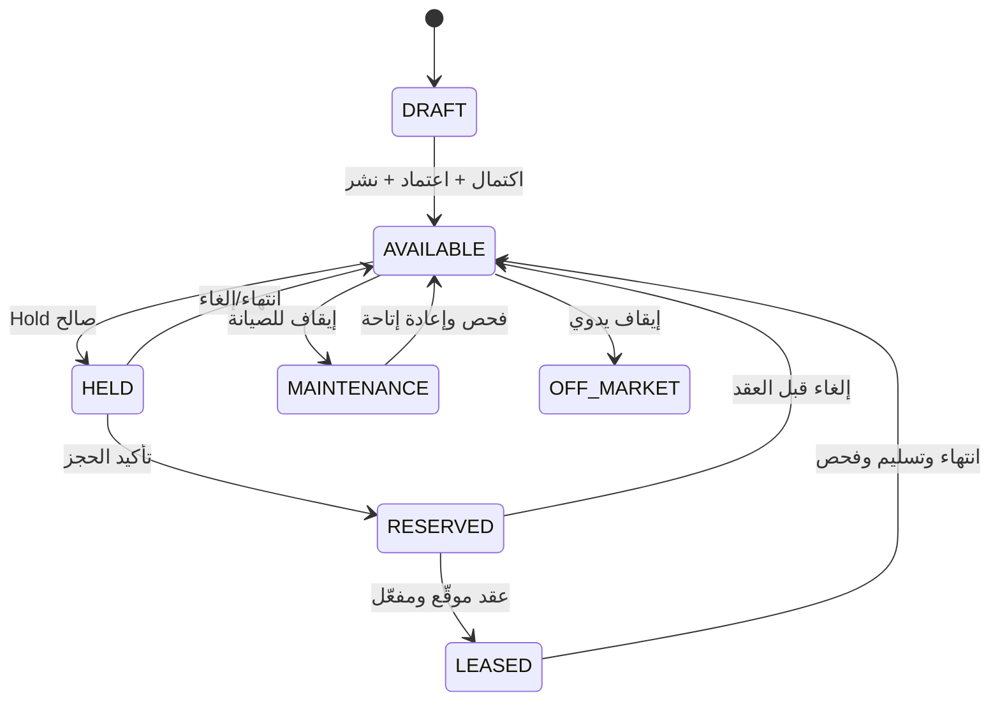
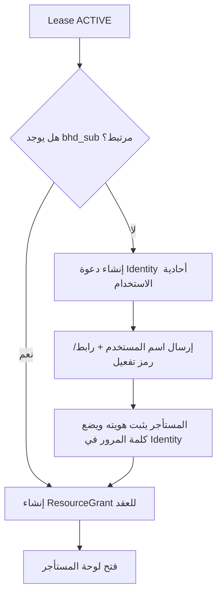

# رحلات المستخدم وحالات الأعمال — BHD R

## 1. مبادئ الرحلات

- كل رحلة تذكر الفاعل والسياق والمورد؛ لا يوجد «مستخدم عام» داخل اللوحات.
- كل Mutation تمر على Authentication وTenant context وPolicy وEntitlement وValidation وTransaction/Audit.
- العمليات الطويلة ترد بـJob id وتعمل في Worker.
- الخطأ لا يترك حالة نصف مكتملة؛ إما Commit كامل أو حالة قابلة للاستئناف.
- العربية والإنجليزية تستخدمان الرحلة نفسها والعقود نفسها.

## 2. إنشاء مؤسسة مالك فرد

**الفاعل:** Platform Admin.  
**الشروط:** حساب BHD للمالك موجود أو دعوة Identity ممكنة.

1. يبحث المسؤول عن المستخدم بواسطة `bhd_sub` أو بريد موثق.
2. ينشئ `Organization(type=INDIVIDUAL_LANDLORD)`.
3. يضيف المستخدم كـ`OWNER_ADMIN`.
4. يختار Country Pack عُمان، العملة، الباقة، وحدود الفريق.
5. يرفع تفويضاً أو مستندات مطلوبة بصورة خاصة.
6. يسجل النظام Audit event بلا محتوى مستند أو أسرار.
7. يرى المالك Workspace جديداً بعد دخوله التالي.

**الاستثناءات:**

- بريد غير موثق: دعوة فقط، بلا منح وصول حتى التحقق.
- حساب مرتبط بـ`bhd_sub` مختلف: رفض وتصعيد يدوي.
- تكرار مؤسسة فردية لنفس الشخص: تحذير وMerge workflow، لا إنشاء صامت.

## 3. إنشاء مؤسسة مالك شركة أو مطور

1. تدخل الإدارة الاسم القانوني والتجاري والسجل والبلد والعنوان.
2. تختار النوع `COMPANY_LANDLORD` أو `DEVELOPER`.
3. تعين المفوض الأول وتثبت Basis التفويض.
4. يختار النظام Plan وEntitlements.
5. ترسل الدعوة للمفوض.
6. بعد القبول يستطيع المفوض دعوة فريق ضمن سقف الباقة.

## 4. إضافة عقار فردي

**الفاعل الافتراضي في V1:** Platform Admin أو مستخدم يملك `properties.create` المشروط.

1. يختار المؤسسة المالكة والجهة المديرة.
2. يختار «عقار فردي» والنوع والغرض.
3. يدخل العنوان والإحداثيات والقطعة والمخطط.
4. يدخل خصائص الأصل والوحدة والسعر والتأمين ودورة الدفع.
5. ينشئ النظام `Property` و`Unit` واحدة داخل Transaction.
6. يرفع الصور؛ تبقى الحالة `PROCESSING` حتى الفحص والمشتقات والعلامة.
7. يرفع المستندات الخاصة.
8. يراجع Preview العربي والإنجليزي.
9. يحفظ Draft أو يطلب النشر.
10. بعد اكتمال الضوابط يصبح `Property=ACTIVE`, `Listing=PUBLISHED`, `Unit=AVAILABLE`.

**Invariants:** لا Property بلا Unit، ولا نشر بلا صورة غلاف وسعر وعنوان وOwner وCurrency.

## 5. إضافة عقار متعدد الوحدات

1. يختار «متعدد الوحدات».
2. يدخل بيانات المبنى المشتركة.
3. يضيف الوحدات يدوياً أو بالنسخ/النطاق أو CSV.
4. Preview الاستيراد يبين الصفوف الصالحة والخاطئة قبل الكتابة.
5. يمنع تكرار رقم الوحدة داخل العقار.
6. تنشأ الوحدات دفعة واحدة أو لا تنشأ، مع Job للحجوم الكبيرة.
7. لكل وحدة سعر وخصائص وصور وحالة وزر عرض مستقل.
8. يمكن تطبيق تعديل جماعي مع Audit يظهر المعرفات والحقول الآمنة فقط.

**الاستثناءات:**

- فشل صف واحد في استيراد صغير: لا Commit ويعاد ملف أخطاء.
- استيراد كبير: staging rows، تصحيح ثم Commit batch قابل للاستئناف.
- وحدة بلا رقم: يسمح بمعرف داخلي فقط إذا كان النوع لا يستخدم أرقاماً، وفق Schema النوع.

## 6. نشر وحدة وإخفاؤها تلقائياً



`effective_visibility` ليست عموداً قابلاً للتعديل، بل نتيجة:

```text
ACTIVE property
+ PUBLISHED listing
+ marketing_enabled
+ AVAILABLE unit
+ no overlapping active hold/reservation/lease
+ moderation passed
```

أي انتقال إلى `HELD/RESERVED/LEASED/MAINTENANCE/OFF_MARKET` يزيل الوحدة من القوائم والكاش وSitemap. عند عودتها `AVAILABLE` تعود آلياً إذا بقي `marketing_enabled=true`.

## 7. طلب معاينة

1. الزائر يفتح وحدة متاحة.
2. يحدد الوقت وبيانات الاتصال ويوافق على الخصوصية.
3. API يعيد Availability slots عامة فقط.
4. ينشأ `ViewingRequest` مع rate limit وanti-bot.
5. الموظف المخول يؤكد/يقترح موعداً.
6. ترسل الإشعارات ويحدث التقويم.
7. بعد المعاينة يسجل Outcome دون ملاحظات حساسة غير لازمة.

## 8. طلب تأجير وحجز

1. يسجل الزائر/المستخدم طلباً على وحدة متاحة.
2. لا تكشف الصفحة بيانات المالك الخاصة.
3. يراجع Leasing Agent الطلب والمستندات.
4. عند الموافقة الأولية ينشئ النظام `AvailabilityHold` بوقت انتهاء.
5. داخل Transaction يتحقق exclusion constraint من عدم وجود تداخل.
6. تختفي الوحدة فور نجاح Hold.
7. إذا لم تكتمل المتطلبات ينتهي Hold ويعيدها النظام.
8. عند التأكيد يتحول إلى `Reservation(CONFIRMED)` ولا ينشأ صف جديد موازٍ.

**التزامن:** طلبان متوازيان؛ ينجح واحد فقط، والآخر يحصل على `409 UNIT_NOT_AVAILABLE`.

## 9. إنشاء العقد والتوقيع

1. يختار الموظف Template version صالحاً لـCountry Pack والغرض.
2. يبني النظام Snapshot للأطراف والوحدة والمبالغ والشروط.
3. يراجع صاحب الصلاحية العقد ويعتمده للإرسال.
4. ينشأ Signature Envelope وPDF draft hash.
5. يوقع المستأجر عبر رابط قصير العمر + OTP/Reauthentication.
6. يوقع المالك أو المفوض المسجل.
7. يولد Worker PDF نهائياً ويثبت Hash وEvidence manifest.
8. تصبح النسخة Immutable.
9. ينشط Lease وجدول الاستحقاقات داخل Transaction واحدة.
10. تتحول الوحدة `LEASED` وتلغى Holds/Reservations غير المتوافقة.

**التصحيح:** لا تعديل للنسخة الموقعة؛ ينشأ Amendment/Version جديد.

## 10. إنشاء أو ربط حساب المستأجر



**قواعد:**

- لا يرسل BHD R كلمة مرور دائمة.
- Token الدعوة مخزن كـHash وله expiry واستخدام واحد.
- إعادة الإرسال تبطل السابق.
- الحساب الموجود لا يربط بالبريد فقط إذا كان `bhd_sub` متعارضاً.
- Grant يقتصر على Lease والوحدة والمستندات والفواتير والصيانة الخاصة بالطرف.

## 11. دعوة مشرف أو ممثل

1. Owner/Developer Admin يختار الدور والموارد.
2. النظام يفحص Entitlement وعدد المقاعد.
3. يمنع الداعي من منح Permission لا يملكها.
4. يرسل Identity invitation.
5. بعد القبول تنشأ Membership بحالة Active.
6. عند التعطيل تلغى Sessions/Grants المرتبطة بسياق المؤسسة.
7. كل تعيين/رفع صلاحية يسجل Audit؛ الصلاحيات الحساسة قد تحتاج reauthentication.

## 12. دفع إيجار أو تسجيل دفعة

1. المستأجر يرى مبلغاً بعملة العقد دون تحويل إلزامي.
2. ينشأ `PaymentAttempt` بمفتاح Idempotency وrequest hash.
3. يستدعى Adapter البوابة بعنوان ثابت مسموح.
4. Webhook يتحقق من raw signature ويحفظ في Inbox بقيد Provider event فريد.
5. Worker يعالج الحدث داخل Transaction وrow lock.
6. يطابق المبلغ والعملة والاستحقاق بدقة.
7. ينشئ Payment/Allocation/Receipt مرة واحدة ويصدر Outbox event.
8. التكرار يعيد النتيجة السابقة ولا يكرر الأثر.

## 13. طلب صيانة

1. المستأجر ينشئ طلباً للوحدة المرتبطة بعقده فقط.
2. يختار الفئة والأولوية والوصف والصور.
3. يفحص النظام الملفات ويخفي Metadata الحساسة.
4. Maintenance Coordinator يصنف ويعين Work order.
5. الممثل أو المورد يرى أقل بيانات لازمة.
6. تتغير الحالات مع رسائل وتواريخ SLA.
7. يغلق الطلب بعد إثبات الإنجاز وموافقة الطرف وفق السياسة.

## 14. انتهاء عقد وإعادة الوحدة

1. يصدر تنبيه 90/60/30 يوماً.
2. يختار التجديد أو الإنهاء وفق الصلاحية.
3. عند الإنهاء ينشأ Handover checklist.
4. لا تصبح الوحدة متاحة بمجرد التاريخ إذا بقي تسليم/صيانة لازمة.
5. بعد التسليم والفحص تتحول `AVAILABLE`.
6. إذا كان `marketing_enabled=true` والإعلان صالحاً، تعود للقوائم تلقائياً.

## 15. إلغاء/إنهاء/نزاع

- الإلغاء قبل التوقيع يعيد الحجز وفق السياسة.
- الإنهاء بعد التفعيل ينشئ Termination record ولا يمحو العقد.
- النزاع يفعّل Legal hold على المستندات والسجلات المعنية.
- أي Refund أو تسوية تحتاج Permission مالية وIdempotency وAudit.

## 16. سياق المستخدم المتعدد

إذا كان المستخدم مالكاً ومستأجراً معاً:

1. يدخل مرة واحدة عبر Identity.
2. يرى Workspaces المسموحة دون أرقام حساسة في المشغل.
3. يختار سياقاً واحداً.
4. تحمل الجلسة `active_context_id` قصير العمر.
5. كل API تعيد التحقق من العضوية/Grant؛ لا تثق في السياق القادم من الواجهة وحدها.
6. التبديل يلغي كاش العميل ويفصل Route group، ولا يخلط لوحات أو Queries.

## 17. حالات الفشل العامة

| الحالة | الاستجابة |
|---|---|
| فقدان صلاحية أثناء نموذج | 403 مع حفظ Draft غير حساس وإعادة التحقق |
| تعديل متزامن | 409 `VERSION_CONFLICT` مع نسخة حديثة |
| Queue متوقفة | حفظ Outbox وإظهار Pending؛ لا فقد للحدث |
| Identity غير متاحة | جلسة قائمة تستمر ضمن TTL؛ دخول/دعوة جديدة تتوقف بأمان |
| Storage غير متاح | metadata pending ولا يعتبر الرفع مكتملاً |
| Payment provider timeout | لا Retry عشوائي؛ الاستعلام بالمفتاح نفسه |
| ترجمة ناقصة | يمنع النشر إذا كان الحقل إلزامياً، أو يظهر fallback معلماً |

