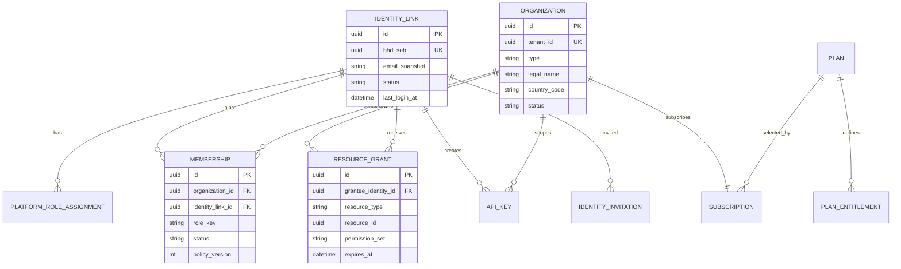
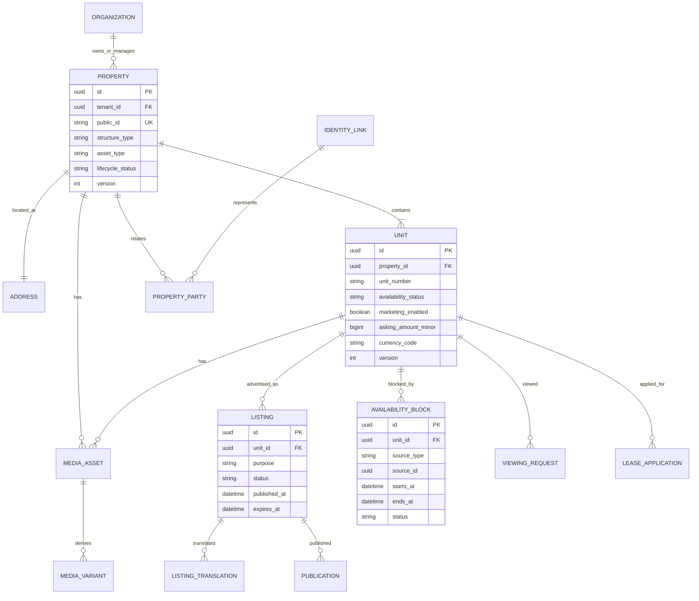
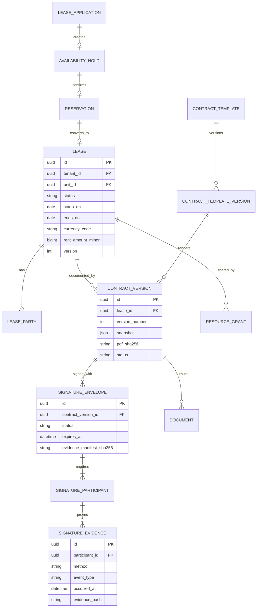
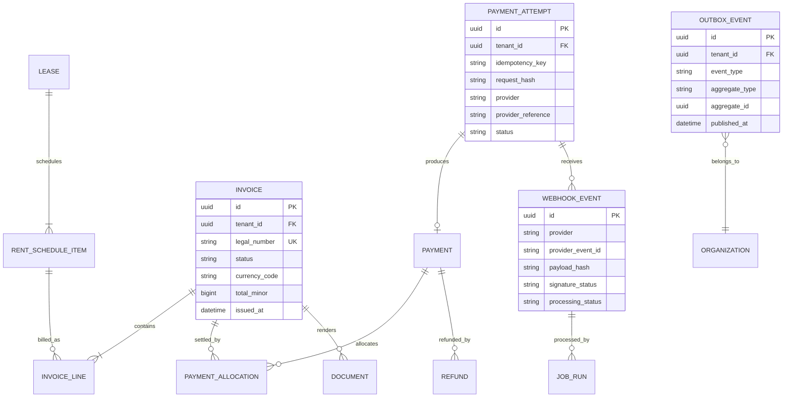
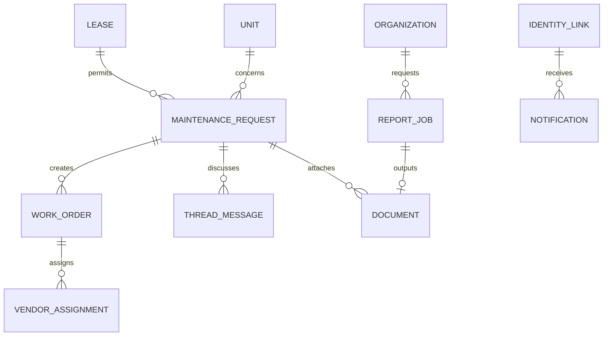

# نموذج المجال والبيانات — BHD R

## 1. مبادئ النموذج

1. PostgreSQL هو مصدر الحقيقة الوحيد.
2. كل أصل عقاري يملك وحدة واحدة على الأقل.
3. `Property` يصف الأصل المشترك، و`Unit` يصف الشيء القابل للتأجير.
4. التوافر ليس Boolean؛ ينتج من حالات وقيود زمنية.
5. كل صف تشغيلي خاص بمؤسسة يحمل `tenant_id` إلزامياً.
6. مشاركة المستأجر تتم بـ`ResourceGrant` لا بكسر Tenant scope.
7. المال BigInt minor units؛ FX والنسب Decimal.
8. العقود والفواتير المصدرة وإثباتات التوقيع Immutable.
9. الملفات في Object Storage؛ قاعدة البيانات تحفظ metadata وhash وclassification فقط.
10. الأحداث الخارجية والداخلية تمر عبر Inbox/Outbox لمنع الفقد والتكرار.

## 2. الهوية والمؤسسات والوصول

### قيود

- `bhd_sub` فريد وغير قابل لإعادة التعيين.
- عضوية فعالة واحدة لكل `(organization_id, identity_link_id, role_key)`.
- `tenant_id` لا يأتي من Body؛ يستخرج من Active context ويثبت في Transaction.
- Grant لا يملك صلاحيات أوسع من المورد المحدد، وله issuer وreason وexpiry/revoked_at.
- Entitlement limit يعد داخل Transaction أو Counter ذري.

## 3. العقار والوحدة والإعلان

### تمثيل الفردي والمتعدد

- `structure_type=SINGLE_UNIT`: قيد يضمن وحدة واحدة `is_primary=true`.
- `structure_type=MULTI_UNIT`: وحدة أو أكثر، ورقم الوحدة فريد داخل العقار عند وجوده.
- لا تخزن وحدات في JSON أو كمفاتيح `shop-0`.

### التوافر

يستخدم PostgreSQL range/exclusion constraint على `AvailabilityBlock(unit_id, tstzrange)` للحالات الفعالة. يمنع أي تداخل من نوع Hold/Reservation/Lease الذي لا يسمح به Policy.

`availability_status` Read model سريع يعاد حسابه Transactionally، لكنه لا يتغلب على قيد الفترات.

## 4. الحجز والعقد والتوقيع

### قيود

- عقد واحد `ACTIVE` لكل وحدة وفترة متداخلة.
- `ContractVersion(status=EXECUTED)` لا يتغير؛ Amendment جديد فقط.
- Snapshot يحتوي البيانات القانونية وقت التوقيع، ولا يعتمد عرضه على Profile حي.
- OTP لا يخزن كنص، وله max attempts وexpiry وanti-replay.
- توقيع المالك لا يقبل إلا من Identity مخول في `LeaseParty` وقت التوقيع.

## 5. المال والتكامل والأحداث

### المال

- `amount_minor BIGINT` لكل مبلغ.
- Currency catalog يحدد `minor_units`.
- FX rates `NUMERIC(24,12)` مع مصدر ووقت.
- لا يسمح بجمع عملتين مختلفتين دون Conversion context صريح.
- Invoice counter ذري لكل `(legal_entity_id, fiscal_year, document_type)`.
- رقم ملغى لا يعاد استخدامه.

### Idempotency

- قيد فريد `(tenant_id, idempotency_key, action)`.
- نفس المفتاح ونفس request hash يعيد النتيجة.
- نفس المفتاح وBody مختلف يعيد `409 IDEMPOTENCY_CONFLICT`.
- Webhook unique على `(provider, provider_event_id)`، مع fallback payload hash وفق مزود.

## 6. الصيانة والمراسلات والتقارير

## 7. الحقول المشتركة

كل جدول تشغيلي مناسب يحمل:

- `id UUIDv7/UUID`
- `tenant_id UUID`
- `created_at`, `created_by`
- `updated_at`, `updated_by`
- `version INT` للتفاؤل في التزامن
- `archived_at` عند الحاجة
- `country_pack_version` للكيانات القانونية

لا يوضع `deleted_at` عشوائياً على كل شيء؛ سياسة الحذف حسب نوع الكيان.

## 8. تصنيف البيانات

| التصنيف      | أمثلة                               | السياسة                              |
| ------------ | ----------------------------------- | ------------------------------------ |
| PUBLIC       | عنوان الإعلان العام، وصف، صور مائية | CDN وCache مسموح                     |
| INTERNAL     | حالات التشغيل، IDs داخلية           | جلسة وصلاحية                         |
| CONFIDENTIAL | عقود، مبالغ، مراسلات، تقارير        | تشفير ووصول مورد                     |
| RESTRICTED   | هوية، سند، IBAN، مفاتيح بوابة، TOTP | Purpose keys، Audit، وصول محدود جداً |

## 9. قواعد RLS الأولية

- مستخدم المؤسسة: `tenant_id = current_setting('app.tenant_id')::uuid` مع Membership فعالة.
- المستأجر: لا RLS على مؤسسة المالك مباشرة؛ View/Policy تربط `ResourceGrant` بالمورد.
- Platform operations: Service role منفصل، ويظل التطبيق يطبق Policy؛ لا يستخدم مفتاح bypass في الويب.
- Worker: Job يحمل tenant id وaggregate id وpolicy purpose؛ لا يقبل tenant id من payload خارجي بلا تحقق.

## 10. Queries وفهارس حرجة

- `units(tenant_id, property_id, availability_status)`.
- `listings(status, published_at)` مع partial index لـ`PUBLISHED`.
- `properties(tenant_id, lifecycle_status, address_id)`.
- `availability_blocks(unit_id, period)` GiST.
- `leases(tenant_id, unit_id, status, starts_on, ends_on)`.
- `memberships(identity_link_id, status, organization_id)`.
- `resource_grants(grantee_identity_id, resource_type, resource_id, revoked_at)`.
- `invoices(tenant_id, status, due_at)`.
- `webhook_events(provider, provider_event_id)` unique.
- `outbox_events(published_at, created_at)` partial على غير المنشور.

الفهرس لا يعتمد قبل `EXPLAIN ANALYZE` على حجم ممثل.
