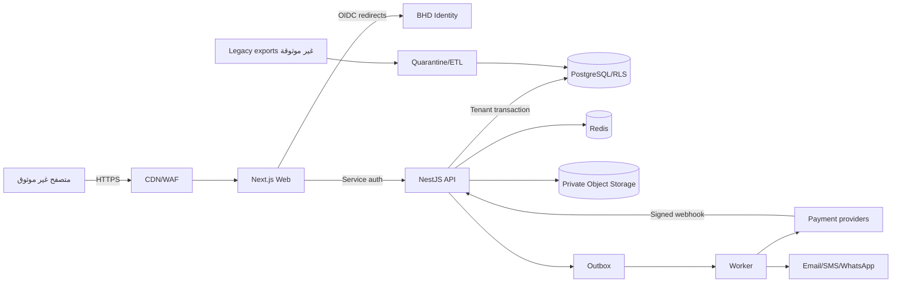

# نموذج التهديد الأولي — BHD R

**المنهج:** STRIDE + Abuse cases + Privacy review  
**النطاق:** Web، API، Worker، BHD Identity، PostgreSQL، Redis، Object Storage، الدفع، البريد/SMS، الخرائط، ودورة الترحيل.  
**الحالة:** Baseline للمرحلة صفر؛ يعاد عند اكتمال التصميم وقبل Pilot وبعد كل تكامل حساس.

## 1. الأصول التي نحميها

### حرجة

- حساب BHD و`bhd_sub` والجلسات والدعوات.
- حدود المؤسسات والعضويات والصلاحيات.
- العقود وإصداراتها وHashes وأدلة التوقيع.
- أرقام الهوية والسندات والتفويضات والمرفقات.
- مبالغ الإيجار والفواتير والمدفوعات والاسترداد.
- أسرار بوابات الدفع وWebhooks وAPI Keys وTOTP.
- النسخ الاحتياطية ومفاتيح التشفير.

### تشغيلية

- حالة الوحدة والتوافر والحجز والعقد.
- بيانات المالك والمطور والمستأجر.
- طلبات الصيانة والمراسلات.
- الصور الأصلية والعلامة المائية.
- سجلات التدقيق والأمان والمراقبة.

### عامة يجب الحفاظ على سلامتها

- الإعلانات والأسعار والتوافر والصور العامة.
- SEO وStructured data وصفحات الثقة.

## 2. الجهات والخصوم

- زائر آلي أو مهاجم خارجي.
- مستأجر يحاول الوصول لوحدة/عقد آخر.
- عضو مؤسسة يحاول تجاوز الموارد المسندة.
- مسؤول مؤسسة مخترق.
- Support أو Platform Admin سيئ الاستخدام.
- مزود خارجي مخترق أو Webhook مزور.
- ملف خبيث أو بيانات ترحيل ملغمة.
- اعتماد برمجي أو CI runner مخترق.
- خطأ بشري في الهجرة أو المفاتيح أو الاستعادة.

## 3. حدود الثقة

كل سهم يعبر حداً يحتاج مصادقة، تحقق مدخلات، مهلة، حد حجم، ورصد مناسب.

## 4. مخاطر P0 قبل الإنتاج

| ID | التهديد | STRIDE | الأثر | الضوابط التصميمية | اختبار القبول |
|---|---|---|---|---|---|
| T-001 | وصول بين مؤسستين عبر IDOR أو Query ناقص | E/I | كشف/تعديل بيانات عميل آخر | tenant context خادمي، RLS، scoped repositories، ResourceGrant | تبديل كل IDs وfilters وexports وfiles بين مؤسستين يعيد 404/403 بلا metadata leakage |
| T-002 | رفع صلاحية أو Route بلا Policy | E | سيطرة على عقار/مال/عقد | Policy Guard عالمي fail-closed، route inventory، permission catalog | CI يفشل لأي Route غير Public بلا Policy؛ matrix سلبية لكل دور |
| T-003 | حجزان أو عقدان متداخلان | T | التزام قانوني مزدوج | exclusion constraints، transactions، state transitions، optimistic version | 100 محاولة متوازية تسمح بواحدة فقط |
| T-004 | تكرار دفع/Webhook | T/R | قيد أو إيصال أو Refund مكرر | Idempotency، Inbox unique، row locks، Outbox، exact amount/currency | 100 Webhook متوازٍ = أثر واحد؛ فشل مؤقت يعاد بأمان |
| T-005 | تعديل عقد بعد التوقيع | T/R | نزاع قانوني وفقد الثقة | immutable version، PDF SHA-256، evidence manifest، append-only events | أي byte change يكسر verification؛ لا UPDATE للمنفذ |
| T-006 | انتحال موقع/طرف التوقيع | S/R | عقد باسم شخص آخر | BHD reauth/OTP/WebAuthn، party binding، expiry، anti-replay | Token مسروق دون step-up لا يكفي؛ OTP reused يرفض |
| T-007 | تسرب مستندات الهوية/السند | I | ضرر شخصي وقانوني | private bucket، short signed URL، encryption، grants، no analytics | URL منتهٍ/مستخدم آخر/Referer لا يفتح الملف |
| T-008 | أسرار في logs/audit/errors | I | اختراق مزودات وحسابات | allowlist logging، deep redaction، route exclusions، size limits | Canary secret في body/query/header/nested/error لا يظهر في أي sink |
| T-009 | XSS في الإعلان/العقد/PDF/JSON-LD | T/E | سرقة جلسة أو تعديل طباعة | context encoding، React text، safe JSON serialization، CSP nonce، isolated PDF worker | payload corpus HTML/SVG/events/URLs لا ينفذ في Web أو print |
| T-010 | SSRF من URL/تكامل/صور | I/E | وصول داخلي وتسريب أسرار | fixed provider endpoints، HTTPS allowlist، DNS/IP checks، no redirects، egress firewall | localhost/RFC1918/link-local/metadata/IPv6/rebinding ترفض |
| T-011 | دعوة مستأجر تربط حساباً خاطئاً | S/E | كشف عقد لشخص آخر | hashed single-use invite، verified channel، bhd_sub conflict rules، revoke old | إعادة الإرسال تبطل القديم؛ البريد المتعارض لا يربط |
| T-012 | سرقة/إعادة جلسة | S/E | وصول طويل | Host-only cookies، rotation/families، reuse detection، security stamp، revoke-all | Password reset/disable يوقف refresh والجلسات القديمة فعلياً |
| T-013 | أموال Float أو تقريب خاطئ | T | فروق مالية وقانونية | BigInt minor units، Decimal FX، currency policy، golden/property tests | كل عملة وحدود/خصومات/Refunds تطابق expected exact values |
| T-014 | رقم فاتورة مكرر | T/R | مخالفة ومطابقة خاطئة | atomic counter/sequence per legal entity/year/type | اختبار تزامن بلا تكرار؛ الأرقام الملغاة لا يعاد استخدامها |
| T-015 | ملف خبيث أو polyglot | E/I | XSS/RCE/تسريب | quarantine، MIME sniff، AV scan، decode/re-encode image، SVG policy | corpus خبيث يرفض؛ الملف غير المفحوص لا يصبح عاماً |

## 5. مخاطر P1

| ID | التهديد | الضوابط |
|---|---|---|
| T-016 | Enumeration للإعلانات/الدعوات/المشاركة | IDs عشوائية، rate limit، رسائل موحدة، token hash/TTL |
| T-017 | إساءة Support access | Case-bound just-in-time grant، reason، expiry، masking، alert/audit |
| T-018 | Platform Admin واحد ينفذ فعلاً مدمراً | step-up، dual control، delay/recovery لبعض الأفعال |
| T-019 | API Key مسرب | prefix+HMAC/hash، scopes، tenant binding، expiry، rotation، distributed limits |
| T-020 | CSRF على Mutations | SameSite + CSRF token + exact Origin/Referer + no unsafe GET mutations |
| T-021 | Clickjacking أو Injection عبر طرف ثالث | frame-ancestors، SRI/عدم تحميل scripts عشوائية، strict CSP |
| T-022 | Cache يخلط مؤسسة/لغة/حساب | public/private split، cache keys typed، no shared cache for private، Vary policy |
| T-023 | Search/count leaks | scoped query before aggregation، minimum result policy عند الحاجة |
| T-024 | EXIF يكشف موقعاً أو جهازاً | strip EXIF للمشتقات العامة، الأصل خاص |
| T-025 | Formula injection في CSV | prefix/escape الخلايا الخطرة، UTF-8، export test |
| T-026 | Email/WhatsApp content injection | typed templates، escape، no secrets، verified destinations |
| T-027 | DoS بصور/PDF/تقارير | quotas، dimensions/pages/timeouts، queue isolation، concurrency limits |
| T-028 | Webhook valid لكن لحساب تاجر آخر | bind merchant/account/provider/tenant and exact reference |
| T-029 | DNS/Domain takeover | inventory، ownership verification، expiry monitoring، no abandoned CNAME |
| T-030 | Supply-chain compromise | lockfile، provenance، SCA، SBOM، signed images، least privilege CI |
| T-031 | Migration imports malicious HTML أو wrong tenant | quarantine، schema validation، sanitization at output، mapping + tenant reconciliation |
| T-032 | Backup unusable أو غير مشفر | encrypted backups، restore drills، checksum، separate credentials |
| T-033 | Key rotation causes data loss | envelope encryption، version metadata، resumable canary rotation، rollback |
| T-034 | Analytics expose PII | event allowlist، no raw text/IDs، consent and retention |
| T-035 | Availability stale in CDN | domain event + tag invalidation + TTL + server recheck before action |

## 6. Abuse cases

### A. مالك يحاول الاطلاع على عقار مالك آخر

حتى إن خمن UUID أو عدل tenant id في Body، يهمل API القيمة ويستخدم active context. Repository يضيف tenant filter وRLS تمنع القراءة. يعاد 404 لتقليل كشف الوجود.

### B. مستأجر يغير contract id

يبحث API من خلال `ResourceGrant(grantee, resource_type, resource_id)` أولاً. لا يسمح Contract controller باستعلام عالمي. الروابط الموقعة تربط بالهوية/Grant عند المستندات الحساسة.

### C. Leasing Agent يحاول Refund

الدور لا يملك `payment.refund`. حتى إن كان API Key منشأ بواسطة Finance Manager فلا بد من scope صريح، step-up، وحدود Amount/Dual control.

### D. مهاجم يرسل Webhook قبل إنشاء محاولة الدفع

يحفظ الحدث Unknown/Unmatched دون تطبيق مالي، ولا ينشئ Payment من payload وحده. Reconciliation job يطابق مرجعاً معروفاً فقط.

### E. طرف يعدل صورة التوقيع أو PDF

النسخة النهائية وEvidence manifest محفوظان بـhash، والتخزين versioned/immutable. التحقق يعيد hash mismatch ويطلق SecurityEvent.

### F. مستخدم يرفع صورة SVG تحتوي script

SVG لا يخدم inline من نطاق التطبيق. إما يرفض أو يحول إلى raster في sandbox، مع Content-Disposition وCSP مناسبة.

## 7. الخصوصية وتقليل البيانات

- Public listing لا يعرض owner user id أو tenant id أو سنداً أو هاتفاً خاصاً.
- لا تحفظ صور الهوية في JSON أو logs أو analytics.
- بيانات الطلب غير الناجح لها مدة احتفاظ أقصر من عقد منفذ.
- Support يرى masked data افتراضياً.
- Data export شخصي يمر على سياسة ويولد في Worker برابط قصير.
- Data deletion request لا يمحو سجلاً قانونياً؛ يطبق restriction/anonymization حسب السياسة.
- Country Pack يحمل سياسة retention/version قانونية قابلة للتحديث بعد مراجعة مختص.

## 8. إدارة المفاتيح والأسرار

Purpose separation:

- `identity-session-signing`
- `pii-envelope`
- `document-envelope`
- `payment-gateway-secrets`
- `totp-secrets`
- `webhook-verification`
- `audit-integrity`

كل Ciphertext يحمل algorithm وkey id وversion وtenant binding في AAD. لا تُجمع مفاتيح الإنتاج في `.env` محلي أو GitHub Actions output.

## 9. Security acceptance gates

- Threat review مع مالك كل Module.
- Automated route inventory = 100% classified.
- Cross-tenant suite = 100% pass.
- P0 security regression = 100% pass.
- Dependency/container scan بلا Critical/High غير مستثنى.
- External penetration test قبل الإطلاق العام.
- Restore drill ناجح.
- Key rotation dry run ناجح.
- Incident/credential compromise tabletop exercise.

## 10. المخاطر المقبولة/المؤجلة

لا يوجد Risk acceptance ضمن المرحلة صفر. أي قبول لاحق يحتاج Owner، السبب، الضوابط التعويضية، تاريخ الانتهاء، وTicket. لا تقبل P0 مفتوحة عند الإطلاق.

