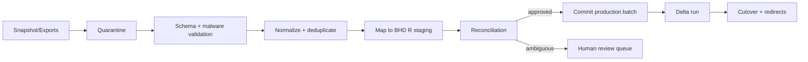

# عقد ترحيل النظام العقاري السابق إلى BHD R

## 1. القرار

الترحيل **بيانات وسلوك موثق فقط**. لا ينسخ مجلد `legacy`، ولا يشغل جسر KV داخل BHD R، ولا يدعم مصدرَي حقيقة بعد القطع.

## 2. المصادر المعروفة

| المصدر القديم                        | طبيعة البيانات             | الخطر                                   |
| ------------------------------------ | -------------------------- | --------------------------------------- |
| Prisma `Property` و`PropertyBooking` | جزء من الأصل والحجز        | Float وغياب Unit حقيقية                 |
| `lib/data/properties.ts`             | عقارات ثابتة وتفاصيل وحدات | تعارض مع DB/Overrides                   |
| Property overrides                   | حالات نشر/توافر            | RESERVED يظهر أحياناً وتناقضات          |
| `BookingStorage.data`                | JSON حجز كامل              | Schema drift وPII/Base64                |
| `ContractStorage.data`               | JSON عقد                   | تكرار مع الحجز ونسخ غير واضحة           |
| `PaymentPendingStorage`              | دفع انتقالي                | مطابقة وIdempotency غير مؤكدة           |
| `LegacyAppKvStore`                   | بيانات النظام الموروث      | مفاتيح وفئات غير موحدة                  |
| `LegacyStoredFile`/Blob              | صور ومستندات               | روابط/أنواع/تكرار/EXIF                  |
| `AddressBookContact`                 | أطراف واتصال               | تكرار وربط بالبريد/الهاتف               |
| Users/AutoUserAccount                | حسابات وأدوار              | لا نقل كلمات المرور أو temp credentials |

## 3. قواعد الترحيل

1. كل Export يحمل source version ووقت وchecksum.
2. لا قراءة مباشرة من Production أثناء تحويل غير محدود؛ نستخدم snapshot/replica/export.
3. كل سجل جديد يحمل `legacy_source`, `legacy_id`, `migration_run_id`.
4. Mapping deterministic وقابل لإعادة التشغيل دون duplication.
5. حالات غامضة تذهب إلى Quarantine/Review queue، لا تخمين صامت.
6. الأموال تتحول إلى minor units بسياسة وتقريب موثقة؛ أي فرق يظهر في Reconciliation.
7. الوحدات النصية تتحول إلى Rows؛ لا تبقى مفاتيح `shop-0`.
8. العقود القديمة تحفظ Historical imported version؛ لا ندعي Evidence لم يكن موجوداً.
9. الصور الأصلية تفحص وتعاد مشتقاتها وعلامتها؛ لا نثق بالامتداد.
10. لا تنقل Password hashes إلى BHD R. الربط عبر Identity أو دعوة.

## 4. مراحل ETL

### A. Discovery

- Counts حسب المصدر والحالة.
- مفاتيح الربط الفعلية.
- عينات عقارات فردية ومتعددة.
- عقود بكل مراحلها.
- قائمة الملفات المفقودة/المكررة/الكبيرة.
- PII وبيانات دفع محتملة في JSON/Logs.

### B. Canonical mapping

- Property القديم → Property جديد.
- العقار الفردي → Unit primary.
- arrays/override units → Unit rows.
- Booking/Hold → Application/Hold/Reservation حسب دليل الحالة.
- Contract JSON → ContractVersion imported snapshot.
- Auto account → Identity invitation candidate، لا User password.
- Contacts → Party/Identity candidate بعد deduplication.

### C. Dry run

- Staging مع نفس schema.
- تقرير errors وتحويلات وفروقات.
- عينات بشرية من كل فئة.
- اختبار APIs/لوحات على البيانات المرحّلة.

### D. Pilot

- مؤسسة أو مجموعة عقارات معروفة.
- النظام القديم Read-only لهذه المجموعة أو Freeze محدد.
- دعم مباشر وقياس الفروقات.
- لا توسيع قبل إغلاق الأخطاء.

### E. Cutover

- Backup + restore proof حديث.
- Final delta.
- Counts/sums/checksums.
- DNS/route redirects.
- إلغاء الكتابة في القديم.
- مراقبة ومهلة rollback.

## 5. Reconciliation

### Counts

- مؤسسات، مستخدمون مرتبطون، عقارات، وحدات، حجوزات، عقود، فواتير، ملفات.

### Financial sums

- إجمالي مبالغ العقود حسب العملة.
- إجمالي الاستحقاقات/المدفوعات/المتبقي حسب العملة والحالة.
- لا تجمع العملات في رقم واحد.

### State

- كل وحدة قديمة تصنف Available/Hidden/Needs review.
- كل عقد فعال يملك وحدة وطرفين وفترة وعملة.
- لا فترات متداخلة؛ التعارض Quarantine.

### Files

- checksum، size، MIME الحقيقي، owner/resource mapping.
- Missing files بتقرير، لا رابط ميت صامت.

## 6. Rollback

- قبل Cutover: حذف Staging run آمن عبر `migration_run_id` فقط.
- أثناء Pilot: العودة للقديم للمجموعة إذا لم تنشأ كتابات قانونية جديدة في BHD R؛ وإلا خطة merge/reconciliation صريحة.
- بعد Cutover: لا rollback قاعدة بيانات أعمى. يعاد توجيه Traffic فقط إذا ضمنت مزامنة Delta وعدم فقد الكتابات.
- النظام القديم يبقى Read-only لمدة معتمدة، ثم أرشيف مشفر.

## 7. بيانات ممنوع حذفها دون قرار

- عقود/فواتير/دفعات وسجلات تدقيق إنتاجية.
- مستندات نزاع أو Legal hold.
- مفاتيح ربط legacy اللازمة للمطابقة.
- النسخة الاحتياطية الأخيرة قبل القطع.

## 8. معايير اعتماد الترحيل

- 100% من السجلات إما Migrated أو Quarantined بسبب واضح.
- صفر duplication بسبب إعادة تشغيل ETL.
- الفروقات المالية صفر بوحدات العملة الصغرى أو مفسرة وموقعة.
- Cross-tenant tests على البيانات المرحّلة.
- عينة بشرية معتمدة لكل نوع عقار وعقد.
- Restore وrollback rehearsal ناجحان.
