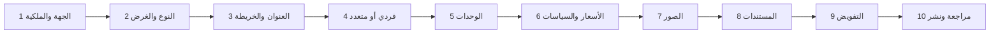

# بنية المعلومات والواجهات الأولية — BHD R

## 1. قاعدة الفصل

الموقع العام واللوحات الأربع Route groups مستقلة. لا يعرض Sidebar روابط دور آخر حتى لو كان للشخص سياق ثانٍ؛ ينتقل عبر Workspace switcher ويعاد تحميل سياق مصادق عليه.

## 2. خريطة الموقع العام

```text
/{locale}
  /                         الرئيسية والبحث
  /properties               جميع الوحدات المتاحة
  /properties/{publicId}-{slug}
  /locations/{governorate}
  /locations/{governorate}/{wilayat}
  /services
  /about
  /contact
  /help
  /security
  /privacy
  /terms
```

### الرأس العام

- شعار BHD R.
- العقارات.
- المواقع.
- الخدمات.
- عن المنصة.
- العربية/English.
- دخول BHD.

### بطاقة العقار

- صورة مائية مناسبة.
- نوع الوحدة والموقع العام.
- السعر والعملة والدورة.
- المساحة والغرف والخصائص الأهم.
- حالة «متاح» فقط؛ لا تعرض Cards محجوزة/مؤجرة في نتائج المتاح.
- CTA مشاهدة التفاصيل/طلب معاينة.

## 3. Route groups الخاصة

```text
/{locale}/platform/*   إدارة المنصة فقط
/{locale}/owner/*      المالك وشركة الإدارة
/{locale}/developer/*  المطور
/{locale}/tenant/*     المستأجر/ممثل المستأجر
```

لا تستخدم `/admin` لجميع الأدوار كما في النظام السابق؛ الاسم يعبر عن السياق.

## 4. لوحة المنصة

```text
platform/
  overview
  organizations
  users
  properties
  listing-reviews
  contracts
  subscriptions
  payments
  maintenance
  content
  reports
  support
  security
  audit
  migrations
  settings
```

### ترتيب الصفحة

```text
┌ BHD R ─ Platform ─ Search ─ Notifications ─ Account ┐
│ Sidebar │ عنوان الصفحة + السياق + الإجراء الرئيسي │
│         │ Filters مختصرة                            │
│         │ Summary ضروري فقط                         │
│         │ Table/List قابلة للتصفح                   │
│         │ Detail drawer/route مع Audit context       │
└─────────┴────────────────────────────────────────────┘
```

لا توجد Impersonation صامتة. Support access يظهر شريطاً واضحاً ووقت انتهاء وCase id.

## 5. لوحة المالك

```text
owner/
  overview
  properties
    /new                 مشروط في V1
    /{id}
    /{id}/units
    /{id}/media
    /{id}/documents
  listings
  leads
  viewings
  applications
  reservations
  leases
  contracts
  rent-schedule
  invoices
  payments
  maintenance
  reports
  team
  plan
  settings
```

الصفحة الأولى تركز على: المتاح، المحجوز، المؤجر، المتأخر، العقود القريبة، والصيانة المفتوحة. لا نضيف Charts بلا قرار تحتاجه الإدارة.

## 6. لوحة المطور

```text
developer/
  overview
  projects
    /{id}/buildings
    /{id}/inventory
    /{id}/media
    /{id}/documents
  listings
  leads
  viewings
  applications
  reservations
  contracts
  finance
  reports
  team
  plan
  settings
```

مركز المخزون يعرض Matrix للوحدات مع identifier واحد واضح لكل خلية، وتفاصيل الحالة عند الاختيار، لا بطاقات مزدحمة لكل وحدة.

## 7. لوحة المستأجر

```text
tenant/
  home
  lease
  contract
  schedule
  invoices
  payments
  receipts
  documents
  maintenance
  messages
  profile
  security
```

لا Sidebar مع أقسام غير متاحة. إن كان له أكثر من عقد، يختار عقداً/سياقاً من أعلى اللوحة، وتظل Queries مقيدة بالـGrants.

## 8. معالج إضافة العقار



### سلوك النموذج

- Draft server-side بعد كل خطوة مكتملة.
- Validation صفية في الوحدات.
- زر «حفظ والخروج» دائماً.
- ملخص أخطاء أعلى الخطوة وروابط للحقول.
- Preview عربي/إنجليزي قبل النشر.
- حالة معالجة الصور واضحة ولا تعتبر الصورة جاهزة قبل Worker.

## 9. صفحة تفاصيل الوحدة العامة

الترتيب المقترح:

1. Breadcrumbs.
2. معرض الصور المائية سريع التحميل.
3. العنوان المختصر والسعر والتوافر.
4. الخصائص الأساسية.
5. الوصف.
6. المرافق والسياسات.
7. خريطة بدقة مناسبة للخصوصية.
8. CTA ثابت غير مزعج لطلب معاينة/تأجير.
9. معلومات الثقة والجهة المديرة العامة.
10. وحدات مشابهة متاحة فقط.

إذا أصبحت غير متاحة بعد فتح الصفحة، يعيد Submit تحققاً خادمياً ويعرض `UNIT_NOT_AVAILABLE` بلا إنشاء طلب مضلل.

## 10. صفحة العقد والتوقيع

- ملخص الطرف والوحدة والمبلغ.
- رابط تنزيل/عرض النسخة المراد توقيعها.
- Checkboxes إقرار واضحة غير محددة مسبقاً.
- Step-up/OTP.
- مساحة توقيع إن كانت مطلوبة.
- تأكيد نهائي يوضح أن النسخة ستثبت.
- Receipt/verification id بعد النجاح.
- لا عرض صور هوية الطرف الآخر.

## 11. Mobile

- Bottom navigation بحد أقصى 4–5 وجهات للسياق.
- القوائم تتحول Cards هادئة أو جداول أفقية عند الضرورة فقط.
- أهداف لمس 44px على الأقل.
- لا Hover-only actions.
- الكاميرا/رفع الصور يوضح الحجم والحالة والتقدم.
- المعالج يحفظ Draft عند انقطاع الشبكة دون تخزين PII حساس في LocalStorage.

## 12. حالات واجهة إلزامية

لكل صفحة: Loading، Empty، Error قابل للإجراء، Permission denied، Plan limit، Offline/timeout، Stale version، Processing job، وPartial external outage.

لا تستخدم Demo fallback ببيانات مزيفة في الإنتاج؛ Empty state صادق أفضل.
