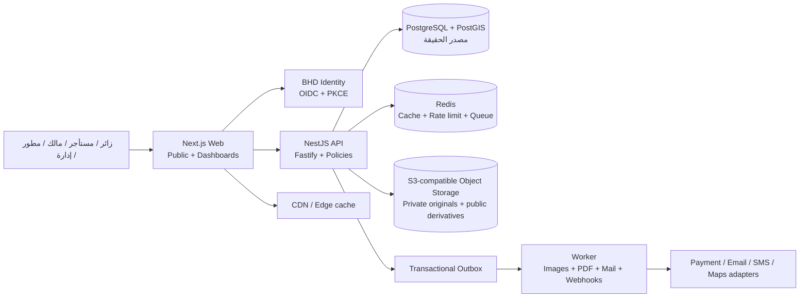

# الخطة الهندسية الكاملة لبناء منصة «BHD R» لإدارة العقارات ضمن منظومة BHD

**حالة الوثيقة:** الخطة معتمدة — اكتمل نطاق النواة V1 برمجياً، وتفاصيل التحقق في `docs/V1-COMPLETION-REPORT-AR.md`

**تاريخ المراجعة:** 24 أغسطس 2026

**نطاقها:** مراجعة مرجعية للمستودعات الأربعة، مطابقة سلوك النظام العقاري السابق، قراءة وثيقة الرؤية، ثم تصميم خطة بناء جديدة من الصفر.

---

## 1. القرار التنفيذي المقترح

أوصي ببناء **منتج عقاري جديد مستقل هندسياً باسم «BHD R»** تحت علامة BHD، ويشير الحرف **R** إلى **إدارة العقارات / Real Estate Management**، على النطاق المقترح:

- المنتج: `BHD R — إدارة العقارات`
- عميل الهوية المقترح: `bhd-r`
- النطاق المقترح: `https://r.bhd-om.com`
- العبارة التابعة: `A BHD Product / من منتجات BHD`
- الدخول: حساب BHD الموحّد فقط عبر `https://id.bhd-om.com`

المنتج الجديد لا يكون نسخة معدّلة من `bhd-om` القديم، ولا دمجاً ثانياً بين نظامين. سيكون **نظاماً واحداً، وقاعدة بيانات تشغيلية واحدة، ونموذج بيانات واحد، ومصدر حقيقة واحد**. نستفيد من الأفكار الناجحة في المشاريع القائمة، لكن لا ننقل تعقيدها أو شيفرتها القديمة بلا اختبار.

البنية المقترحة هي **Modular Monolith** داخل Monorepo منظم: واجهة عامة ولوحات، API مركزية، وWorker للأعمال الخلفية. هذه ليست Microservices مبكرة، وليست نظامين مدموجين؛ هي ثلاثة تطبيقات تشغيلية لمنتج واحد، تشترك في عقود وأنواع وقاعدة بيانات وسياسات أمان موحدة.

### قرارات أساسية لا أرى التنازل عنها

1. كل عقار يملك وحدة واحدة على الأقل؛ العقار الفردي ينشئ وحدة تلقائياً، والمتعدد ينشئ وحدات مستقلة.
2. ظهور الإعلان لا يعتمد على زر فقط؛ يعتمد على حالة مشتقة وآمنة من الإعلان والوحدة والحجز والعقد.
3. المحجوز أو المؤجر أو الموقوف أو تحت الصيانة لا يظهر في نتائج العقارات المتاحة.
4. أدوار المنصة، وأدوار المالك/المطور، وصلاحية المستأجر موارد منفصلة، وليست قيمة `role` واحدة في جدول المستخدم.
5. لا تُرسل كلمة مرور دائمة أو تُحفظ بنص واضح. ينشأ للمستأجر اسم مستخدم ورابط/رمز تفعيل أحادي الاستخدام في BHD Identity.
6. الهوية البصرية الرسمية من ONE-BHD هي المصدر، لا الألوان القديمة المتفاوتة داخل المنتجات.
7. المال يخزن بوحدات صغرى صحيحة `amount_minor`، وأسعار الصرف والنسب تستخدم Decimal؛ يمنع `Float/Number` في الحسابات القانونية.
8. التوقيع الإلكتروني يكون Envelope قابلًا للإثبات ومربوطاً بنسخة PDF ثابتة وHash وسجل أحداث، لا صورة توقيع فقط.
9. بيانات النظام القديم تُرحّل عبر ETL قابل للتكرار والمطابقة، ولا تُدمج شيفرة `legacy` في المنتج الجديد.
10. لا إطلاق عام قبل اجتياز بوابات الأمان، عزل المستأجرين، التزامن المالي، الأداء، والاستعادة.

---

## 2. ما تمت مراجعته

تم تثبيت المراجعة على الالتزامات التالية حتى تكون النتائج قابلة لإعادة التحقق:

| المستودع                                                                                           | الالتزام الذي تمت مراجعته |             الحجم البنيوي التقريبي | وظيفته الأساسية                                |
| -------------------------------------------------------------------------------------------------- | ------------------------- | ---------------------------------: | ---------------------------------------------- |
| [ONE-BHD](https://github.com/ainoamn/ONE-BHD/commit/eb17ca0a49668f00dec68cc12fa0a2ddbd81ea6c)      | `eb17ca0`                 |                 626 ملفاً متتبّعاً | بوابة BHD، الهوية الرسمية، دليل العلامة، وSSO  |
| [hisaby](https://github.com/ainoamn/hisaby/commit/853b17138cb46e1a9895b5900dbfcfea214165fe)        | `853b171`                 |          839 ملفاً؛ 68 هجرة Prisma | محاسبة وفوترة وPOS ومطعم وصلاحيات شركات        |
| [WAZEN](https://github.com/ainoamn/WAZEN/commit/c39ab78f1b687962238dafd899ae11d8e78451f6)          | `c39ab78`                 |                          275 ملفاً | منصة مالية عربية حديثة وحزمة أمان/اشتراكات     |
| [BHD-STOR](https://github.com/ainoamn/BHD-STOR/commit/1b31537ef01432534ecac2c583c287180d12acf4)    | `1b31537`                 |                        1,105 ملفات | سوق متعدد البائعين، API منفصلة، أدوار وتكاملات |
| [bhd-om القديم](https://github.com/ainoamn/bhd-om/commit/8ec962d59a6a814c0b047cab8202ad6f832e470a) | `8ec962d`                 | 1,235 ملفاً، منها 178 تحت `legacy` | نظام العقارات السابق وسلوكه الحالي             |

تمت أيضاً قراءة ملف الرؤية `انشاء موقع للعقارات .docx` نصياً وبنيوياً كاملاً: 285 فقرة، منها 237 فقرة ذات محتوى، بلا جداول أو صور مضمّنة. تعذر فقط التحقق البصري من ترقيم صفحاته لأن LibreOffice غير موجود في بيئة المراجعة؛ لم يؤثر ذلك على استخراج المحتوى.

هذه مراجعة شيفرة ومخططات ووثائق وإعدادات واختبارات موجودة، وليست اختبار اختراق نشط للإنتاج، ولا مراجعة إعدادات Vercel/Render/Neon الفعلية، ولا شهادة قانونية أو امتثال.

---

## 3. خلاصة مقارنة المشاريع الأربعة

### 3.1 ONE-BHD — ما يجب أن يكون المصدر الرسمي

**التقنيات الحالية:** Next.js 16.2.6، React 19.2.6، TypeScript 5.9.3، Tailwind CSS 4.2.1، Drizzle ORM 0.45.2، PostgreSQL، `jose`، Node.js 22.13+.

**نأخذ منه:**

- الشعار ونظام العلامة الرسمي.
- ألوان BHD وخطوطها ونبرة النص والحركة.
- مشغل التطبيقات والحساب الموحّد.
- مواصفة OIDC: Authorization Code + PKCE S256، و`state` و`nonce`، وكوكيز Host-only.
- قاعدة أن بيانات المنتج وصلاحياته تبقى محلية ويرتبط المستخدم بواسطة `bhd_sub`.

**ما يجب إصلاحه قبل إطلاق BHD R:**

- توكنات الهوية الحالية موقعة مؤقتاً بـ`HS256`، ومسار JWKS يعيد مفاتيح فارغة. الهدف يجب أن يصبح `RS256` أو `ES256` مع JWKS حقيقي، و`kid`، وإصدارات وتدوير مفاتيح.
- الهوية والبوابة موجودتان حالياً في تطبيق واحد؛ الأفضل فصل نشر الهوية تشغيلياً قبل نمو عدد المنتجات، ولو بقي المستودع مشتركاً مؤقتاً.
- سجل العملاء ثابت في الشيفرة وليس مخزناً إدارياً كاملاً.
- توجد نسخ إصدار مكررة `v1.1.0` و`v1.1.1`؛ يجب اعتماد تطبيق Canonical واحد وحزمة علامة بإصدار واحد.
- يوجد تعارض تاريخي مهم: `bhd-office` و`bhd-baitak` مسجلان حالياً على `baitak.bhd-om.com`. الاسم الجديد يتجنب إعادة استخدامهما؛ نسجل `bhd-r` على `r.bhd-om.com`، ثم نقرر إبقاء `bhd-baitak` Alias انتقالياً أو إلغاءه.

### 3.2 WAZEN — أفضل أساس تقني حديث نعيد استخدام نمطه

**التقنيات الحالية:** Next.js 16.3، React 19.2، TypeScript 5.9، Tailwind 4.3، Drizzle 0.45، Neon، Zod 4، Node 22.

**نأخذ منه:**

- الواجهة الهادئة العربية أولاً، والخطوط نفسها تقريباً.
- تخزين الأموال كـ`amount_minor` بدلاً من Float.
- أنماط العضوية والـtenant resources، وAPI Keys ذات scopes، وTOTP بإصدار مفتاح، وIdempotency keys.
- فصل أدوار المنصة عن أدوار مساحة العمل.
- Country Packs كبداية، والاشتراكات والحدود والخطط.
- صفحات الثقة والسياسات وRunbooks والاختبارات الأمنية.

**لا ننسخه حرفياً لأن:**

- مخطط Drizzle مكتوب لـSQLite مع طبقة تحويل تشغيلية إلى Neon/PostgreSQL؛ النظام الجديد سيستخدم PostgreSQL أصلياً دون مترجم لهجات.
- Country Packs الحالية لا تشمل إلا عُمان والسعودية والإمارات.
- كثير من الواجهة متجمع في Dashboard ضخم، وبعض APIs متعددة الأفعال؛ BHD R يحتاج وحدات وEndpoints وعقود أصغر.
- لديه 16 ملف اختبار متتبّع وملف E2E واحد؛ هذه بداية جيدة وليست بوابة ثقة كافية لمنصة عقود وعقارات.

### 3.3 Hisaby — نأخذ منه انضباط الأعمال المالية ولا ننقل تعقيده

**التقنيات الفعلية في الحزم الحالية:** NestJS 11.1، Next.js 15.5، React 18.3، TypeScript 5.5، Tailwind 3.4، Prisma 5.19، PostgreSQL، Redis، S3، Sentry، `jose`، TOTP. بعض نصوص README ما زالت تذكر Next 14/Nest 10، ما يثبت حاجة التوثيق إلى توليد آلي ومراجعة إصدار.

**نأخذ منه:**

- Backend وحدات أعمال واضحة، وDTOs، وOpenAPI/Swagger.
- Document sequences، الدعوات، الجلسات، الصلاحيات الوظيفية، وDecimal في أجزاء من البيانات.
- الفواتير والمدفوعات والتقارير والمرفقات ومراحل الاعتماد.
- الدروس الأمنية المثبتة: التفويض المركزي، XSS في الطباعة، منع تكرار Webhook، SSRF، وتقليل DTOs العامة.

**لا ننقله حرفياً لأن:**

- وصل المنتج إلى اتساع ERP/POS/Restaurant في مستودع واحد وخدمات كبيرة.
- ظهرت في مراجعاته السابقة مخاطر عالية في سجل التدقيق، التفويض، الطباعة، الدفع، وروابط الفواتير.
- توجد 19 ملفات اختبار Backend وملفان Frontend فقط مقابل اتساع ضخم.
- البنية المالية والعقارية الجديدة يجب أن تبدأ بالقيود والتزامن الصحيحين لا بإصلاحهما بعد نمو النظام.

### 3.4 BHD-STOR — نأخذ منه مفهوم السوق والتنظيمات لا اتساعه المبكر

**التقنيات الحالية:** Next.js 14.2/React 18، NestJS 10، TypeORM 0.3، PostgreSQL، Redis، S3، Socket.IO، Node 24.

**نأخذ منه:**

- فصل الواجهة عن API، ونموذج المنصة متعددة الجهات.
- إدارة الملفات والتخزين، المتاجر/الجهات، لوحات مختلفة، وأفكار الـPolicy Guards.
- اختبارات أمان مخصصة لمسارات حساسة.

**لا ننسخه حرفياً لأن:**

- المشروع يعلن بنفسه أنه `NO-GO` في مراجعة أغسطس 2026 حتى إغلاق P0.
- توسع إلى AI ولوجستيات وCRM وHR وموبايل قبل اكتمال المسار التجاري الأساسي.
- الهوية البصرية فيه خضراء/ذهبية قديمة (`#006400` و`#D4AF37`) ولا تطابق دليل ONE-BHD الأحدث.
- نموذج `user.role` لا يكفي لعضويات شركات متعددة أو ممثلين ضمن باقات.
- المراجعة السابقة وجدت عبئاً كبيراً للـJavaScript واختبارات Integration/E2E غير موثوقة في تلك النسخة.

### 3.5 النظام العقاري السابق — السلوك المفيد والمشكلة الجوهرية

النظام السابق غني فعلاً: عقارات، حجوزات، عقود، توقيعات، مستندات هوية، محاسبة، صيانة، لوحات مالك ومستأجر، حسابات تلقائية، أرشفة وتشفير. لكنه يحمل أعراض دمج نظامين:

- 185 مسار API و84 صفحة و178 ملفاً داخل `legacy`.
- ملف Legacy واحد يتجاوز 63 ألف سطر، وصفحة إدارة عقد تتجاوز 3,900 سطر.
- `Property` في Prisma، وفي الوقت نفسه عقارات ثابتة داخل `lib/data/properties.ts` مع Overrides.
- حجوزات وعقود مخزنة في JSON داخل `BookingStorage` و`ContractStorage`، وKV قديم، وجسور مزامنة بينها.
- الوحدة المتعددة ليست كيان قاعدة بيانات كاملاً؛ تُعرّف بمفاتيح مثل `shop-0` و`apartment-1` داخل بيانات وOverrides.
- حقول مالية عديدة تستخدم `Float`.
- نظام الحساب التلقائي يولد كلمة مرور ويرجعها في استجابة API، بينما عمود `tempPassword` يحمل Hash رغم أن التعليق يسميه «مشفراً».
- التفويض يعتمد كثيراً على مطابقة Prefix للمسار، وليس Policy على كل فعل ومورد.
- السلوك الحالي يعرض `RESERVED` في الواجهة أحياناً، بينما المطلوب الجديد إخفاؤه.

الاستنتاج: **نحافظ على رحلة المستخدم ومخرجاتها، لا على طريقة تخزينها وتنفيذها.**

---

## 4. الهوية البصرية الموحدة

المصدر الرسمي هو دليل ONE-BHD، وتكون لوحة BHD R امتداداً له:

| الرمز       | اللون     | الاستخدام                              |
| ----------- | --------- | -------------------------------------- |
| Oman Deep   | `#092D24` | الشريط الداكن، النص الرئيسي، الثقة     |
| BHD Teal    | `#08A39F` | الإجراءات والابتكار والحالات التفاعلية |
| BHD Navy    | `#174B70` | الهندسة والخرائط والبيانات             |
| Higher Gold | `#B58D55` | لون BHD R الفرعي والإبراز الراقي       |
| Sand        | `#F4F0E8` | خلفيات عمانية دافئة                    |
| Warm White  | `#FBFAF7` | القراءة والمساحات                      |
| Line        | `#DFE6E2` | الحدود والفواصل                        |
| Muted       | `#66756F` | النص المساعد                           |
| Oman Red    | `#C8102E` | إشارة عمانية محدودة أو خطر فقط         |

### الخطوط والحركة

- العربية: IBM Plex Sans Arabic.
- الإنجليزية والأرقام: Inter.
- التفاعل الصغير: 150–220ms.
- فتح اللوحات: 220–320ms.
- احترام `prefers-reduced-motion`.
- منع bounce والمؤثرات التي تؤخر المحتوى.

### تطبيق الهوية هندسياً

بدلاً من نسخ CSS بين المستودعات، ننشئ حزماً داخلية ذات إصدارات:

- `@bhd/design-tokens`: الألوان والخطوط والمسافات والظلال والحركة.
- `@bhd/ui`: المكونات المشتركة المتاحة Accessible.
- `@bhd/brand`: الشعارات وHigher Horizon وSub-brand lockups.
- `@bhd/app-switcher`: مشغل المنتجات.
- `@bhd/identity-client`: عميل OIDC الموحّد والتحقق من التوكن.

كل حزمة تملك اختبارات Visual Regression وChangelog. يستخدم BHD R لون Higher Gold كلون منتج، مع بقاء Oman Deep وTeal أساس المنظومة.

### الصور والعلامة المائية

لا نكتب العلامة على النسخة الأصلية بصورة مدمرة:

1. يرفع المستخدم الملف إلى مساحة مؤقتة خاصة.
2. يفحص النوع الحقيقي والحجم والأبعاد وEXIF والبرمجيات الخبيثة.
3. تزال بيانات EXIF الحساسة ويصحح الاتجاه.
4. تحفظ النسخة الأصلية الخاصة للاستعادة والتحرير.
5. ينشئ Worker نسخ AVIF/WebP/JPEG بأحجام متعددة.
6. توضع علامة `BHD R — A BHD Product` على كل نسخة عامة، بموضع وشفافية ثابتين.
7. تستخدم الروابط العامة CDN، بينما الأصل والمستندات بروابط موقعة قصيرة العمر.

هذا يحقق ظهور الشعار على صور الموقع، ويحفظ أصلاً نظيفاً لاستخدامات المالك أو إعادة التصميم.

---

## 5. نطاق الرؤية: ماذا نبني أولاً وماذا نؤجل

وثيقة الرؤية تصف منصة عقارية شاملة تتجاوز التأجير إلى البيع والاستثمار والخدمات والتمويل والذكاء الاصطناعي والمزادات وVR. هذه رؤية ممتازة، لكنها يجب أن تصبح Backlog مرحلياً لا إصداراً أولاً متضخماً.

### الإصدار الأساسي V1 — يجب أن ينجح بالكامل

- عقارات فردية ومتعددة الوحدات.
- مالك فرد أو شركة، ومطور عقاري.
- ممثلون ومشرفون وصلاحيات وباقات.
- عناوين عمانية وخرائط وصور ووثائق.
- نشر الوحدات المتاحة وإخفاؤها آلياً عند الحجز/التأجير.
- طلب معاينة، تقديم طلب، حجز، عقد، توقيع، وجدول إيجار.
- حساب مستأجر تلقائي آمن، ولوحات منفصلة.
- فواتير/إيصالات ومدفوعات وذمم أساسية.
- صيانة، إشعارات، مراسلات موثقة، وتقارير تشغيلية.
- العربية والإنجليزية والعملات الخليجية والدولار.
- صفحات الثقة والخصوصية والشروط والأمان.

### V1.5 / V2 — بعد ثبوت النواة

- بيع العقارات وإدارة صفقات الشراء.
- مقدمو الصيانة والبناء والتجديد، وسوق طلبات الخدمات.
- تقييمات موثقة ومتبادلة مع الإشراف والاعتراض.
- إدارة جمعيات الملاك والمصاريف المشتركة.
- تكامل حسابي للمحاسبة المتقدمة بدلاً من تكرار ERP داخل BHD R.
- تكامل خرائط ومرافق ومؤسسات حكومية عند توفر APIs واتفاقيات.
- تسعير مرن يومي/أسبوعي/شهري/سنوي.
- تقارير ROI، مقارنة السوق، وتوصيات التحسين.

### V3 / رؤية مستقبلية

- المزادات وربط الجهات القضائية.
- الملكية الجزئية والاستثمار الجماعي.
- التمويل والبنوك والتأمين.
- 360/VR/AR والجولات الغامرة.
- AI لقراءة المستندات والمخططات والمقارنة والتوقع، مع Human Review.
- شبكات الوسطاء والمسوقين والنقاط والمكافآت.
- المنازل الذكية والخدمات الدولية للملاك.

لا تفعّل أي ميزة مالية منظمة أو مزاد أو ملكية جزئية قبل مراجعة قانونية وترخيص مناسب.

---

## 6. المستخدمون والسياقات والصلاحيات

### 6.1 المبدأ

الهوية تجيب عن سؤال «من أنت؟»، وBHD R يجيب عن «ما الذي تستطيع فعله وفي أي مؤسسة وعلى أي مورد؟».

لا يوجد دور عالمي واحد يخلط كل شيء. يستطيع الشخص نفسه—إن احتاج—امتلاك أكثر من سياق، لكنه يدخل سياقاً واحداً في كل لحظة عبر Workspace Switcher، ولا يرى بيانات السياقات الأخرى داخل اللوحة المفتوحة.

### 6.2 لوحة إدارة الموقع

أدوار مقترحة:

- `PLATFORM_SUPER_ADMIN`: إعدادات حساسة واستعادة وتشغيل فقط.
- `PLATFORM_ADMIN`: إدارة المنتج والمستخدمين والمؤسسات.
- `LISTING_MODERATOR`: مراجعة العقارات والصور والمحتوى.
- `SUPPORT_AGENT`: دعم محدود مع إخفاء البيانات الحساسة.
- `FINANCE_OPERATOR`: اشتراكات المنصة وتسوياتها.
- `SECURITY_AUDITOR`: قراءة سجلات مختارة دون تعديل.
- `CONTENT_EDITOR`: CMS وصفحات الموقع.

### 6.3 لوحة المالك

المؤسسة `Organization` قد تكون `INDIVIDUAL_LANDLORD` أو `COMPANY_LANDLORD`.

أدوار العضوية:

- `OWNER_ADMIN`: المالك/المفوّض الأعلى.
- `PROPERTY_MANAGER`: العقارات والوحدات والتشغيل.
- `LEASING_AGENT`: المعاينات والحجوزات والعقود ضمن التفويض.
- `FINANCE_MANAGER`: الجداول والفواتير والمدفوعات والتقارير.
- `MAINTENANCE_COORDINATOR`: طلبات الصيانة والموردون.
- `VIEWER/AUDITOR`: قراءة فقط.

### 6.4 لوحة المطور

المؤسسة `DEVELOPER`، ولها أدوار مستقلة:

- `DEVELOPER_ADMIN`
- `PROJECT_MANAGER`
- `INVENTORY_MANAGER`
- `SALES_LEASING_AGENT`
- `FINANCE_VIEWER`
- `REPORT_VIEWER`

### 6.5 لوحة المستأجر

المستأجر لا يصبح عضواً في مؤسسة المالك. يحصل على `ResourceGrant` محدود للعقد والوحدة والمستندات والدفعات والصيانة الخاصة به فقط.

أدوار المستأجر المحتملة:

- `TENANT_PRIMARY`: الطرف الرئيسي في العقد.
- `TENANT_REPRESENTATIVE`: ممثل شركة مستأجرة.
- `OCCUPANT_VIEWER`: ساكن مخول بالاطلاع المحدود إذا أجازه العقد.

### 6.6 الباقات وحدود الممثلين

يطبق نظام Entitlements مركزي مثل:

- عدد المؤسسات/العقارات/الوحدات.
- عدد المشرفين والممثلين النشطين.
- مساحة الصور والمستندات.
- عدد الإعلانات العامة.
- التقارير والتصدير وAPI Keys.
- مستوى الدعم والتكاملات.

الواجهة تعرض الحد، لكن API وقاعدة البيانات هما اللتان تفرضان القيود داخل Transaction. لا يُعتمد على إخفاء الزر.

---

## 7. المعمارية المقترحة



### هيكل Monorepo

```text
apps/
  web/                 Next.js: الموقع العام واللوحات وBFF الآمن
  api/                 NestJS/Fastify: جميع APIs وسياسات الأعمال
  worker/              BullMQ: الصور وPDF والإشعارات والمهام المجدولة
packages/
  domain/              حالات العقار والحجز والعقد والمال
  db/                  Drizzle schema + SQL migrations + RLS
  authz/               Policy engine + permissions + resource scopes
  contracts/           Zod/OpenAPI schemas وعميل API مولد
  ui/                  نظام تصميم BHD R/BHD
  brand/               الأصول والتوكنز والعلامة المائية
  i18n/                رسائل ar/en وأنواعها
  observability/       logs/metrics/traces مع redaction
  config/              إعدادات typed وCountry Packs
docs/
  architecture/        ADRs وERD وThreat Model
  runbooks/            تشغيل/استعادة/حوادث/مفاتيح/إصدار
```

### لماذا هذا أفضل من السابق

- لا ملفات عقارات ثابتة ولا LocalStorage كمصدر حقيقة.
- لا KV انتقالية تحمل نظاماً ثانياً.
- لا صفحة عقد بآلاف الأسطر؛ كل Use Case ووحدة لهما حدود.
- لا API route يقرر التفويض بنفسه؛ Policy Guard عالمي fail-closed.
- لا Microservices مبكرة؛ يمكن استخراج وحدة لاحقاً عبر العقود وOutbox فقط عند الحاجة.
- البيانات التشغيلية كلها في PostgreSQL؛ Redis وObject Storage ليست مصادر حقيقة.

---

## 8. الحزمة التقنية الكاملة

تثبت الإصدارات الدقيقة في Lockfile عند بدء التنفيذ، مع استخدام آخر إصدار مصحح أمنياً متوافق مع الخط الأساسي التالي:

| الطبقة           | التقنية المقترحة                                                                        | الاستخدام                                     |
| ---------------- | --------------------------------------------------------------------------------------- | --------------------------------------------- |
| Runtime          | Node.js 24 LTS                                                                          | الويب وAPI وWorker                            |
| إدارة المشروع    | pnpm workspaces + Turborepo                                                             | Monorepo وكاش البناء                          |
| اللغة            | TypeScript 5.9+ بـ`strict`                                                              | جميع التطبيقات والحزم                         |
| الواجهة          | Next.js 16 App Router + React 19                                                        | SSR/RSC/ISR واللوحات                          |
| CSS              | Tailwind CSS 4 + CSS variables                                                          | نظام BHD الموحد                               |
| مكونات           | Radix primitives + مكونات BHD الخاصة                                                    | Dialog/Menu/Tabs متاحة وقابلة للتخصيص         |
| النماذج          | React Hook Form + Zod 4                                                                 | تحقق مشترك ومتعدد الخطوات                     |
| i18n             | next-intl 4                                                                             | العربية/الإنجليزية وRTL/LTR                   |
| Client data      | TanStack Query 5 عند الحاجة فقط                                                         | التحديثات التفاعلية؛ RSC للقراءة العامة       |
| API              | NestJS 11 + Fastify adapter                                                             | وحدات الأعمال، Guards، OpenAPI                |
| العقود           | OpenAPI 3.1 + Zod schemas + typed client                                                | منع اختلاف الواجهة والخلفية                   |
| قاعدة البيانات   | PostgreSQL 16+ + PostGIS                                                                | معاملات، قيود، خرائط، RLS                     |
| ORM/Queries      | Drizzle ORM + SQL migrations أصلية                                                      | Types قوية دون ترجمة SQLite                   |
| المال            | BigInt minor units + Decimal للـFX/ratios                                               | OMR/KWD/BHD ثلاث منازل، وبقية العملات حسب ISO |
| Cache/Rate limit | Redis 7/Upstash-compatible                                                              | كاش محدود، rate limit موزع، جلسات مساعدة      |
| Queue            | BullMQ + Transactional Outbox                                                           | PDF والصور والبريد وWebhooks                  |
| التخزين          | S3-compatible private buckets + CDN                                                     | صور ومستندات وروابط موقعة                     |
| الصور            | Sharp داخل Worker                                                                       | AVIF/WebP، resize، watermark، EXIF removal    |
| PDF              | Chromium/Playwright معزول + pdf-lib                                                     | عقود عربية ثابتة، ختم وHash ونسخ              |
| التوقيع          | Signature Envelope داخلي + OTP/WebAuthn adapters                                        | أدلة توقيع وإمكانية ربط مزود مؤهل             |
| البحث            | PostgreSQL FTS + `pg_trgm` + PostGIS                                                    | بحث نصي ومكاني في V1                          |
| المصادقة         | ONE-BHD OIDC + `jose`                                                                   | Authorization Code + PKCE؛ لا دخول محلي       |
| الأسرار          | KMS/Vault adapter + envelope encryption                                                 | فصل مفاتيح وتدوير وإصدارات                    |
| الرصد            | OpenTelemetry + Sentry + structured logs                                                | traces/errors/metrics بلا أسرار               |
| الاختبارات       | Vitest + Testing Library + Testcontainers + Playwright + axe + k6                       | Unit/Integration/E2E/A11y/Load                |
| الجودة           | ESLint 9 + Prettier + TypeScript strict                                                 | فحص آلي موحد                                  |
| CI/CD            | GitHub Actions + Docker BuildKit + SBOM                                                 | بناء وفحص ونشر وتوقيع صورة                    |
| النشر المقترح    | Vercel للويب، Container host للـAPI/Worker، Neon/Postgres، Redis managed، S3-compatible | قابل للاستبدال عبر adapters                   |

لا نضيف Elasticsearch أو Kafka أو Kubernetes في V1. لا حاجة لها قبل قياسات حقيقية، وستزيد التكلفة والتشغيل دون فائدة مؤكدة.

---

## 9. نموذج العقار والوحدات

### 9.1 القاعدة الموحدة

- `Property`: الأصل/الموقع/المبنى والملكية والعنوان.
- `Unit`: الشيء القابل للحجز أو التأجير أو البيع.
- `Listing`: الإعلان العام عن وحدة أو مجموعة وحدات.

العقار الفردي = `Property` + `Unit` واحدة مولدة.

العقار المتعدد = `Property` + وحدات مستقلة بعدد غير محدود حسب الباقة.

هذه القاعدة تلغي الاستثناءات وتوحد الحجز والعقد والصيانة والتقارير.

### 9.2 معالج إضافة العقار

1. **الجهة والملكية:** مالك فرد/شركة، الجهة المديرة، المفوض، نسبة الإدارة.
2. **الغرض:** إيجار/بيع/استثمار؛ V1 يبدأ بالإيجار ويمكن تفعيل البقية Feature Flag.
3. **النوع:** شقة، فيلا، مبنى، محل، مكتب، مخزن، أرض، مزرعة/شاليه، نوع قابل للإضافة.
4. **البنية:** فردي أو متعدد الوحدات.
5. **العنوان العماني:** المحافظة، الولاية، المنطقة/القرية، السكة/الشارع، رقم المبنى، القطعة، المخطط، الرمز البريدي، صندوق البريد، الإحداثيات.
6. **تفاصيل الأصل:** المساحة، الطوابق، المواقف، المرافق، سنة البناء، حالة التشطيب، قواعد الاستخدام.
7. **الوحدات:** رقم الوحدة، الطابق، النوع، المساحة، الغرف، الحمامات، المرافق، العداد، السعر، التأمين، دورة الدفع، تاريخ الإتاحة.
8. **الإضافة بالجملة:** صفوف متكررة، نسخ وحدة، توليد نطاق أرقام، واستيراد CSV مع Preview وأخطاء صفية.
9. **الصور:** ترتيب، صورة غلاف، وصف بديل عربي/إنجليزي، غرف/مخططات/مرافق.
10. **المستندات الخاصة:** سند الملكية، الرسم المساحي، التفويض، السجل التجاري؛ لا تظهر للعامة.
11. **التفويض:** اختيار المشرفين والممثلين وصلاحيتهم على هذا العقار.
12. **المراجعة والنشر:** Preview عربي/إنجليزي، فحص الاكتمال، ثم Draft أو Publish.

### 9.3 حالات منفصلة لا تختلط

| المجال             | حالات نموذجية                                                          |
| ------------------ | ---------------------------------------------------------------------- |
| Property lifecycle | `DRAFT`, `ACTIVE`, `SUSPENDED`, `ARCHIVED`                             |
| Unit availability  | `AVAILABLE`, `HELD`, `RESERVED`, `LEASED`, `MAINTENANCE`, `OFF_MARKET` |
| Listing            | `DRAFT`, `PUBLISHED`, `PAUSED`, `EXPIRED`, `REMOVED`                   |
| Reservation        | `PENDING`, `CONFIRMED`, `EXPIRED`, `CANCELLED`, `CONVERTED`            |
| Lease              | `DRAFT`, `SIGNING`, `ACTIVE`, `EXPIRED`, `TERMINATED`, `CANCELLED`     |

### 9.4 قاعدة الظهور المطلوبة

تكون الوحدة ظاهرة في الرئيسية والبحث فقط عندما:

```text
property.lifecycle = ACTIVE
AND unit.marketing_enabled = true
AND listing.status = PUBLISHED
AND unit.availability = AVAILABLE
AND لا يوجد Hold/Reservation/Lease فعّال ومتداخل زمنياً
AND media/moderation policy passed
```

السلوك الناتج:

| الحدث                                | النتيجة العامة                                           |
| ------------------------------------ | -------------------------------------------------------- |
| الإدارة تفعّل «عرض الوحدة» وهي متاحة | تظهر بعد اكتمال النشر                                    |
| بدء Hold صالح                        | تختفي فوراً من نتائج المتاح                              |
| تأكيد الحجز                          | تبقى مخفية                                               |
| تفعيل العقد                          | تتحول `LEASED` وتبقى مخفية                               |
| انتهاء/إلغاء الحجز بلا عقد           | تعود `AVAILABLE`؛ وتظهر تلقائياً إذا بقي زر العرض مفعلاً |
| إنهاء العقد وإتمام التسليم           | تعود متاحة بعد فحص الإدارة                               |
| صيانة أو إيقاف                       | تختفي مهما كان زر العرض                                  |

نضيف PostgreSQL exclusion/unique constraints لمنع عقدين أو حجزين متداخلين على الوحدة، ولا نعتمد على فحص التطبيق وحده.

الرابط القديم للوحدة لا يحذف عشوائياً: عند عدم الإتاحة يمكنه عرض حالة مختصرة «غير متاح حالياً» بلا نموذج حجز وبـ`noindex` حسب المدة، بينما تختفي الوحدة من الرئيسية والبحث. يمكن اختيار 404 بدلاً من ذلك للعقارات الخاصة.

---

## 10. رحلة التأجير والعقد والتوقيع والحساب

### 10.1 تدفق الأعمال

```mermaid
flowchart LR
  L[استفسار/طلب معاينة] --> A[طلب تأجير]
  A --> C[تحقق وموافقة]
  C --> H[Hold/حجز محدد المدة]
  H --> D[مسودة عقد من Template Version]
  D --> R[مراجعة واعتماد]
  R --> TS[توقيع المستأجر]
  TS --> OS[توقيع المالك/المفوّض]
  OS --> X[ختم النسخة وHash]
  X --> E[تفعيل Lease وجدول الاستحقاقات]
  E --> I[إنشاء/ربط حساب BHD للمستأجر]
  I --> P[لوحة المستأجر والعقد والدفعات]
```



### 10.2 العقد الإلكتروني

كل عقد يحتوي على:

- `ContractTemplate` ونسخة `TemplateVersion` لا تتغير بعد الاستخدام.
- Snapshot لأسماء الأطراف والعقار والوحدة والرسوم والشروط وقت التوقيع.
- PDF نهائي ثابت وSHA-256 hash.
- `SignatureEnvelope` وحالة كل طرف.
- وقت موثوق، IP، User-Agent، معرف الجلسة، طريقة التحقق، ونتيجة OTP/WebAuthn.
- سجل أحداث Append-only لكل إرسال/فتح/موافقة/رفض/توقيع/إلغاء.
- إعادة توقيع تنشئ نسخة/Envelope جديدة ولا تمحو السابقة.
- مرفقات الهوية خاصة ومشفرة وليست Data URLs داخل JSON.

التوقيع المرسوم وحده لا يثبت الهوية. V1 يجمع توقيعاً مرسوماً عند الحاجة مع OTP أو إعادة مصادقة، ويترك Adapter لمزود توقيع معتمد إذا قرر المستشار القانوني ذلك.

### 10.3 منح بيانات الدخول للمستأجر

المطلوب التجاري يتحقق، لكن بصورة آمنة ومتوافقة مع الدخول الموحد:

1. عند تفعيل العقد، يبحث النظام عن `bhd_sub` مرتبط ببريد/هاتف المستأجر الموثق.
2. إذا كان الحساب موجوداً، يضاف `ResourceGrant` للعقد فقط ويرسل إشعار الدخول.
3. إذا لم يوجد، تطلب API داخلية موثقة من BHD Identity إنشاء دعوة.
4. يولد اسم مستخدم BHD، ورمز تفعيل أحادي الاستخدام مخزّن كـHash وينتهي سريعاً.
5. يرسل للمستأجر اسم المستخدم ورابط/رمز التفعيل؛ يضع كلمة مروره بنفسه على `id.bhd-om.com`.
6. عند التفعيل تُلغى كل دعواته السابقة، ويُفتح له سياق المستأجر فقط.

إذا كان القرار النهائي يفرض «كلمة مرور مؤقتة»، فيجب أن تولد داخل Identity فقط، تظهر مرة واحدة، تنتهي سريعاً، ويُفرض تغييرها في أول دخول. BHD R لا يخزنها أو يسجلها أو يرسلها في Response عامة.

---

## 11. اللوحات الأربع

### 11.1 لوحة الموقع/المنصة

- مؤشرات المستخدمين والمؤسسات والعقارات والوحدات والإشغال.
- مراجعة الإعلانات والصور والبلاغات.
- إدارة الخطط والحدود والاشتراكات والكوبونات.
- إدارة CMS: الرئيسية، من نحن، الخدمات، الأسئلة، الثقة والسياسات.
- إدارة المؤسسات والملاك والمطورين والمستخدمين والدعوات.
- مراقبة العقود والمدفوعات المتعثرة دون كشف زائد.
- دعم وصيانة ونزاعات.
- سجلات تدقيق منقحة، أحداث أمان، جلسات وAPI Keys.
- عمليات الاستيراد والترحيل وحالتها، لا تنفيذ SQL عشوائي من الواجهة.
- تقارير المنصة والتصدير وفق صلاحية منفصلة.

### 11.2 لوحة المالك

- ملخص العقارات والوحدات والمتاح والمحجوز والمؤجر والصيانة.
- إضافة وتعديل العقار والوحدات والصور.
- التحكم بالنشر لكل وحدة.
- المعاينات والطلبات والحجوزات.
- العقود والتوقيعات والتجديد والإنهاء.
- جداول الإيجار والفواتير والإيصالات والمتأخرات.
- الصيانة والموردون والموافقات.
- فريق العمل والممثلون وحدود الباقة وسجل التفويض.
- تقارير الإشغال، الإيراد، المتأخرات، انتهاء العقود، أداء الوحدة، وكشف المالك.

### 11.3 لوحة المطور

- المشاريع والمراحل والمباني والمخزون والوحدات.
- نسبة الإنجاز والمستندات والصور والتحديثات.
- Matrix للوحدات: متاح/محجوز/مؤجر/مباع/موقوف.
- Leads والمعاينات والتحويل والعقود.
- فرق المشروع والممثلون.
- الإيرادات المتوقعة والفعلية ومؤشرات الامتصاص.
- تقارير المشروع والوحدات والعملاء، دون ظهور بيانات مؤسسات أخرى.

### 11.4 لوحة المستأجر

- الوحدة والعقد والنسخ الموقعة.
- الاستحقاقات والمدفوعات والإيصالات.
- طلبات الصيانة ومواعيدها ومحادثاتها.
- الإشعارات والتجديد أو الإنهاء حسب السياسة.
- المستندات التي شاركها المالك معه فقط.
- بيانات التواصل المسموح بها.
- لا تظهر له بقية وحدات العقار أو أرباح المالك أو مستأجرون آخرون.

---

## 12. نموذج البيانات المقترح

| المجال    | الكيانات الأساسية                                                                        | أهم القيود                                      |
| --------- | ---------------------------------------------------------------------------------------- | ----------------------------------------------- |
| الهوية    | `IdentityLink`, `SessionGrant`, `Invite`                                                 | `bhd_sub` فريد؛ لا كلمة مرور منتج               |
| المؤسسات  | `Organization`, `Membership`, `Role`, `Permission`, `Entitlement`                        | عضوية فعالة + نطاق مورد + حد باقة               |
| العقار    | `Property`, `Address`, `Unit`, `Amenity`, `Meter`                                        | رقم وحدة فريد داخل العقار؛ وحدة واحدة للفردي    |
| الوسائط   | `MediaAsset`, `MediaVariant`, `WatermarkJob`                                             | أصل خاص، variant عامة، checksum                 |
| الإعلان   | `Listing`, `ListingTranslation`, `Publication`                                           | إعلان فعال واحد لكل وحدة/غرض/فترة               |
| الطلب     | `Lead`, `Viewing`, `Application`, `AvailabilityHold`, `Reservation`                      | منع التداخل؛ TTL للحجز المؤقت                   |
| الأطراف   | `Party`, `PartyContact`, `ResourceGrant`                                                 | أقل بيانات لازمة، وGrant محدد                   |
| العقد     | `Lease`, `ContractTemplate`, `ContractVersion`, `SignatureEnvelope`, `SignatureEvidence` | النسخة الموقعة immutable وذات hash              |
| المال     | `RentSchedule`, `Invoice`, `InvoiceLine`, `PaymentAttempt`, `Payment`, `Refund`          | minor units، عملة ثابتة، idempotency            |
| التكامل   | `WebhookEvent`, `OutboxEvent`, `InboxMessage`                                            | مفاتيح Provider فريدة ومعالجة مرة واحدة منطقياً |
| الصيانة   | `MaintenanceRequest`, `WorkOrder`, `VendorAssignment`, `MaintenanceMessage`              | وصول صاحب الطلب والفريق المخول فقط              |
| المستندات | `Document`, `DocumentVersion`, `ShareGrant`                                              | روابط موقعة، TTL، فحص ملفات                     |
| التقارير  | Read models/materialized views                                                           | لا تقرأ كل الجداول مباشرة من الواجهة            |
| التشغيل   | `AuditEvent`, `SecurityEvent`, `JobRun`, `MigrationRun`                                  | Append-only وredaction وretention               |
| التوسع    | `CountryPack`, `Currency`, `TaxRule`, `AddressSchema`, `LegalTemplate`                   | إصدار و`effective_from/to`                      |

كل جدول تشغيلي تابع لمؤسسة يحمل `tenant_id` إلزامياً وفهرساً يبدأ به، وتطبق عليه PostgreSQL RLS. المشاركة مع مستأجر أو ممثل خارجي تتم عبر `ResourceGrant`، لا بإزالة شرط المؤسسة.

---

## 13. العملات والتوسع الخليجي

### العملات المفعلة منذ البداية

| العملة           | الرمز | المنازل الصغرى |
| ---------------- | ----- | -------------: |
| الريال العماني   | OMR   |              3 |
| الدينار البحريني | BHD   |              3 |
| الدينار الكويتي  | KWD   |              3 |
| الدرهم الإماراتي | AED   |              2 |
| الريال السعودي   | SAR   |              2 |
| الريال القطري    | QAR   |              2 |
| الدولار الأمريكي | USD   |              2 |

العملة ليست Format فقط:

- كل عقد وفاتورة يحتفظان بعملتهما الأصلية ولا يتغيران لاحقاً.
- `amount_minor` يكون BigInt ولا يسمح بعمليات JavaScript Float.
- سعر الصرف `Decimal` مع المصدر والتاريخ ونوع السعر.
- التحويل يستخدم للتقرير الموحد فقط؛ لا يغير الدين القانوني الأصلي.
- قواعد التقريب تحفظ في Currency/Country Pack وتختبر Property-based tests.
- إضافة عملة جديدة تتم من Catalog/Config وإصدار، لا بتعديل عشرات الملفات.

### Country Packs

`OM` هو Pack الإطلاق، ويحتوي:

- اللغة الافتراضية والمنطقة الزمنية.
- بنية العنوان والمحافظات/الولايات.
- العملة الافتراضية والمنازل الصغرى.
- تنسيقات الهاتف والتاريخ والأرقام.
- الضرائب والرسوم القابلة للإعداد والإصدار.
- قوالب العقود والسياسات القانونية المرتبطة بتاريخ النفاذ.
- مزودو الدفع والإشعارات المتاحون.

تضاف Packs للخليج لاحقاً دون شروط `if country === ...` مبعثرة.

---

## 14. الأمن والخصوصية — بوابات إطلاق غير قابلة للتجاوز

| الخطر/المطلب         | التصميم الوقائي                                                                                           | دليل القبول قبل الإنتاج                                                                 |
| -------------------- | --------------------------------------------------------------------------------------------------------- | --------------------------------------------------------------------------------------- |
| تسرب الأسرار للسجلات | Allowlist logging + recursive redaction للـbody/query/header/error؛ منع bodies لمسارات الأسرار            | Canary secrets في مستويات متداخلة لا تظهر في أي log أو audit export                     |
| صلاحيات APIs         | Authentication Guard ثم Tenant Context ثم Policy Guard عالمي fail-closed                                  | Inventory آلي: كل Route إما Public صراحة أو له Permission؛ Matrix أدوار × أفعال × ملكية |
| عزل الشركات          | `tenant_id` + RLS + service context + resource grants                                                     | اختبارات متعددة المؤسسات لكل CRUD/export/search/file؛ لا IDOR ولا count leakage         |
| XSS والطباعة         | React/DOM text nodes، Templates typed، escaping حسب السياق، iframe/worker معزول، CSP nonce                | Payloads HTML/SVG/onerror وJSON-LD في العقود والفواتير لا تنفذ                          |
| تكرار الدفع          | Idempotency key + request hash + unique provider ref + webhook inbox + row lock/state transition + outbox | 50 طلباً متوازياً = محاولة واحدة؛ 100 webhook = دفعة وقيد واحدان                        |
| روابط عامة           | Token عشوائي مخزن Hash، TTL، revoke، DTO أصغر، rate limit                                                 | Snapshot يثبت غياب IDs/ملاحظات/هوية/أرصدة/مرفقات خاصة                                   |
| SSRF                 | لا URL حر للبوابات، HTTPS allowlist، DNS/IP validation، no redirects، egress policy                       | رفض localhost/private/link-local/metadata/IPv6/redirect/rebinding                       |
| الجلسات وكلمة المرور | الهوية فقط، activation tokens، session families، revoke-all، security stamp                               | تغيير/استعادة كلمة المرور في Identity يلغي الجلسات القديمة فعلياً                       |
| CSRF                 | Host-only Secure HttpOnly cookies + SameSite + CSRF token وOrigin exact                                   | اختبارات Browser cross-site لكل Mutation                                                |
| TOTP/WebAuthn        | enrollment confirmation، secret مشفر purpose-specific، recovery codes Hash، anti-replay                   | reuse والـbrute force والاستعادة تخضع للحدود والتدقيق                                   |
| API Keys             | prefix + HMAC/hash + scopes + expiry + rotation + tenant binding؛ Header فقط                              | مفتاح ناقص Scope أو لمؤسسة أخرى يرفض دائماً                                             |
| التشفير              | Envelope encryption؛ مفاتيح منفصلة لـPII/TOTP/payments/docs؛ `key_id/version`                             | تدوير تجريبي مع قراءة القديم وكتابة الجديد واستئناف/rollback                            |
| أرقام الفواتير       | Counter row/sequence لكل كيان قانوني وسنة ونوع داخل Transaction                                           | اختبار تزامن بلا تكرار؛ الإلغاء يحتفظ بالرقم                                            |
| الحسابات المالية     | BigInt minor units + Decimal rates + rounding policy                                                      | Golden tests لكل عملة وضريبة وخصم وتقسيط واسترداد                                       |
| الملفات              | MIME sniffing، size/dimension limits، AV scan، quarantine، أسماء آمنة، private storage                    | ملفات polyglot/SVG/HTML/executable ترفض أو تعالج بأمان                                  |
| CSP والرؤوس          | nonce-based CSP بلا `unsafe-eval`، HSTS، frame-ancestors، permissions policy، nosniff                     | فحص آلي للرؤوس والصفحات والطباعة في CI                                                  |
| الاعتماديات          | Lockfile، Renovate/Dependabot، audit/SCA، SBOM، container scan                                            | لا Critical/High بلا استثناء موثق وتاريخ انتهاء                                         |
| الإدارة الحساسة      | TOTP/WebAuthn، reauthentication، dual control لبعض الأفعال                                                | حذف/استعادة/تدوير/تصدير حساس يملك Approval/Audit                                        |

### مبادئ إضافية

- بيانات الهوية والمستندات لا تظهر في Sentry أو analytics.
- لا يحتوي Audit log على payload كامل؛ يحفظ الفعل والمعرف والنتيجة والتغييرات الآمنة.
- حذف السجل التشغيلي الحساس Soft-delete/retention وفق سياسة؛ لا زر حذف نهائي عشوائي.
- نسخ احتياطية مشفرة واختبار استعادة دوري، لا الاكتفاء بأن المزود «ينسخ».
- نموذج تهديد يراجع قبل V1 وعند كل تكامل دفع/توقيع/حكومة.

---

## 15. الأداء: تحويل «سرعة البرق» إلى أرقام

### ميزانية الأداء

- Mobile p75 LCP: أقل من 2.0 ثانية للصفحات العامة.
- INP: أقل من 200ms.
- CLS: أقل من 0.10.
- TTFB cached: أقل من 300ms، وuncached API read الشائع أقل من 500ms عند p95 ضمن المنطقة.
- JavaScript أولي للصفحة العامة: هدف 100–150KB gzip، ولا تحمل حزم اللوحات على الموقع العام.
- صورة الغلاف الأولى: نسخة مناسبة للشاشة، AVIF/WebP، مع Placeholder وأبعاد ثابتة.
- APIs القائمة: cursor pagination وحدود صريحة، لا `take: 500` كحل دائم.

### كيف نحققها

1. Server Components للصفحات العامة، وClient Components للتفاعل اللازم فقط.
2. فصل Bundles العامة عن كل لوحة بحسب Route Group.
3. CDN وISR/tag invalidation لقوائم العقارات والفئات؛ المحتوى الخاص `no-store`.
4. مشتقات صور مسبقة، لا Watermark عند كل طلب.
5. PostGIS وفهارس `tenant_id + status + published_at` وGIN/trigram للبحث.
6. Read models للتقارير والDashboard، مع تحديثات background بدلاً من joins ضخمة كل مرة.
7. منع N+1 واستخدام query budgets وslow-query logging منقح.
8. Redis فقط للبيانات الساخنة والـrate limit؛ لا يستخدم لإخفاء استعلامات سيئة.
9. Queue للـPDF والصور والبريد والتقارير الثقيلة.
10. قياس Web Vitals حقيقي حسب اللغة والجهاز والمنطقة، مع Performance CI على سيناريوهات ثابتة.

هدف الأداء Gate إصدار؛ أي Pull Request يتجاوز حجم Bundle أو زمن السيناريو المتفق عليه يفشل.

---

## 16. SEO والأرشفة الرقمية واللغتان

### العربية والإنجليزية

- URLs مستقرة تحت `/ar` و`/en`.
- `dir="rtl"` و`dir="ltr"` من الخادم قبل Hydration.
- رسائل مترجمة Typed؛ CI يفشل عند نقص مفتاح أو بقاء نص واجهة Hardcoded.
- أسماء العقار ووصفه وAlt text ثنائية اللغة؛ fallback معلن عند غياب الترجمة.
- تنسيق `ar-OM` و`en-OM` والعملات عبر Intl مع قواعد minor units الخاصة بنا.

### SEO

- Metadata وCanonical و`hreflang` لكل صفحة عامة.
- Sitemap مقسم، ويحتوي فقط صفحات قابلة للفهرسة وإعلانات مسموحة.
- Structured data آمن ومشفر السياق للمنظمة، Breadcrumbs، العقار/المكان، العرض والسعر والتوافر.
- Open Graph images مشتقة وتحمل العلامة المائية.
- روابط نظيفة وثابتة بـslug + public id، مع Redirect map عند الترحيل.
- صفحات الفئات والمحافظات/الولايات محتوى حقيقي، لا آلاف صفحات Thin/doorway.
- الصفحات الخاصة واللوحات والعقود والمشاركة: `noindex, noarchive`.
- عند تغير التوافر يتغير structured availability ويزال العقار من القوائم وSitemap وفق السياسة.

### الأرشفة التشغيلية

- سجلات العقود والفواتير المصدرة immutable؛ التصحيح بإصدار/عكس لا حذف.
- Lifecycle منفصل للبيانات، الصور، المرفقات، السجلات والنسخ الاحتياطية.
- أرشيف بارد مشفر وقابل للاستعادة مع Checksums.
- Legal hold يمنع الحذف عند نزاع.
- Runbook استعادة واختبار Restore دوري موثق بزمن الاستعادة وفقد البيانات المقبول.

---

## 17. التقارير المطلوبة

### تقارير المالك

- الإشغال والشغور حسب العقار والوحدة والفترة.
- الدخل المستحق والمحصل والمتأخر.
- انتهاء وتجديد العقود خلال 30/60/90 يوماً.
- مصروفات الصيانة ووقت الإنجاز.
- أداء الوحدة والسعر وتاريخ التوافر.
- كشف مالك قابل للطباعة والتصدير.
- نشاط الممثلين والتغييرات الحساسة.

### تقارير المطور

- مخزون الوحدات وحالاته.
- Funnel: استفسار → معاينة → طلب → حجز → عقد.
- الإيراد المتوقع والفعلـي حسب المشروع.
- سرعة التأجير/البيع ونسب الامتصاص.
- أداء فرق المبيعات والتفويض.

### تقارير المستأجر

- جدول الاستحقاقات.
- المدفوع والمتبقي والإيصالات.
- العقد وإصداراته.
- الصيانة وحالتها ومراسلاتها.

### تقارير المنصة

- نمو المؤسسات والعقارات والوحدات والإعلانات.
- جودة البيانات ونسب اكتمال العقارات.
- خطط واشتراكات وفشل الدفع.
- مراجعات المحتوى والبلاغات.
- أداء النظام والأمان، دون كشف PII في لوحات التحليل.

كل تقرير يمر بسياسة الوصول نفسها، ويولد PDF/CSV في Worker برابط موقّع، ولا يرسل بيانات مؤسسة إلى مستخدم مؤسسة أخرى.

---

## 18. استراتيجية الاختبارات

| الطبقة              | ما تختبره                                                               |
| ------------------- | ----------------------------------------------------------------------- |
| Unit                | المال والتقريب، حالات الوحدة، التوافر، الصلاحيات، النصوص، تحويل العملات |
| Property-based      | آلاف حالات المبالغ والتواريخ والتداخل والحجوزات                         |
| Component           | النماذج، RTL/LTR، الجداول، الأخطاء، التنقل بلوحة المفاتيح               |
| API Integration     | Postgres/Redis/Object storage حقيقية عبر Testcontainers                 |
| Tenant isolation    | شركتان/مالك/مطور/مستأجر، كل CRUD/search/export/file                     |
| Contract            | تطابق OpenAPI والعميل، وتكامل Identity/Payment adapters                 |
| Concurrency         | حجزان للوحدة، رقم فاتورة، Webhook، refund، plan quota                   |
| Security regression | redaction، XSS، SSRF، CSRF، API keys، public DTO، session revocation    |
| E2E                 | المسارات الحرجة لكل لوحة بالعربية والإنجليزية وعلى mobile/desktop       |
| Accessibility       | axe + لوحة مفاتيح + focus + قارئ شاشة لعينة حرجة                        |
| Visual              | الهوية وRTL والـPDF والعلامة المائية عبر screenshots                    |
| Performance         | k6 للـAPI وLighthouse/Web Vitals للصفحات الأساسية                       |
| Backup/restore      | استعادة نسخة إلى بيئة معزولة ومطابقة الأعداد والـchecksums              |

الأهداف ليست نسبة Coverage شكلية. المطلوب 100% للحالات المالية وState machines وسياسات الوصول الحساسة، وحد أدنى متفق عليه لباقي الحزم، ومنع خفضه في CI.

### سيناريوهات E2E الإلزامية

1. إدارة تنشئ مالكاً فردياً وعقاراً فردياً وتنشره.
2. إدارة تنشئ مبنى متعدد الوحدات وتعدل كل وحدة مستقلة.
3. وحدة منشورة تظهر؛ يبدأ حجزها فتختفي؛ ينتهي الحجز فتعود.
4. عقد يوقعه المستأجر ثم المالك، ثم ينشط Lease وتختفي الوحدة.
5. مستأجر بلا حساب يتلقى دعوة ويدخل ويرى عقده فقط.
6. مالك شركة يدعو ممثلاً؛ الحد يسمح/يرفض حسب الباقة.
7. ممثل بلا صلاحية مالية لا يرى المبالغ/التصدير.
8. مالك A لا يستطيع قراءة ID أو ملف أو تقرير لمالك B بأي تبديل معرف.
9. Webhook مكرر ومتوازٍ لا يكرر الدفعة أو الإيصال.
10. جميع الرحلات نفسها تعمل بالعربية والإنجليزية وRTL/LTR.

---

## 19. CI/CD والإصدار والتشغيل

### عند كل Pull Request

1. تثبيت Lockfile ثابت وكاش pnpm.
2. Format check، lint، TypeScript strict.
3. Unit/component tests.
4. Migration lint وdrift check، ومنع destructive migration غير المعتمدة.
5. Integration وtenant-isolation tests.
6. Security regression وsecret scan وSAST وdependency audit.
7. بناء web/api/worker وقياس bundles.
8. E2E smoke وAccessibility على Preview.
9. Container scan وSBOM.

### طريق الإصدار

- بيئات منفصلة: local، CI، preview، staging، production.
- أسرار وقواعد بيانات منفصلة تماماً.
- الهجرات بأسلوب Expand → backfill → switch → contract.
- نسخة احتياطية واختبار Migration على Clone قبل الإنتاج.
- نشر Web مستقل عن API/Worker مع Compatibility contract.
- Canary/rolling للـAPI والWorker، وFeature flags للوظائف الجديدة.
- Rollback للشيفرة، وForward-fix/expand-contract لقاعدة البيانات؛ لا rollback أعمى لهجرة بيانات.
- Release notes وإصدار Schema/API/Design tokens.

### Runbooks المطلوبة

- فشل الدخول الموحد.
- تسرب/تدوير سر أو مفتاح.
- Webhook متوقف أو مكرر.
- Queue backlog.
- قاعدة البيانات بطيئة أو غير متاحة.
- استعادة نسخة احتياطية.
- ملف ضار أو تسرب رابط موقّع.
- خطأ هجرة أو إصدار.
- Incident response وإبلاغ أصحاب البيانات.

---

## 20. خطة الترحيل من النظام السابق

لا نعمل Big Bang ولا ننسخ مجلد `legacy`.

### مصادر البيانات التي يجب جردها

- جداول Prisma الأساسية.
- `lib/data/properties.ts` والـOverrides.
- `BookingStorage` و`ContractStorage` و`PaymentPendingStorage`.
- `LegacyAppKvStore` و`LegacyStoredFile`.
- الصور والمرفقات وروابط Vercel Blob/S3.
- المستخدمون ودفتر العناوين وروابط العقود والحجوزات.

### خطوات الترحيل

1. Export read-only بإصدار وchecksum.
2. Mapping موثق من كل حقل قديم إلى كيان جديد، وقائمة حقول لا يمكن الوثوق بها.
3. تنظيف التكرار وربط الأشخاص عبر معرفات واضحة؛ البريد وحده لا يمنح وصولاً بلا تحقق.
4. تحويل العقارات متعددة الوحدات إلى `Unit` حقيقية، مع تقرير حالات غامضة.
5. نقل الصور إلى Originals خاصة وإعادة توليد العلامة المائية.
6. تحويل العقود والحجوزات JSON إلى نسخ تاريخية immutable، مع وسم `migrated_legacy`.
7. عدم نسخ كلمات المرور إلى BHD R؛ ربط BHD Identity أو إرسال دعوة آمنة.
8. Dry runs متكررة ومقارنة counts/sums/checksums وعينات بشرية.
9. تشغيل Pilot على مؤسسة محددة.
10. Freeze قصير، Delta import، Reconciliation، ثم تحويل DNS/الروابط.
11. إبقاء القديم Read-only لفترة مع سياسة وصول وموعد إغلاق.
12. Redirects للروابط العامة التي يمكن مطابقتها، وخطة رجوع واضحة.

لا يبدأ الترحيل الفعلي أو حذف أي سجل إنتاج دون نسخة احتياطية وصلاحية صريحة.

---

## 21. مراحل البناء وبوابات الموافقة

### المرحلة 0 — تثبيت القرارات والعقود

**المخرجات:** Product brief، User journeys، مصفوفة أدوار وصلاحيات، ERD، Threat Model أولي، ADRs، اختيار النطاق، نموذج بصري، OpenAPI skeleton، وخطة ترحيل تفصيلية.

**بوابة القبول:** اعتماد الاسم/النطاق، الحساب الآمن للمستأجر، مستوى التوقيع، نطاق V1، ومصفوفة الصلاحيات.

### المرحلة 1 — الأساس المشترك

**المخرجات:** Monorepo، CI، تصميم BHD، ar/en، Identity client، جلسات المنتج، المؤسسات والعضويات والباقات، PostgreSQL/RLS، logging/observability.

**بوابة القبول:** دخول موحد كامل، تنقل التطبيق، واختبارات عزل أساسية.

### المرحلة 2 — العقارات والوحدات والوسائط

**المخرجات:** معالج الإضافة، العناوين، الوحدات الفردية والمتعددة، الاستيراد، الصور والعلامة المائية، الوثائق الخاصة، إدارة الحالة.

**بوابة القبول:** إنشاء/تعديل/أرشفة عقار ووحدات تحت مؤسسة صحيحة بلا تسرب.

### المرحلة 3 — الموقع العام والبحث

**المخرجات:** الرئيسية، القوائم، التفاصيل، الفلاتر، الخرائط، SEO، CMS، التوافر المشتق، اللغتان، Web Vitals.

**بوابة القبول:** سيناريو الظهور/الإخفاء التلقائي واختبارات الأداء وإمكانية الوصول.

### المرحلة 4 — الطلب والحجز والعقد والتوقيع

**المخرجات:** معاينة، Application، Hold/Reservation، Templates، Contract versions، Signature envelope، PDF، Lease activation.

**بوابة القبول:** لا حجزين متداخلين، نسخة عقد ثابتة، وأدلة توقيع كاملة.

### المرحلة 5 — حساب المستأجر واللوحات

**المخرجات:** دعوة Identity، Resource grants، لوحة المستأجر، لوحة المالك، لوحة المطور، لوحة المنصة، مشرفون وممثلون وحدود الباقات.

**بوابة القبول:** كل مستخدم يرى ما له وما عليه فقط، وE2E متعدد الأدوار يمر.

### المرحلة 6 — المال والصيانة والتقارير

**المخرجات:** الاستحقاقات والفواتير والإيصالات والمدفوعات، Webhooks idempotent، صيانة، تنبيهات، تقارير وتصدير.

**بوابة القبول:** اختبارات التزامن والمال والعملات والـWebhook والتقارير.

### المرحلة 7 — التقوية والترحيل والتجربة المغلقة

**المخرجات:** Security audit، load tests، restore drill، migration dry runs، Pilot ببيانات مختارة، إصلاحات UX/A11y، Runbooks.

**بوابة القبول:** إغلاق P0/P1 المتفق عليها، لا Critical/High غير مستثنى، واعتماد مالك المنتج.

### المرحلة 8 — الإطلاق والمراقبة

**المخرجات:** Cutover، مراقبة، دعم، Incident readiness، تحسينات مبنية على القياس.

**بوابة القبول:** SLOs مستقرة، مطابقة بيانات، وخطة إغلاق النظام القديم.

### تقدير أولي مشروط

لفريق متفرغ متعدد التخصصات، MVP الآمن يقع غالباً في 10–14 Sprint من أسبوعين، وV1 الكامل في 16–22 Sprint. هذا تقدير تخطيطي فقط؛ يعتمد بعد المرحلة 0 على عدد أعضاء الفريق، مستوى التوقيع، بوابة الدفع، وجود API لتهيئة حسابات Identity، وحجم بيانات الترحيل.

---

## 22. ما لن نكرره من المشاريع السابقة

- لا Source trees مكررة للإصدارات داخل نفس المستودع.
- لا SQLite schema يتحول يدوياً إلى PostgreSQL في الإنتاج.
- لا Backend يبني مع تعطيل TypeScript type checking.
- لا `user.role` واحد لكل السياقات.
- لا Route prefix بديلاً عن التفويض على المورد.
- لا عقارات في ملف TypeScript مع Overrides وKV.
- لا وحدات ممثلة بسلاسل `shop-0` بدلاً من Rows.
- لا صور هوية أو توقيع كـBase64 داخل JSON.
- لا صفحة/خدمة من آلاف الأسطر.
- لا مدفوعات بلا idempotency وInbox/Outbox.
- لا Float للأموال.
- لا Password دائمة في رسالة أو Response أو Audit log.
- لا نسخ كل مزايا الرؤية في V1 قبل تثبيت النواة.
- لا وثيقة تقول إصداراً مختلفاً عن `package.json` وLockfile؛ نولد صفحة Versions في CI.

---

## 23. القرارات التي أطلب اعتمادها قبل بدء البرمجة

أوصي باعتماد الخيارات التالية كما هي:

1. **الاسم والنطاق:** الاسم معتمد `BHD R — إدارة العقارات`. المقترح للبوابة هو `r.bhd-om.com` وعميل الهوية `bhd-r`؛ يحتاجان اعتماداً نهائياً في بوابة المرحلة صفر.
2. **طريقة البناء:** مشروع جديد من الصفر؛ القديم مصدر سلوك وبيانات فقط.
3. **النواة:** إيجار وإدارة عقارات في V1؛ البيع والخدمات المتقدمة بعد ثبوت النواة.
4. **الحساب:** اسم مستخدم + رابط/رمز تفعيل مرة واحدة في BHD Identity، لا كلمة مرور دائمة مرسلة.
5. **الأدوار:** حساب موحد مع Workspace contexts منفصلة وسياسات موارد، لا حسابات مكررة لكل دور.
6. **المعمارية:** Next.js Web + NestJS API + Worker ضمن Modular Monolith/Monorepo.
7. **البيانات:** PostgreSQL/PostGIS + Drizzle native + RLS، وObject Storage خاص.
8. **التوافر:** المحجوز والمؤجر وHold والصيانة مخفية تلقائياً؛ العودة تلقائية عند الإتاحة إذا بقي زر العرض مفعلاً.
9. **التوقيع:** Envelope + OTP/Reauthentication + PDF hash؛ مستوى قانوني أعلى عبر مزود بعد القرار القانوني.
10. **الإطلاق الجغرافي:** عُمان أولاً، مع OMR وكل عملات الخليج وUSD من اليوم الأول، وCountry Packs للتوسع.
11. **الترحيل:** ETL تدريجي وPilot؛ لا دمج Legacy ولا حذف إنتاج.
12. **بوابة الإنتاج:** لا إطلاق قبل عزل المستأجرين والتزامن المالي والأمان والأداء والاستعادة.

إذا اعتمدت هذه القرارات، يكون أول عمل تنفيذي هو **المرحلة 0** وإنتاج ERD ومصفوفة الصلاحيات وواجهات الاستخدام الأولية وADRs، ثم نعرضها عليك قبل إنشاء وحدات الأعمال الفعلية.

---

## 24. تعريف النجاح

يُعد الإصدار الأساسي ناجحاً عندما يستطيع:

- مالك أو مطور إضافة عقار فردي أو متعدد الوحدات بصوره وعنوانه ووثائقه.
- نشر وحدة متاحة فتظهر بسرعة وبالعربية والإنجليزية، مع صور مائية محسنة.
- إخفاؤها آلياً وبشكل متزامن عند الحجز أو العقد، بلا بيع/تأجير مزدوج.
- توقيع عقد ثابت قابل للإثبات، وتفعيل الاستحقاقات والوصول.
- إنشاء أو ربط حساب BHD للمستأجر بأمان، فيرى عقده ودفعاته وصيانته فقط.
- تمكين المالك من ممثلين ضمن الباقة وبأقل صلاحية.
- تقديم لوحات منفصلة للإدارة والمالك والمطور والمستأجر دون تسرب عبر مؤسسة أو دور.
- إجراء حسابات صحيحة لكل العملات المطلوبة، وتكرار Webhook بلا تكرار مالي.
- اجتياز الاختبارات الأمنية والأدائية والاستعادة، مع توثيق تشغيلي صالح للاستخدام.

هذا هو الحد الذي يجعل النظام الجديد أفضل فعلاً، لا أكبر فقط.
