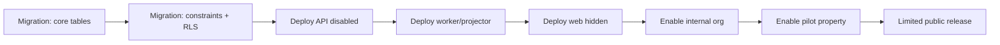

# مصفوفة تنفيذ BHD R Stays

هذه المصفوفة تحول الخطة الرئيسية إلى حزم عمل قابلة للمراجعة والدمج. أسماء الملفات المقترحة قابلة للتعديل بما يوافق أنماط المستودع، لكن حدود المجالات غير قابلة للدمج مع Leasing القديم.

## 1. خريطة الحزم والملفات

```text
packages/contracts/src/stays/
  schemas.ts
  events.ts
  index.ts

packages/domain/src/stays/
  booking-machine.ts
  availability.ts
  pricing.ts
  cancellation.ts
  money.ts

packages/db/src/
  schema.ts                 # إضافة exports فقط
packages/db/migrations/
  00xx_stays_core.sql
  00xy_stays_rls.sql
  00xz_stays_projections.sql

packages/authz/src/
  index.ts                  # الصلاحيات والأدوار

apps/api/src/stays/
  stays.module.ts
  public-stays.controller.ts
  public-stays.service.ts
  stays-operations.controller.ts
  stays-operations.service.ts
  stays-booking.service.ts
  stays-pricing.service.ts
  stays-inventory.service.ts
  stays-finance.service.ts

apps/worker/src/
  jobs/stay-inventory-projector.ts
  jobs/stay-hold-expirer.ts
  jobs/stay-notifications.ts
  jobs/stay-housekeeping.ts

apps/web/src/app/[locale]/stays/
  page.tsx
  [slug]/page.tsx
  [slug]/book/page.tsx

apps/web/src/app/[locale]/owner/stays/
apps/web/src/app/[locale]/developer/stays/
apps/web/src/app/[locale]/guest/stays/

apps/web/src/components/stays/
  stay-search.tsx
  stay-card.tsx
  stay-date-picker.tsx
  guest-selector.tsx
  price-breakdown.tsx
  stay-calendar.tsx
  stay-setup-wizard.tsx
  stay-booking-manager.tsx
```

لا تنشئ BFF write fallback جديداً تحت `apps/web/src/lib/*-neon.ts`. الكتابة الجديدة Nest-only وfail-closed.

## 2. مصفوفة المراحل

| المرحلة | الحزم                     | التسليمات                             | اختبارات إلزامية                    | شرط الدمج          |
| ------- | ------------------------- | ------------------------------------- | ----------------------------------- | ------------------ |
| 0       | docs/config/tests         | ADR، Flag، baseline                   | current E2E                         | لا فرق مع Flag off |
| 1       | contracts/domain/db/authz | schema، state machines، RLS           | unit، DB، concurrency، cross-tenant | لا حجز متداخل      |
| 2       | api/worker                | profiles، rates، locks، quotes        | API integration، outbox idempotency | API خلف Flag       |
| 3       | web owner/developer       | setup، calendar، rates، bookings      | component، a11y، portal E2E         | لا نشر عام بعد     |
| 4       | web public/api read       | search، detail، SEO                   | search correctness، RTL/LTR، perf   | لا نتيجة غير متاحة |
| 5       | api payment/web guest     | hold، pay، confirm، cancel            | webhook replay، E2E booking         | لا تكرار مالي      |
| 6       | finance/ops/worker        | folio، refund، check-in/out، cleaning | reconciliation، task E2E            | دورة كاملة         |
| 7       | reports/reviews           | KPIs، verified reviews                | report fixtures                     | دقة التقارير       |
| 8       | integrations              | iCal/OTA                              | SSRF، sync conflict                 | لا double booking  |

## 3. اختبارات التوافر الأساسية

- `[2026-09-01, 2026-09-03)` لا يتعارض مع `[2026-09-03, 2026-09-05)`.
- يتعارض مع أي فترة تبدأ قبل 3 سبتمبر وتنتهي بعد 1 سبتمبر.
- Hold منتهي يحرر داخل أمر الحجز حتى لو لم يعمل Worker.
- إعادة نفس Idempotency-Key والحمولة تعيد النتيجة نفسها.
- إعادة المفتاح بحمولة مختلفة تعيد `409`.
- 50 طلباً متزامناً لنفس الوحدة والفترة ينتج حجزاً واحداً فقط.
- وحدتان من النوع نفسه يمكن حجزهما للفترة نفسها.
- Lease متداخل يمنع حجزاً يومياً.
- Maintenance block متداخل يمنع الحجز.
- حجز يومي لا يخفي الوحدة لتواريخ غير متداخلة.
- فرق Timezone لا يغير عدد الليالي.

## 4. اختبارات التسعير

- سعر أساسي دون قواعد.
- سعر نهاية الأسبوع.
- موسم يتغلب على السعر الأساسي بأولوية صريحة.
- حد أدنى لليالي.
- خصم أسبوعي.
- رسوم تنظيف مرة واحدة.
- رسوم لكل ضيف ولكل ليلة.
- ضريبة وتقريب لكل line ثم total حسب السياسة.
- OMR/BHD/KWD بثلاث خانات، وبقية العملات المدعومة بدقتها.
- Quote لا يتغير بعد تعديل Rate Plan.
- لا جمع بين عملتين.
- لا استخدام float في API أو Domain.

## 5. اختبارات الأمن

- مالك المؤسسة A لا يقرأ Profile أو Booking للمؤسسة B.
- معرف صحيح من مؤسسة أخرى يعاد كـ 404 عند منع enumeration.
- Guest يرى حجوزاته فقط.
- Tenant role لا يمنح Guest booking access والعكس.
- Public listing لا يعرض owner/guest/unit exact number/private coordinates.
- CSRF يفشل دون token/origin صحيح.
- Webhook بتوقيع غير صحيح يفشل دون تغيير بيانات.
- Webhook مكرر لا يكرر الدفع أو Journal أو Outbox.
- Logs/Audit لا تحتوي token أو وثائق أو payload دفع.
- نص ضيف خبيث لا ينفذ في PDF أو البريد أو لوحة الإدارة.
- ملف خبيث أو MIME مخالف يفشل.
- iCal URL خاص/داخلي/redirect خاص يفشل.
- جميع جداول stays مغطاة بسياسات RLS.

## 6. اختبارات الواجهة وE2E

### المسار العام

1. اختيار «إقامة يومية».
2. تحديد المكان والتواريخ والضيوف.
3. ظهور الوحدات المتاحة فقط.
4. فتح صفحة التفاصيل دون reload كامل للـ Shell.
5. تغيير التاريخ وتحديث السعر.
6. إنشاء Hold.
7. دفع تجريبي في بيئة الاختبار.
8. استقبال Webhook.
9. ظهور القسيمة في بوابة الضيف.
10. إلغاء حسب السياسة والتحقق من الاسترداد.

### مسار المالك

1. فتح عقار حالي.
2. تفعيل الإقامة لوحدة دون تغيير `listingPurpose`.
3. إضافة السعر والسياسات.
4. إغلاق يوم من التقويم.
5. نشر Profile.
6. مشاهدة حجز قادم.
7. Check-in ثم Check-out.
8. اكتمال مهمة التنظيف.
9. عودة الوحدة متاحة.

### Regression

- إنشاء عقار فردي ومتعدد.
- البيع والإيجار الطويل والبحث الحالي.
- عربون الحجز الطويل.
- تحويل الحجز إلى Lease.
- العقود والتوقيع.
- الفواتير والمدفوعات.
- الصيانة والمهام.
- البوابات الأربع والدخول الموحد.

## 7. أوامر بوابة الجودة

تنفذ من جذر BHD-R، ويجب حفظ المخرجات في تقرير المرحلة:

```bash
pnpm format:check
pnpm verify:source
pnpm lint
pnpm typecheck
pnpm test
pnpm build
pnpm test:e2e
```

عند فشل أمر:

- لا تتجاوزه.
- أصلح السبب ضمن نطاق المرحلة.
- أعد الأمر الفاشل ثم البوابة كاملة.
- لا تخف الاختبار ولا تحوله إلى skip لإجبار النجاح.

## 8. ترتيب المهاجرات والنشر



كل migration يجب أن تكون:

- قابلة للتشغيل على قاعدة تحتوي بيانات حالية.
- بلا default يعيد كتابة جدول ضخم دون حاجة.
- بلا حذف/إعادة تسمية في مرحلة التوسع.
- مفحوصة على نسخة/بيئة Staging.
- موثقة في Release note وRunbook.

## 9. قائمة Definition of Done لكل Pull Request

- [ ] نطاق PR مرحلة واحدة أو Slice واحدة.
- [ ] لا تغييرات غير مرتبطة.
- [ ] العقود والـ API والـ DB متوافقة.
- [ ] تفويض مركزي وRLS.
- [ ] Idempotency عند الحاجة.
- [ ] Audit منقح.
- [ ] ترجمة عربية وإنجليزية دون نصوص مبعثرة.
- [ ] RTL/LTR وKeyboard/Screen reader.
- [ ] Unit/Integration tests.
- [ ] Regression tests ذات صلة.
- [ ] Migration/rollback-by-flag موثق.
- [ ] `pnpm check` ناجح.
- [ ] E2E المناسب ناجح.
- [ ] تحديث الوثائق وRelease note.
