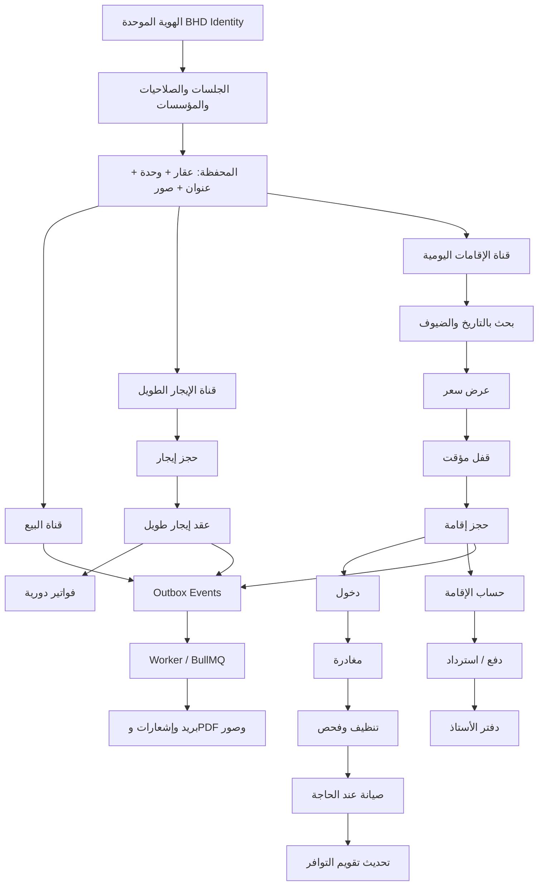
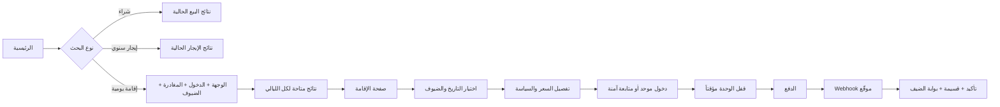
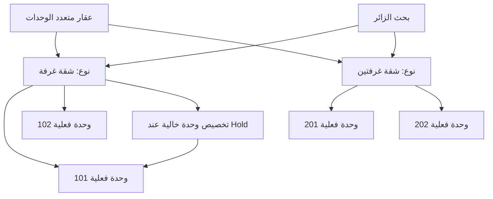
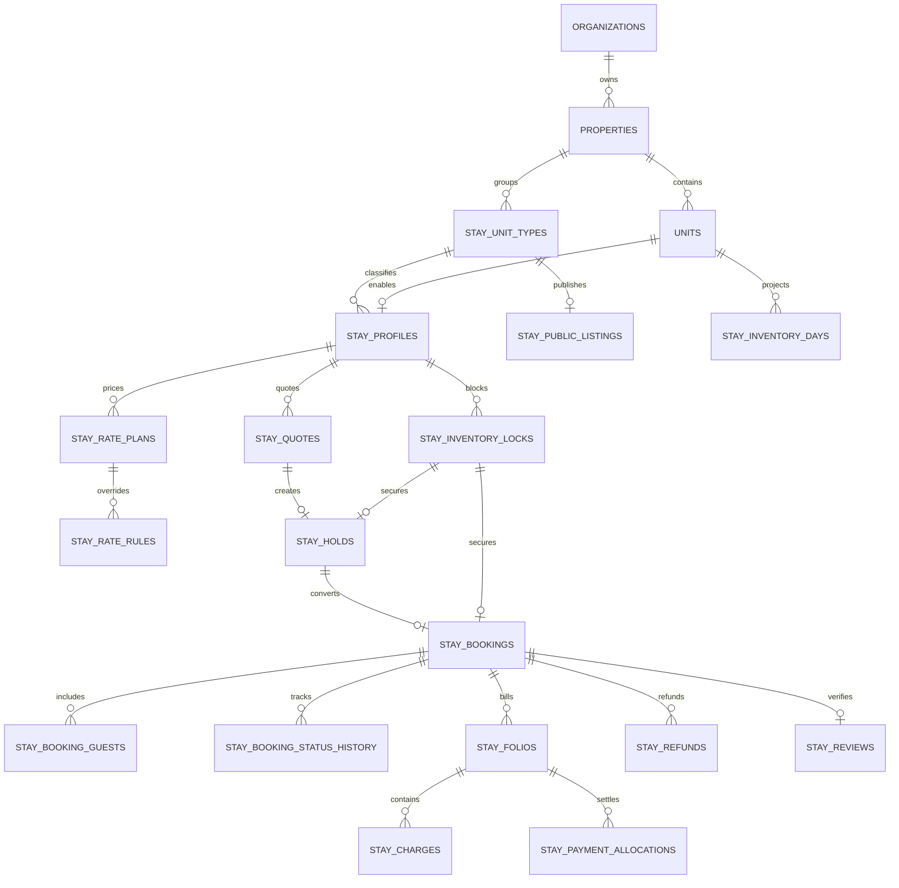
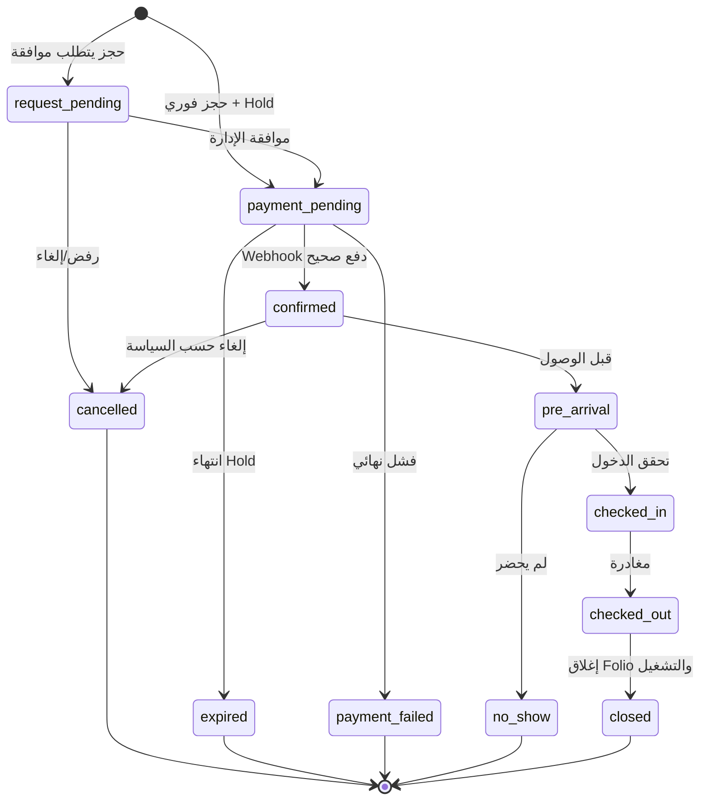
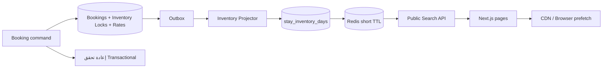
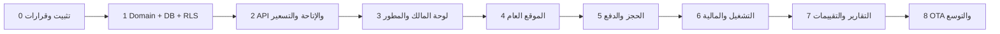

# BHD R Stays — الخطة الرئيسية للإقامات اليومية

**الحالة:** مواصفة بناء معتمدة للتنفيذ التدريجي  
**النطاق:** BHD R الحالي  
**اللغات:** العربية والإنجليزية  
**السوق الأول:** سلطنة عُمان  
**العملات:** OMR, AED, SAR, BHD, KWD, QAR, USD وقابلة للتوسعة  
**هدف الوثيقة:** إضافة تجربة تأجير يومي شبيهة بمنصات الحجز، مع الحفاظ الكامل على البيع والإيجار الطويل.

---

## 1. القرار التنفيذي

تُبنى الإقامات اليومية كـ **Bounded Context** مستقل داخل الـ Modular Monolith الحالي باسم تقني `stays` واسم واجهة «الإقامات اليومية».

تشترك الوحدة الجديدة مع النظام الحالي في:

- المؤسسة والمستخدم والدخول الموحد.
- العقار والوحدة والعنوان والموقع الجغرافي.
- الصور والوسائط والعلامة المائية.
- جهات الاتصال والأطراف.
- دفتر الأستاذ والأحداث والمهام والإشعارات.
- Country Packs والعملات والترجمة.

وتبقى مستقلة في:

- تقويم التوافر.
- حجز الليالي.
- التسعير اليومي والموسمي.
- الضيوف والدخول والمغادرة.
- الإلغاء وعدم الحضور والاسترداد.
- حساب الإقامة `Folio`.
- تقييمات الإقامات المكتملة.

### ما لا يجب فعله

1. لا تضاف قيمة `daily` إلى `units.listingPurpose`.
2. لا تستخدم جداول `holds` و`reservations` الحالية للإقامة اليومية.
3. لا يحول حجز الليالي إلى `lease`.
4. لا ينشأ `lease` وهمي حتى تقبل الفاتورة الحالية حجزاً يومياً.
5. لا تجعل حجز ليلتين يخفي الوحدة عن جميع التواريخ أو عن البيع.
6. لا تضف كتابة مباشرة إلى Neon من الويب للمجال الجديد.
7. لا تعتمد صحة منع التداخل على Cron فقط.

---

## 2. خريطة المجالات



---

## 3. خريطة تجربة المستخدم العامة



### مسارات الموقع العامة

| المسار                              | الغرض                          |
| ----------------------------------- | ------------------------------ |
| `/[locale]/stays`                   | البحث والنتائج                 |
| `/[locale]/stays/[slug]`            | صفحة العقار/نوع الوحدة اليومية |
| `/[locale]/stays/[slug]/book`       | المراجعة وبيانات الضيف والدفع  |
| `/[locale]/guest/stays`             | رحلات وإقامات المستخدم         |
| `/[locale]/guest/stays/[bookingId]` | تفاصيل الحجز والقسيمة والخدمات |

تبقى مسارات `/properties` و`/book/[unitId]` الحالية للإيجار الطويل دون تغيير.

---

## 4. ظهور الصفحة الرئيسية والنتائج

### مربع البحث

```text
┌────────────────────────────────────────────────────────────────────┐
│       شراء        إيجار سنوي        إقامة يومية                    │
├────────────────────────────────────────────────────────────────────┤
│ الوجهة │ تاريخ الدخول │ تاريخ المغادرة │ الضيوف والغرف │ بحث       │
└────────────────────────────────────────────────────────────────────┘
```

عند تغيير التبويب تتغير الحقول والـ URL فقط، ولا يعاد تحميل Shell الصفحة كاملاً.

### بطاقة الإقامة اليومية

تعرض البطاقة:

- صورة محسنة ومائية.
- اسم العقار والمنطقة.
- نوع الوحدة وسعتها.
- عدد غرف النوم والأسرة والحمامات.
- التقييم الموثق إن وجد.
- سياسة الإلغاء والحجز الفوري.
- السعر لليلة دون تواريخ.
- السعر الإجمالي وعدد الليالي عند وجود تواريخ.
- أقل عدد متبقٍ من الوحدات عندما يكون مهماً.

لا تعرض البطاقة:

- رقم الوحدة الفعلي.
- اسم المالك أو هاتفه.
- العنوان الدقيق أو إحداثيات الدخول.
- بيانات ضيف أو حجز سابق.

### صفحة التفاصيل

تقسم إلى:

1. معرض الصور.
2. ملخص الموقع والنوع والسعة.
3. الوصف العربي/الإنجليزي.
4. الغرف والأسرة والمرافق.
5. تقويم التوافر.
6. بطاقة حجز ثابتة تحتوي التاريخ والضيوف والسعر.
7. تفصيل الليالي والرسوم والضرائب.
8. سياسة الإلغاء وقوانين المنزل.
9. وقت الدخول والخروج.
10. تقييمات ضيوف مكتملة الإقامة فقط.
11. خريطة تقريبية قبل التأكيد.

---

## 5. العقار الفردي ومتعدد الوحدات

### العقار الفردي

- ينشئ النظام `Unit` واحدة كما يفعل حالياً.
- ينشأ لها `stay_profile` واحد عند تفعيل الإقامة اليومية.
- تظهر كإعلان مستقل وتقويم مستقل.

### العقار متعدد الوحدات

- تبقى كل وحدة مادية سجلاً مستقلاً.
- تجمع الوحدات المتشابهة اختيارياً في `stay_unit_type`.
- الواجهة العامة تعرض نوع الوحدة وعدد المتاح، لا أرقام الوحدات.
- عند إنشاء Hold يخصص النظام وحدة فعلية واحدة خلف الكواليس.
- يمكن إعادة تخصيص الوحدة قبل الدخول إذا:
  - النوع والسعة متطابقان.
  - لا يوجد تداخل في التقويم.
  - يسجل التغيير في Audit Log.



---

## 6. واجهات لوحات التحكم

### مجموعة تنقل جديدة

داخل بوابتي المالك والمطور:

- لوحة الإقامات.
- التقويم.
- الحجوزات اليومية.
- الوصول والمغادرة.
- الأسعار والعروض.
- التنظيف والتشغيل.
- التقارير.

يعاد تسمية «الحجوزات» الحالية في النصوص إلى «حجوزات الإيجار» دون تغيير مسارها أو منطقها.

### صفحة العقارات

| العمود         | المحتوى                                   |
| -------------- | ----------------------------------------- |
| العقار/الوحدة  | الاسم والكود والنوع                       |
| القنوات        | بيع، إيجار طويل، إقامة يومية              |
| الحالة المادية | نشطة، غير نشطة، مؤرشفة                    |
| حالة اليوم     | متاحة، وصول، مشغولة، مغادرة، تنظيف، صيانة |
| الحجز القادم   | التاريخ ومرجع الحجز دون PII زائد          |
| السعر          | سعر الليلة الفعلي لليوم                   |
| الإجراء        | فتح التقويم أو الحجز أو الإعداد           |

### صفحة العقار 360

تضاف تبويبات:

- الإقامات اليومية.
- التقويم.
- التسعير.
- الحجوزات والضيوف.
- الدخول والخروج.
- التنظيف.
- مالية الإقامات.

### معالج تفعيل الإقامة اليومية

لا يعدل معالج إنشاء العقار الحالي. بعد حفظ العقار يظهر زر «إعداد للإقامة اليومية» ويفتح معالجاً مستقلاً:

1. اختيار الوحدات.
2. إنشاء/اختيار أنواع الوحدات.
3. السعة والأسرة والغرف.
4. المرافق والخدمات.
5. أوقات الدخول والخروج وقوانين المنزل.
6. سياسة الحجز والإلغاء.
7. السعر والرسوم والتأمين.
8. التقويم والإغلاقات.
9. الصور والمحتوى وSEO.
10. قائمة الجاهزية والنشر.

النشر يمنع إذا غاب السعر أو العملة أو السعة أو الصور أو السياسة أو وقت الدخول/الخروج.

### التقويم التشغيلي

```text
الوحدة       1    2    3    4    5    6    7
101        متاح ───── [حجز أحمد] ─── تنظيف ─ متاح
102        [صيانة] ─────────────── متاح ─────────
201        متاح ─ [Hold] ─ متاح ─ [حجز شركة] ───
```

الألوان ليست المصدر الوحيد للمعنى؛ كل حالة تحمل نصاً/نمطاً ورمزاً يمكن قراءته بلوحة المفاتيح وقارئ الشاشة.

---

## 7. نموذج البيانات المقترح

### 7.1 جداول الإعداد والتسويق

#### `stay_unit_types`

- `id`, `organization_id`, `property_id`.
- `code`, `name_ar`, `name_en`.
- السعة والغرف والأسرة والحمامات.
- `status`.
- Unique: `(organization_id, property_id, code)`.

#### `stay_profiles`

- `id`, `organization_id`, `unit_id`, `unit_type_id`.
- `enabled`, `publish_status`, `instant_book`.
- `timezone`, `currency`, `minor_unit`.
- `max_adults`, `max_children`, `max_guests`.
- `min_nights`, `max_nights`, `lead_time_hours`, `advance_booking_days`.
- `check_in_from`, `check_in_until`, `check_out_until`.
- `cancellation_policy_id`, `house_rules_id`.
- Unique: `(unit_id)`.

#### `stay_public_listings`

- `id`, `organization_id`, `property_id`, `unit_type_id`.
- `slug`, `enabled`, `published_at`.
- SEO عربي/إنجليزي.
- Unique عالمي للـ slug.
- لا يحتوي بيانات مالك أو ضيف.

### 7.2 التسعير والسياسات

#### `stay_rate_plans`

- الخطة، العملة، السعر الأساسي، قابلية الاسترداد، حالة التفعيل.
- ترتبط بنوع وحدة أو Profile.

#### `stay_rate_rules`

- فترة تاريخية.
- أيام الأسبوع.
- سعر مطلق أو تعديل نسبي.
- حد أدنى لليالي.
- أولوية صريحة لمنع غموض القواعد.

#### `stay_fees`

- تنظيف، خدمة، ضيف إضافي، تأمين أو رسم محلي.
- `calculation_type`: ثابت، لكل ليلة، لكل ضيف، نسبة.
- حفظ نسخة القاعدة داخل Quote/Booking.

#### `stay_policies`

- سياسة الإلغاء.
- قواعد الاسترداد حسب الوقت قبل الدخول.
- قوانين المنزل.
- نسخ versioned حتى لا تتغير الحجوزات التاريخية.

### 7.3 المصدر الحقيقي للتوافر

#### `stay_inventory_locks`

هذا الجدول هو مصدر الحقيقة الوحيد لكل فترات الإغلاق:

- `id`, `organization_id`, `unit_id`.
- `stay_range` من نوع PostgreSQL `daterange` وبحدود `[)`.
- `kind`: `hold | booking | owner_block | maintenance | lease | channel`.
- `status`: `active | released`.
- `source_type`, `source_id`.
- `expires_at` للـ Hold فقط.
- `note`, `created_by_user_id`.

قيد GiST exclusion:

```text
لا يسمح بوحدتين لهما unit_id نفسه وstay_range متداخل وحالة active.
```

قبل الإدخال داخل نفس المعاملة:

1. يقفل مفتاح الوحدة Advisory Lock أو صف الوحدة.
2. يحول الـ holds المنتهية إلى released.
3. يتحقق من قواعد البيع/الإيجار الطويل والصيانة.
4. ينشئ القفل.
5. ينشئ Outbox event.

#### `stay_inventory_days`

Read projection سريعة وليست مصدر الحقيقة:

- `organization_id`, `unit_id`, `stay_date`.
- `availability_status`.
- `effective_rate_minor`, `currency`, `min_nights`.
- Unique: `(unit_id, stay_date)`.

يعاد بناؤها بالأحداث ويمكن إصلاحها من المصدر.

### 7.4 العرض والحجز

#### `stay_quotes`

- التواريخ والضيوف.
- العملة وعدد الليالي.
- تفصيل كل ليلة والرسوم والضرائب والخصومات.
- الإجمالي النهائي.
- `expires_at` وhash للحمولة.
- Immutable بعد الإصدار.

#### `stay_holds`

- `quote_id`, `inventory_lock_id`.
- `status`: `active | converted | expired | cancelled`.
- `expires_at`.
- Idempotency scope.

#### `stay_bookings`

- مرجع فريد للمؤسسة.
- `organization_id`, `property_id`, `unit_type_id`, `unit_id`.
- `guest_party_id`, `user_id` عند توفره.
- `check_in_on`, `check_out_on`, `timezone`.
- `status`.
- `booking_mode`: فوري أو طلب موافقة.
- Snapshot للسعر والسياسات وCountry Pack.
- الإجماليات بوحدات العملة الصغرى.
- `source`: مباشر، إدارة، قناة خارجية.
- `inventory_lock_id`.

#### `stay_booking_guests`

- الضيف الرئيسي والمرافقون.
- أقل قدر لازم من PII.
- الحقول الحساسة مشفرة مع version للمفتاح.

#### `stay_booking_status_history`

- الحالة السابقة والجديدة.
- الفاعل والسبب والوقت.
- Metadata منقحة دون أسرار.

### 7.5 المالية والتقييمات

#### `stay_folios` و`stay_charges`

- Folio واحد أو أكثر للحجز عند الحاجة.
- بنود الليالي والتنظيف والخدمة والضرائب والتأمين.
- لا تستخدم `invoices.lease_id` الحالي.
- يمكن لاحقاً تعميم Billing Documents بطريقة Expand–Contract.

#### `stay_payment_intents`, `stay_payment_allocations`, `stay_refunds`

- مفاتيح idempotency.
- مراجع مزود فريدة.
- مبلغ وعملة ثابتان.
- فصل طلب الاسترداد عن اعتماده وتنفيذه.

#### `stay_reviews`

- حجز مكتمل واحد لكل تقييم ضيف.
- لا يقبل التقييم قبل `checked_out`.
- نصوص منقحة ضد XSS مع Audit للمراجعة.

---

## 8. مخطط العلاقات



---

## 9. حالات الحجز

يجب فصل حالة الحجز عن حالة الدفع والاسترداد.



الاسترداد يبقى في `stay_refunds` وPayment status، ولا يحول الحجز إلى حالة غامضة باسم `refunded`.

---

## 10. قواعد التوافر بين القنوات

| الحدث               | أثره على البيع          | أثره على الإيجار الطويل     | أثره على اليومي                        |
| ------------------- | ----------------------- | --------------------------- | -------------------------------------- |
| حجز يومي            | لا يغلق البيع افتراضياً | يمنع عقداً متداخلاً         | يغلق الليالي فقط                       |
| Lease فعال          | لا يغلق البيع تلقائياً  | هو المصدر                   | ينشئ lock بمدة العقد                   |
| حجز إيجار طويل فعال | لا يغلق البيع           | يمنع حجز إيجار آخر          | يوقف قبول حجوزات يومية جديدة حتى الحسم |
| صيانة حاجبة         | لا تغير إعلان البيع     | تمنع التسليم حسب المدة      | تغلق أيام الصيانة                      |
| بيع مكتمل           | يغلق قناة البيع         | يحتاج قرار نقل/إنهاء العقود | يحتاج نقل تشغيل أو إلغاء منضبط         |

أي أمر طويل المدة يجب أن يفشل بوضوح إذا كان سيصطدم بإقامة مؤكدة، أو يطلب تاريخ بدء بعد آخر مغادرة مؤكدة.

---

## 11. API المقترح

### Public read

- `GET /v1/public/stays/search`
- `GET /v1/public/stays/:slug`
- `GET /v1/public/stays/:slug/availability`

### Public booking

- `POST /v1/public/stays/:profileId/quotes`
- `POST /v1/public/stays/holds`
- `POST /v1/public/stays/bookings`
- `POST /v1/public/stays/bookings/:id/cancel`

كل POST حساس يحتاج Idempotency-Key، rate limit، تحقق DTO وعدم كشف سبب وجود موارد مؤسسة أخرى.

### Owner/developer operations

- `GET|POST|PATCH /v1/stays/unit-types`
- `GET|POST|PATCH /v1/stays/profiles`
- `POST /v1/stays/profiles/:id/publish`
- `GET|PUT /v1/stays/calendar`
- `POST|PATCH /v1/stays/rate-plans`
- `POST|PATCH|DELETE /v1/stays/inventory-blocks`
- `GET /v1/stays/bookings`
- `GET /v1/stays/bookings/:id`
- `POST /v1/stays/bookings/:id/approve`
- `POST /v1/stays/bookings/:id/check-in`
- `POST /v1/stays/bookings/:id/check-out`
- `POST /v1/stays/bookings/:id/no-show`
- `POST /v1/stays/bookings/:id/refund-requests`
- `POST /v1/stays/refunds/:id/approve`

### Guest portal

- `GET /v1/guest/stays/bookings`
- `GET /v1/guest/stays/bookings/:id`
- `POST /v1/guest/stays/bookings/:id/guests`
- `POST /v1/guest/stays/bookings/:id/requests`
- `POST /v1/guest/stays/bookings/:id/review`

### Webhooks

يمتد webhook الدفع الحالي بنوع `stay_booking` مع:

- توقيع إلزامي.
- معرف حدث فريد للمزود.
- مطابقة amount/currency/intent/organization.
- معالجة transaction واحدة.
- إعادة الحدث تعيد نتيجة duplicate دون تكرار الحجز أو القيد.

---

## 12. الصلاحيات

تضاف صلاحيات دقيقة إلى الحزمة المركزية:

- `stay.read`
- `stay.profile.manage`
- `stay.publish.manage`
- `stay.inventory.read`
- `stay.inventory.manage`
- `stay.rate.read`
- `stay.rate.manage`
- `stay.booking.read`
- `stay.booking.manage`
- `stay.checkin.manage`
- `stay.checkout.manage`
- `stay.housekeeping.manage`
- `stay.refund.request`
- `stay.refund.approve`
- `stay.finance.read`
- `stay.review.moderate`

كل Service يعيد تطبيق نطاق المؤسسة والعقار/الوحدة، ولا تعتمد السلطة على إخفاء الزر في الواجهة.

الضيف لا يرث دور `tenant`. يمكن للحساب نفسه امتلاك سياق Tenant وسياق Guest منفصلين.

---

## 13. المالية

### تفصيل Quote/Folio

```text
Nightly charges
+ Weekend/season adjustments
+ Extra guest charges
+ Cleaning fee
+ Service fee
+ Taxes/local fees
- Discounts
= Booking total
+ Refundable security deposit, if charged
```

القواعد:

- لا تستخدم `number` للحساب المالي.
- تستخدم Decimal/string في Domain والحساب، ثم تحول إلى minor units بتقريب صريح.
- العملة ثابتة من Quote إلى Payment/Folio.
- سعر الصرف لا يغير حجزاً تاريخياً.
- Security deposit يسجل التزاماً وليس إيراداً.
- Journal source يكون `stay_booking`, `stay_payment` أو `stay_refund`.
- فريد `(organization_id, source_type, source_id)` يمنع تكرار القيد.

### الاعتمادات

| القرار              | الاعتماد                             |
| ------------------- | ------------------------------------ |
| نشر Profile مكتمل   | مدير العقار                          |
| خصم ضمن الحد        | صاحب صلاحية السعر                    |
| خصم فوق الحد        | مدير العقار                          |
| إلغاء مطابق للسياسة | آلي أو عمليات                        |
| استثناء إلغاء       | إدارة ثم مالية                       |
| استرداد             | منفذ مختلف عن المعتمد عند تجاوز الحد |
| شطب مالي            | مالية + Audit إلزامي                 |

---

## 14. التشغيل والمهام

أحداث تلقائية:

- `stay.booking.confirmed` يرسل القسيمة ويحدث التقويم.
- `stay.pre_arrival.due` يطلب بيانات الوصول المسموحة.
- `stay.checked_out` ينشئ مهمة تنظيف وفحص.
- فشل الفحص ينشئ بلاغ صيانة وInventory Lock.
- نجاح التنظيف يحرر حالة Turnover في العرض اليومي.
- `stay.no_show` يطبق السياسة ويرسلها للمالية.

المهام الحالية يعاد استخدامها مع:

- `source_type = stay_booking`.
- `source_id = bookingId`.
- `property_id` و`unit_id`.
- SLA حسب وقت الوصول القادم.

---

## 15. الأمن والخصوصية

### ضوابط إلزامية

1. RLS لكل جدول مؤسسي مع اختبارات Cross-tenant.
2. تفويض مركزي لكل API.
3. CSRF لطلبات الجلسة.
4. Idempotency للـ Hold والحجز والدفع والاسترداد.
5. توقيع Webhook ومنع replay.
6. تشفير PII الحساسة مع key versioning والتدوير.
7. عدم تسجيل tokens أو بيانات هوية أو payload دفع في Audit/Logs.
8. Sanitization وoutput encoding للقسائم والفواتير والبريد.
9. فحص الملفات، إزالة EXIF، MIME sniffing، حدود الحجم، Signed URLs.
10. Rate limit وabuse controls لمسارات البحث والحجز.
11. عنوان تقريبي قبل التأكيد وتعليمات دقيقة للمخول بعد التأكيد فقط.
12. SSRF protection لأي iCal أو Channel URL:
    - HTTPS فقط عند الإمكان.
    - منع loopback/private/link-local.
    - DNS resolve وإعادة التحقق بعد redirects.
    - حجم ووقت محدودان.
    - Egress proxy/allowlist للقنوات الرسمية.

### متطلبات ما قبل الإنتاج

- بوابة دفع حقيقية موقعة.
- ClamAV فعلي.
- Nest+DB E2E.
- دور DB لا يملك BYPASSRLS.
- تدوير الأسرار المعرضة سابقاً.
- Backup/restore drill.
- مراجعة سياسة الإلغاء والخصوصية والمتطلبات المحلية قانونياً.

---

## 16. الأداء وSEO

### استراتيجية القراءة



البحث يستخدم projection/cache، لكن الحجز يعيد التحقق داخل قاعدة المصدر قبل التأكيد.

### أهداف القياس

- Search API warm p95 أقل من 300ms.
- Detail API warm p95 أقل من 250ms.
- LCP للصفحة العامة أقل من 2.5s على هاتف متوسط.
- CLS أقل من 0.1.
- انتقالات اللوحة تستخدم prefetch/cache الحالي ولا تعيد تحميل Shell.
- الصور responsive AVIF/WebP مع CDN وlazy loading.
- لا N+1 في البحث أو التقويم.

### SEO

- canonical وhreflang لكل listing.
- صفحات البحث ذات تواريخ/فلاتر `noindex,follow`.
- Sitemap للإعلانات المنشورة فقط.
- Structured Data مناسب لنوع الإقامة والعروض والتقييمات.
- Slug ثابت وتاريخي؛ لا تكشف الصفحة المؤرشفة بيانات خاصة.

---

## 17. الأحداث والتكاملات

أحداث Outbox الأساسية:

- `stay.profile.published`
- `stay.rate.changed`
- `stay.inventory.changed`
- `stay.quote.created`
- `stay.hold.created`
- `stay.hold.expired`
- `stay.booking.requested`
- `stay.booking.confirmed`
- `stay.booking.cancelled`
- `stay.checked_in`
- `stay.checked_out`
- `stay.no_show`
- `stay.refund.requested`
- `stay.refund.completed`

كل مستهلك idempotent ويستخدم event id/job id ثابتاً. فشل البريد أو الصورة أو Projection لا يلغي معاملة الحجز الصحيحة، لكنه يظهر في DLQ والمراقبة.

التكامل المباشر مع Booking.com أو OTA أخرى ليس جزءاً من النواة الأولى. يبدأ لاحقاً بـ iCal للقراءة/الكتابة المحدودة، ثم Channel Manager رسمي بعد توفر الاعتمادات.

---

## 18. خطة المراحل



### المرحلة 0 — الحماية من الانحدار

- ADR وThreat Model وFeature Flag.
- تثبيت اختبارات البيع والإيجار الطويل الحالية.
- توثيق API/DB baseline.
- لا تغيير سلوكي.

**بوابة الخروج:** العلم مغلق، و`pnpm check` وE2E الحاليان ناجحان.

### المرحلة 1 — Domain وDB

- العقود المشتركة والحالات وقواعد المال والتاريخ.
- الجداول والمهاجرات وRLS.
- Inventory Lock وGiST exclusion.
- اختبارات التوازي والعزل.

**بوابة الخروج:** 50 محاولة متزامنة للفترة نفسها = فائز واحد، ولا تغيير في الجداول القديمة إلا Additive موثق.

### المرحلة 2 — API

- Profiles، Unit Types، Rates، Calendar، Quotes.
- أوامر Hold والحجز الإداري.
- Outbox وProjection.
- صلاحيات مركزية.

**بوابة الخروج:** API integration tests بقاعدة فعلية، Feature Flag مغلق افتراضياً.

### المرحلة 3 — لوحة التحكم

- مجموعة التنقل.
- معالج الإعداد.
- التقويم والتسعير وقائمة الحجوزات.
- مؤشرات الوصول والمغادرة.

**بوابة الخروج:** المالك يهيئ وحدة ويغلق يوماً ويغير سعراً دون أن تظهر للعامة.

### المرحلة 4 — الموقع العام

- تبويب الرئيسية.
- البحث والنتائج والتفاصيل.
- Calendar وGuest selector وPrice breakdown.
- SEO وRTL/LTR وAccessibility.

**بوابة الخروج:** البحث لا يعرض وحدة غير متاحة لأي ليلة، وWeb Vitals ضمن الهدف.

### المرحلة 5 — الدفع والتأكيد

- Quote immutable، Hold، Payment intent.
- Webhook موقع وIdempotent.
- قسيمة وبوابة الضيف وإلغاء.

**بوابة الخروج:** E2E من البحث إلى التأكيد، وإعادة webhook لا تكرر حجزاً أو دفعاً أو قيداً.

### المرحلة 6 — التشغيل والمالية

- Check-in/out وNo-show.
- Folio وCharges وRefund approvals.
- تنظيف وفحص وصيانة.
- Journal posting/reconciliation.

**بوابة الخروج:** دورة إقامة كاملة، وتطابق Folio والمدفوعات والدفتر.

### المرحلة 7 — التقارير والتقييمات

- Occupancy، ADR، RevPAR، الإيراد والإلغاءات.
- تقييم موثق بعد المغادرة.
- تقارير مالك/مطور/منصة.

**بوابة الخروج:** التقارير تتطابق مع استعلامات المصدر وTimezone/عملة العقار.

### المرحلة 8 — القنوات والتوسع

- iCal آمن.
- Channel mappings وsync conflicts.
- Country Pack/legal configuration.
- Channel Manager/OTA رسمي.

**بوابة الخروج:** اختبارات تعارض وفشل وإعادة محاولة، ولا حجز مزدوج عبر القنوات.

---

## 19. استراتيجية النشر والتراجع

1. Deploy DB additive migration.
2. Deploy API يدعم القديم والجديد.
3. Deploy Worker/Projection.
4. Deploy Web مع إخفاء القنوات خلف العلم.
5. تفعيل لمؤسسة داخلية.
6. تفعيل لعقار تجريبي.
7. تشغيل Shadow metrics.
8. فتح عام محدود.
9. توسعة تدريجية.

التراجع يكون بإغلاق Feature Flag. لا تحذف الجداول أو البيانات، ولا تنفذ rollback مدمر أثناء حادث إنتاجي.

مؤشرات التشغيل:

- معدل تعارض الحجز.
- Holds المنتهية وغير المحررة.
- تأخر Projection.
- فشل Webhooks وإعاداتها.
- عدم تطابق Folio/payment/ledger.
- Search p50/p95/p99.
- نسبة الخطأ حسب المسار والمؤسسة.
- وقت دورة التنظيف قبل الوصول التالي.

---

## 20. تعريف الاكتمال

لا تعتبر الإقامة اليومية مكتملة إلا إذا تحقق ما يلي:

- البيع والإيجار الطويل والعقود والفواتير الحالية تعمل باختبارات regression.
- Feature Flag مغلق يعيد السلوك الحالي.
- البحث يعمل بالعربية والإنجليزية وRTL/LTR.
- العملات المدعومة تعمل بدقة صحيحة.
- لا يوجد حجز مزدوج تحت التوازي.
- Webhook والدفع والاسترداد Idempotent.
- RLS واختبارات Cross-tenant ناجحة.
- الضيف لا يحصل على صلاحيات المستأجر.
- الإدارة ترى التقويم والأسعار والوصول والتنظيف.
- الضيف يرى الحجز والقسيمة والمدفوعات فقط.
- Folio وLedger متطابقان.
- الصيانة تغلق الأيام وتعيد فتحها بضوابط.
- Lighthouse/Playwright/API/DB tests ناجحة.
- Runbooks للدفع والتعارض والـ projection والـ worker والاسترداد موجودة.
- وثائق النشر والتراجع والنسخ الاحتياطي محدثة.
